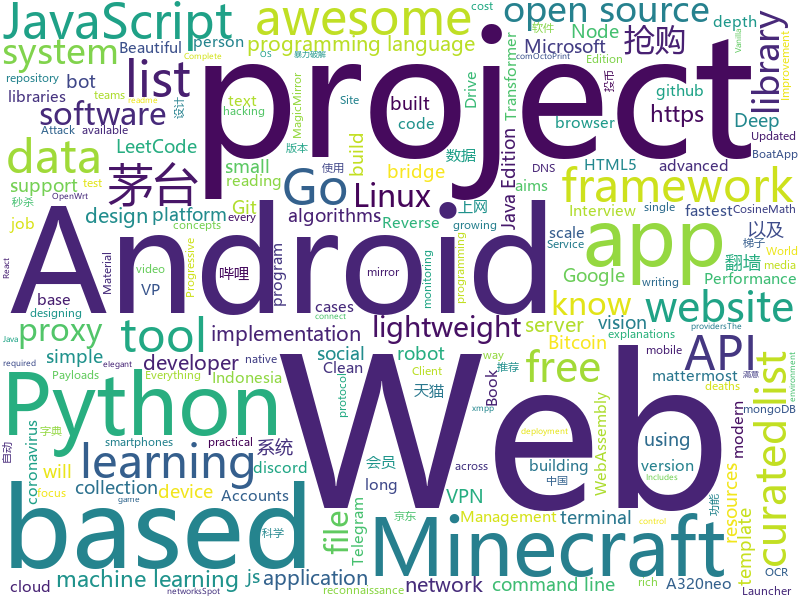

# 2021-01-04
See what the GitHub community is most excited about.

## python
+ [jd_maotai_seckill](https://github.com/ChinaVolvocars/jd_maotai_seckill)(**1,021 stars today**): 优化版本的京东茅台抢购神器
+ [sherlock](https://github.com/sherlock-project/sherlock)(**234 stars today**): 🔎Hunt down social media accounts by username across social networks
+ [spot-sdk](https://github.com/boston-dynamics/spot-sdk)(**64 stars today**): Spot SDK repo
+ [youtube-dl](https://github.com/ytdl-org/youtube-dl)(**374 stars today**): Command-line program to download videos from YouTube.com and other video sites
+ [GHunt](https://github.com/mxrch/GHunt)(**354 stars today**): 🕵️‍♂️Investigate Google Accounts with emails.
+ [vit-pytorch](https://github.com/lucidrains/vit-pytorch)(**200 stars today**): Implementation of Vision Transformer, a simple way to achieve SOTA in vision classification with only a single transformer encoder, in Pytorch
+ [system-design-primer](https://github.com/donnemartin/system-design-primer)(**142 stars today**): Learn how to design large-scale systems. Prep for the system design interview. Includes Anki flashcards.
+ [electrum](https://github.com/spesmilo/electrum)(**10 stars today**): Electrum Bitcoin Wallet
+ [rich](https://github.com/willmcgugan/rich)(**289 stars today**): Rich is a Python library for rich text and beautiful formatting in the terminal.
+ [PayloadsAllTheThings](https://github.com/swisskyrepo/PayloadsAllTheThings)(**30 stars today**): A list of useful payloads and bypass for Web Application Security and Pentest/CTF
+ [TransCoder](https://github.com/facebookresearch/TransCoder)(**41 stars today**): Public release of the TransCoder research project https://arxiv.org/pdf/2006.03511.pdf
+ [covid-19-data](https://github.com/owid/covid-19-data)(**17 stars today**): Data on COVID-19 (coronavirus) cases, deaths, hospitalizations, tests • All countries • Updated daily by Our World in Data
+ [ML-From-Scratch](https://github.com/eriklindernoren/ML-From-Scratch)(**13 stars today**): Machine Learning From Scratch. Bare bones NumPy implementations of machine learning models and algorithms with a focus on accessibility. Aims to cover everything from linear regression to deep learning.
+ [taobao_seckill](https://github.com/jerry3747/taobao_seckill)(**152 stars today**): 淘宝、天猫半价抢购，抢电视、抢茅台，干死黄牛党
+ [stock](https://github.com/pythonstock/stock)(**169 stars today**): stock，股票系统。使用python进行开发。
+ [PaddleOCR](https://github.com/PaddlePaddle/PaddleOCR)(**57 stars today**): Awesome multilingual OCR toolkits based on PaddlePaddle （practical ultra lightweight OCR system, provide data annotation and synthesis tools, support training and deployment among server, mobile, embedded and IoT devices）
+ [Xiaomi-cloud-tokens-extractor](https://github.com/PiotrMachowski/Xiaomi-cloud-tokens-extractor)(**14 stars today**): This tool/script retrieves tokens for all devices connected to Xiaomi cloud.
+ [bips](https://github.com/bitcoin/bips)(**6 stars today**): Bitcoin Improvement Proposals
+ [devicon](https://github.com/devicons/devicon)(**8 stars today**): Set of icons representing programming languages, designing & development tools
+ [daily-coding-problem](https://github.com/vineetjohn/daily-coding-problem)(**4 stars today**): Solutions to problems sent by dailycodingproblem.com
+ [OctoPrint](https://github.com/OctoPrint/OctoPrint)(**4 stars today**): OctoPrint is the snappy web interface for your 3D printer!
+ [Oblivion](https://github.com/loseys/Oblivion)(**16 stars today**): Data leak checker & OSINT Tool
+ [python-telegram-bot](https://github.com/python-telegram-bot/python-telegram-bot)(**9 stars today**): We have made you a wrapper you can't refuse
+ [Telethon](https://github.com/LonamiWebs/Telethon)(**9 stars today**): Pure Python 3 MTProto API Telegram client library, for bots too!
+ [python-binance](https://github.com/sammchardy/python-binance)(**7 stars today**): Binance Exchange API python implementation for automated trading

## java
+ [Mindustry](https://github.com/Anuken/Mindustry)(**51 stars today**): A sandbox tower defense game
+ [CS-Notes](https://github.com/CyC2018/CS-Notes)(**132 stars today**): 📚技术面试必备基础知识、Leetcode、计算机操作系统、计算机网络、系统设计、Java、Python、C++
+ [COLA](https://github.com/alibaba/COLA)(**41 stars today**): Clean Object-oriented & Layered Architecture
+ [AndroidAPS](https://github.com/nightscout/AndroidAPS)(**30 stars today**): 
+ [termux-app](https://github.com/termux/termux-app)(**14 stars today**): Android terminal and Linux environment - app repository.
+ [BILIBILI-HELPER](https://github.com/JunzhouLiu/BILIBILI-HELPER)(**32 stars today**): B站，哔哩哔哩（Bilibili）自动签到投币工具，每天轻松获取65经验值，支持每日自动投币，银瓜子兑换硬币，领取大会员福利，大会员月底给自己充电等功能。呐！赶快和我一起成为Lv6吧！
+ [Algorithms](https://github.com/williamfiset/Algorithms)(**14 stars today**): A collection of algorithms and data structures
+ [EdXposed](https://github.com/ElderDrivers/EdXposed)(**8 stars today**): Elder driver Xposed Framework.
+ [interview](https://github.com/mission-peace/interview)(**2 stars today**): Interview questions
+ [MinecraftForge](https://github.com/MinecraftForge/MinecraftForge)(**5 stars today**): Modifications to the Minecraft base files to assist in compatibility between mods.
+ [APlayer](https://github.com/rRemix/APlayer)(**6 stars today**): Android Music Player
+ [uhabits](https://github.com/iSoron/uhabits)(**8 stars today**): Loop Habit Tracker, a mobile app for creating and maintaining long-term positive habits
+ [openhab-core](https://github.com/openhab/openhab-core)(**0 stars today**): Core framework of openHAB
+ [spring-petclinic](https://github.com/spring-projects/spring-petclinic)(**0 stars today**): A sample Spring-based application
+ [miaosha](https://github.com/qiurunze123/miaosha)(**151 stars today**): ⭐⭐⭐⭐秒杀系统设计与实现.互联网工程师进阶与分析🙋🐓
+ [MCinaBox](https://github.com/AOF-Dev/MCinaBox)(**3 stars today**): MCinaBox - A Minecraft: Java Edition Launcher for Android. An Encapsulation of [CosineMath's BoatApp](https://github.com/CosineMath/BoatApp).
+ [PojavLauncher](https://github.com/PojavLauncherTeam/PojavLauncher)(**3 stars today**): A Minecraft: Java Edition Launcher for Android based on Boardwalk. Note that v2 will not able to run Minecraft 1.12+.
+ [interviews](https://github.com/kdn251/interviews)(**30 stars today**): Everything you need to know to get the job.
+ [ksql](https://github.com/confluentinc/ksql)(**5 stars today**): The event streaming database purpose-built for stream processing applications
+ [OpenBot](https://github.com/intel-isl/OpenBot)(**4 stars today**): OpenBot leverages smartphones as brains for low-cost robots. We have designed a small electric vehicle that costs about $50 and serves as a robot body. Our software stack for Android smartphones supports advanced robotics workloads such as person following and real-time autonomous navigation.
+ [Minestom](https://github.com/Minestom/Minestom)(**2 stars today**): 1.16.4 Lightweight and multi-threaded Minecraft server
+ [Geyser](https://github.com/GeyserMC/Geyser)(**7 stars today**): A bridge/proxy allowing you to connect to Minecraft: Java Edition servers with Minecraft: Bedrock edition.
+ [zookeeper](https://github.com/apache/zookeeper)(**5 stars today**): Apache ZooKeeper
+ [AndroidTutorialForBeginners](https://github.com/hussien89aa/AndroidTutorialForBeginners)(**5 stars today**): Step by step to build Android apps using Android Studio
+ [epoxy](https://github.com/airbnb/epoxy)(**20 stars today**): Epoxy is an Android library for building complex screens in a RecyclerView

## unknown
+ [first-contributions](https://github.com/firstcontributions/first-contributions)(**450 stars today**): 🚀✨Help beginners to contribute to open source projects
+ [developer-roadmap](https://github.com/kamranahmedse/developer-roadmap)(**96 stars today**): Roadmap to becoming a web developer in 2021
+ [ml-visuals](https://github.com/dair-ai/ml-visuals)(**246 stars today**): 🎨ML Visuals contains figures and templates which you can reuse and customize to improve your scientific writing.
+ [awesome-remote-job](https://github.com/lukasz-madon/awesome-remote-job)(**13 stars today**): A curated list of awesome remote jobs and resources. Inspired by https://github.com/vinta/awesome-python
+ [free-programming-books](https://github.com/EbookFoundation/free-programming-books)(**139 stars today**): 📚Freely available programming books
+ [awesome-mlops](https://github.com/visenger/awesome-mlops)(**14 stars today**): A curated list of references for MLOps
+ [awesome-public-datasets](https://github.com/awesomedata/awesome-public-datasets)(**22 stars today**): A topic-centric list of HQ open datasets.
+ [Awesome-CobaltStrike-Defence](https://github.com/MichaelKoczwara/Awesome-CobaltStrike-Defence)(**89 stars today**): Defences against Cobalt Strike
+ [Python-programming-exercises](https://github.com/zhiwehu/Python-programming-exercises)(**18 stars today**): 100+ Python challenging programming exercises
+ [500-AI-Machine-learning-Deep-learning-Computer-vision-NLP-Projects-with-code](https://github.com/ashishpatel26/500-AI-Machine-learning-Deep-learning-Computer-vision-NLP-Projects-with-code)(**513 stars today**): 500 AI Machine learning Deep learning Computer vision NLP Projects with code
+ [suning_seckill](https://github.com/8090shuo/suning_seckill)(**60 stars today**): 苏宁易购抢购茅台，茅台秒杀
+ [Git-Commands](https://github.com/joshnh/Git-Commands)(**8 stars today**): A list of commonly used Git commands
+ [Big-Ass-Data-Broker-Opt-Out-List](https://github.com/yaelwrites/Big-Ass-Data-Broker-Opt-Out-List)(**13 stars today**): 
+ [PENTESTING-BIBLE](https://github.com/blaCCkHatHacEEkr/PENTESTING-BIBLE)(**17 stars today**): Learn ethical hacking.Learn about reconnaissance,windows/linux hacking,attacking web technologies,and pen testing wireless networks.Resources for learning malware analysis and reverse engineering.
+ [AMD_Vanilla](https://github.com/AMD-OSX/AMD_Vanilla)(**3 stars today**): Native AMD macOS via Clover & OpenCore
+ [mydexchain](https://github.com/mydexchain/mydexchain)(**6 stars today**): 
+ [covid-19-data](https://github.com/nytimes/covid-19-data)(**2 stars today**): An ongoing repository of data on coronavirus cases and deaths in the U.S.
+ [every-programmer-should-know](https://github.com/mtdvio/every-programmer-should-know)(**11 stars today**): A collection of (mostly) technical things every software developer should know about
+ [ClashForAndroid](https://github.com/Kr328/ClashForAndroid)(**13 stars today**): A rule-based tunnel for Android.
+ [awesome-deep-learning](https://github.com/ChristosChristofidis/awesome-deep-learning)(**13 stars today**): A curated list of awesome Deep Learning tutorials, projects and communities.
+ [awesome-production-machine-learning](https://github.com/EthicalML/awesome-production-machine-learning)(**18 stars today**): A curated list of awesome open source libraries to deploy, monitor, version and scale your machine learning
+ [MyIPTV](https://github.com/SPX372928/MyIPTV)(**0 stars today**): 标准协议移动直播源
+ [build-your-own-x](https://github.com/danistefanovic/build-your-own-x)(**101 stars today**): 🤓Build your own (insert technology here)
+ [javascript-questions](https://github.com/lydiahallie/javascript-questions)(**39 stars today**): A long list of (advanced) JavaScript questions, and their explanations✨
+ [Projects](https://github.com/karan/Projects)(**19 stars today**): 📃A list of practical projects that anyone can solve in any programming language.

## javascript
+ [TabFS](https://github.com/osnr/TabFS)(**527 stars today**): 🗄Mount your browser tabs as a filesystem.
+ [social-analyzer](https://github.com/qeeqbox/social-analyzer)(**1,474 stars today**): API and Web App for analyzing & finding a person profile across 300+ social media websites (Detections are updated regularly)
+ [myDrive](https://github.com/subnub/myDrive)(**18 stars today**): Node.js and mongoDB Google Drive Clone
+ [javascript-algorithms](https://github.com/trekhleb/javascript-algorithms)(**218 stars today**): 📝Algorithms and data structures implemented in JavaScript with explanations and links to further readings
+ [clean-code-javascript](https://github.com/ryanmcdermott/clean-code-javascript)(**411 stars today**): 🛁Clean Code concepts adapted for JavaScript
+ [How-To-Ask-Questions-The-Smart-Way](https://github.com/ryanhanwu/How-To-Ask-Questions-The-Smart-Way)(**94 stars today**): 本文原文由知名 Hacker Eric S. Raymond 所撰寫，教你如何正確的提出技術問題並獲得你滿意的答案。
+ [33-js-concepts](https://github.com/leonardomso/33-js-concepts)(**237 stars today**): 📜33 concepts every JavaScript developer should know.
+ [complete-javascript-course](https://github.com/jonasschmedtmann/complete-javascript-course)(**13 stars today**): Starter files, final projects and FAQ for my Complete JavaScript course
+ [alpine](https://github.com/alpinejs/alpine)(**125 stars today**): A rugged, minimal framework for composing JavaScript behavior in your markup.
+ [awesome-selfhosted](https://github.com/awesome-selfhosted/awesome-selfhosted)(**57 stars today**): A list of Free Software network services and web applications which can be hosted locally. Selfhosting is the process of hosting and managing applications instead of renting from Software-as-a-Service providers
+ [next.js](https://github.com/vercel/next.js)(**308 stars today**): The React Framework
+ [vanillawebprojects](https://github.com/bradtraversy/vanillawebprojects)(**16 stars today**): Mini projects built with HTML5, CSS & JavaScript. No frameworks or libraries
+ [Awesome-Profile-README-templates](https://github.com/kautukkundan/Awesome-Profile-README-templates)(**10 stars today**): A collection of awesome readme templates to display on your profile
+ [ZeroNet](https://github.com/HelloZeroNet/ZeroNet)(**9 stars today**): ZeroNet - Decentralized websites using Bitcoin crypto and BitTorrent network
+ [outline](https://github.com/outline/outline)(**7 stars today**): The fastest wiki and knowledge base for growing teams. Beautiful, feature rich, and markdown compatible.
+ [Tmall_Tickets](https://github.com/cehui0303/Tmall_Tickets)(**235 stars today**): 天猫超市茅台抢票功能
+ [chavascript](https://github.com/ChavaScript/chavascript)(**8 stars today**): ChavaScript language transpiler
+ [snapdrop](https://github.com/RobinLinus/snapdrop)(**31 stars today**): A Progressive Web App for local file sharing
+ [django-ecommerce](https://github.com/justdjango/django-ecommerce)(**3 stars today**): An e-commerce website built with Django
+ [zigbee2mqtt](https://github.com/Koenkk/zigbee2mqtt)(**9 stars today**): Zigbee🐝to MQTT bridge🌉, get rid of your proprietary Zigbee bridges🔨
+ [MagicMirror](https://github.com/MichMich/MagicMirror)(**15 stars today**): MagicMirror² is an open source modular smart mirror platform. With a growing list of installable modules, the MagicMirror² allows you to convert your hallway or bathroom mirror into your personal assistant.
+ [a32nx](https://github.com/flybywiresim/a32nx)(**8 stars today**): The A32NX Project is a community driven open source project to create a free Airbus A320neo in Microsoft Flight Simulator that is as close to reality as possible. It aims to enhance the default A320neo by improving the systems depth and functionality to bring it up to payware-level, all for free.
+ [hexo-theme-fluid](https://github.com/fluid-dev/hexo-theme-fluid)(**7 stars today**): 🌊一款 Material Design 风格的 Hexo 主题 / An elegant Material-Design theme for Hexo
+ [iptv](https://github.com/iptv-org/iptv)(**64 stars today**): Collection of 5000+ publicly available IPTV channels from all over the world
+ [Valetudo](https://github.com/Hypfer/Valetudo)(**2 stars today**): Cloud-free control webinterface for vacuum robots

## html
+ [pml-book](https://github.com/probml/pml-book)(**331 stars today**): "Probabilistic Machine Learning" - a book series by Kevin Murphy
+ [OpenClash](https://github.com/vernesong/OpenClash)(**15 stars today**): A Clash Client For OpenWrt
+ [privacytools.io](https://github.com/privacytools/privacytools.io)(**8 stars today**): 🛡🛠You are being watched. Protect your privacy against global mass surveillance.
+ [zenbot](https://github.com/DeviaVir/zenbot)(**10 stars today**): Zenbot is a command-line cryptocurrency trading bot using Node.js and MongoDB.
+ [html-css](https://github.com/gustavoguanabara/html-css)(**10 stars today**): Curso de HTML5 e CSS3
+ [JavaScript30](https://github.com/wesbos/JavaScript30)(**11 stars today**): 30 Day Vanilla JS Challenge
+ [openwrt-passwall](https://github.com/xiaorouji/openwrt-passwall)(**20 stars today**): 
+ [discord-bot-client](https://github.com/Flam3rboy/discord-bot-client)(**1 stars today**): A custom version of discord, with bot login support
+ [AdminLTE](https://github.com/ColorlibHQ/AdminLTE)(**15 stars today**): AdminLTE - Free admin dashboard template based on Bootstrap 4
+ [vpncn.github.io](https://github.com/vpncn/vpncn.github.io)(**20 stars today**): 2020中国翻墙软件VPN推荐指南，以及对比VPS搭建梯子、SSR机场、蓝灯、WireGuard、V2ray、老王VPN等科学上网软件与翻墙方法，中国最新科学上网翻墙VPN梯子下载推荐，稳定好用。
+ [ws-monitoring](https://github.com/elestio/ws-monitoring)(**4 stars today**): A simple & lightweight realtime monitoring web UI + server in Node.js
+ [DAFTAR-API-LOKAL-INDONESIA](https://github.com/farizdotid/DAFTAR-API-LOKAL-INDONESIA)(**10 stars today**): Berisi API tentang Data Indonesia ataupun API yang dibuat oleh developer Indonesia <3
+ [Web-Fuzzing-Box](https://github.com/gh0stkey/Web-Fuzzing-Box)(**100 stars today**): Web Fuzzing Box - Web 模糊测试字典与一些Payloads，主要包含：弱口令暴力破解、目录以及文件枚举、Web漏洞...字典运用于实战案例：https://gh0st.cn/archives/2019-11-11/1
+ [covid19italia](https://github.com/ondata/covid19italia)(**4 stars today**): 
+ [wpt](https://github.com/web-platform-tests/wpt)(**3 stars today**): Test suites for Web platform specs — including WHATWG, W3C, and others
+ [blog_os](https://github.com/phil-opp/blog_os)(**12 stars today**): Writing an OS in Rust
+ [Scrum-Management](https://github.com/Harshita248/Scrum-Management)(**3 stars today**): Scrum-Management: This is a project on the platform of web designing which will be a website developed for amateurs entering into codex that will make their tasks easier...
+ [responsive-website-restaurant](https://github.com/bedimcode/responsive-website-restaurant)(**2 stars today**): 
+ [git-it-electron](https://github.com/jlord/git-it-electron)(**3 stars today**): 💻🎓Git-it is a (Mac, Win, Linux) Desktop App for Learning Git and GitHub
+ [pcc_2e](https://github.com/ehmatthes/pcc_2e)(**3 stars today**): Online resources for Python Crash Course (Second Edition), from No Starch Press
+ [ESPEasy](https://github.com/letscontrolit/ESPEasy)(**1 stars today**): Easy MultiSensor device based on ESP8266
+ [raytracing.github.io](https://github.com/RayTracing/raytracing.github.io)(**7 stars today**): Main Web Site (Online Books)
+ [RateMySupervisor](https://github.com/kgco/RateMySupervisor)(**5 stars today**): 永久免费开源的导师评价数据、数据爬虫、无需编程基础的展示网页以及新信息补充平台
+ [EIPs](https://github.com/ethereum/EIPs)(**5 stars today**): The Ethereum Improvement Proposal repository
+ [valorant-match-history](https://github.com/dylantheriot/valorant-match-history)(**1 stars today**): See your VALORANT match history with LP (VP??) gains

## go
+ [photoprism](https://github.com/photoprism/photoprism)(**502 stars today**): Personal Photo Management powered by Go and Google TensorFlow
+ [matterbridge](https://github.com/42wim/matterbridge)(**19 stars today**): bridge between mattermost, IRC, gitter, xmpp, slack, discord, telegram, rocketchat, twitch, ssh-chat, zulip, whatsapp, keybase, matrix, microsoft teams, nextcloud, mumble and more with REST API (mattermost not required!)
+ [LeetCode-Go](https://github.com/halfrost/LeetCode-Go)(**326 stars today**): ✅Solutions to LeetCode by Go, 100% test coverage, runtime beats 100% / LeetCode 题解
+ [jd_seckill](https://github.com/ztino/jd_seckill)(**128 stars today**): go版本jd_seckill，京东茅台抢购，降低使用门栏。
+ [OpenDiablo2](https://github.com/OpenDiablo2/OpenDiablo2)(**25 stars today**): An open source re-implementation of Diablo 2
+ [nebula](https://github.com/slackhq/nebula)(**13 stars today**): A scalable overlay networking tool with a focus on performance, simplicity and security
+ [uroboros](https://github.com/evilsocket/uroboros)(**135 stars today**): A GNU/Linux monitoring and profiling tool focused on single processes.
+ [excelize](https://github.com/360EntSecGroup-Skylar/excelize)(**89 stars today**): Golang library for reading and writing Microsoft Excel™ (XLSX) files.
+ [dnscrypt-proxy](https://github.com/DNSCrypt/dnscrypt-proxy)(**11 stars today**): dnscrypt-proxy 2 - A flexible DNS proxy, with support for encrypted DNS protocols.
+ [awesome-go](https://github.com/avelino/awesome-go)(**84 stars today**): A curated list of awesome Go frameworks, libraries and software
+ [bettercap](https://github.com/bettercap/bettercap)(**12 stars today**): The Swiss Army knife for 802.11, BLE and Ethernet networks reconnaissance and MITM attacks.
+ [age](https://github.com/FiloSottile/age)(**7 stars today**): A simple, modern and secure encryption tool (and Go library) with small explicit keys, no config options, and UNIX-style composability.
+ [gopl.io](https://github.com/adonovan/gopl.io)(**6 stars today**): Example programs from "The Go Programming Language"
+ [k3s](https://github.com/k3s-io/k3s)(**16 stars today**): Lightweight Kubernetes
+ [nats-server](https://github.com/nats-io/nats-server)(**6 stars today**): High-Performance server for NATS, the cloud native messaging system.
+ [fzf](https://github.com/junegunn/fzf)(**32 stars today**): 🌸A command-line fuzzy finder
+ [tinygo](https://github.com/tinygo-org/tinygo)(**7 stars today**): Go compiler for small places. Microcontrollers, WebAssembly, and command-line tools. Based on LLVM.
+ [chromedp](https://github.com/chromedp/chromedp)(**14 stars today**): A faster, simpler way to drive browsers supporting the Chrome DevTools Protocol.
+ [lnd](https://github.com/lightningnetwork/lnd)(**4 stars today**): Lightning Network Daemon⚡️
+ [Amass](https://github.com/OWASP/Amass)(**8 stars today**): In-depth Attack Surface Mapping and Asset Discovery
+ [micro](https://github.com/zyedidia/micro)(**12 stars today**): A modern and intuitive terminal-based text editor
+ [Modlishka](https://github.com/drk1wi/Modlishka)(**2 stars today**): Modlishka. Reverse Proxy.
+ [go-app](https://github.com/maxence-charriere/go-app)(**26 stars today**): A package to build progressive web apps with Go programming language and WebAssembly.
+ [waybackurls](https://github.com/tomnomnom/waybackurls)(**3 stars today**): Fetch all the URLs that the Wayback Machine knows about for a domain
+ [hugo](https://github.com/gohugoio/hugo)(**38 stars today**): The world’s fastest framework for building websites.

## WordCloud

