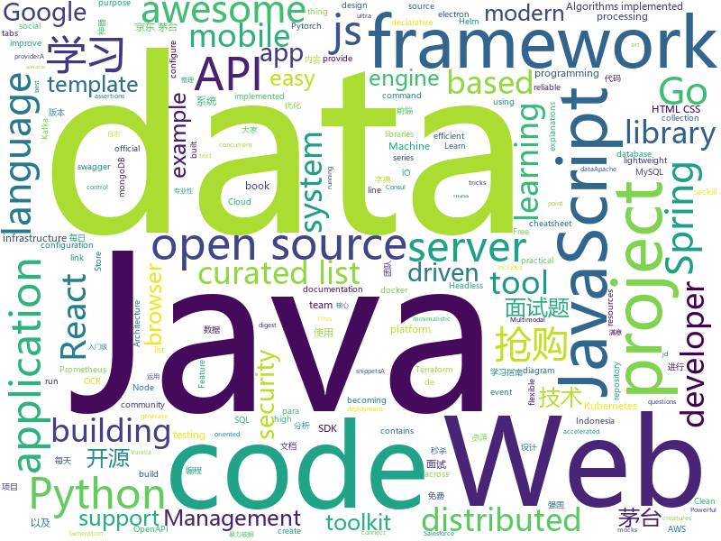

# 2021-01-05
See what the GitHub community is most excited about.

## python
+ [jd_maotai_seckill](https://github.com/ChinaVolvocars/jd_maotai_seckill)(**1,037 stars today**): 优化版本的京东茅台抢购神器
+ [sherlock](https://github.com/sherlock-project/sherlock)(**249 stars today**): 🔎Hunt down social media accounts by username across social networks
+ [faceai](https://github.com/vipstone/faceai)(**55 stars today**): 一款入门级的人脸、视频、文字检测以及识别的项目.
+ [Oblivion](https://github.com/loseys/Oblivion)(**15 stars today**): Data leak checker & OSINT Tool
+ [spot-sdk](https://github.com/boston-dynamics/spot-sdk)(**70 stars today**): Spot SDK repo
+ [deepqmc](https://github.com/deepqmc/deepqmc)(**7 stars today**): Deep learning quantum Monte Carlo for electrons in real space
+ [python-small-examples](https://github.com/jackzhenguo/python-small-examples)(**49 stars today**): 告别枯燥，致力于打造 Python 实用小例子
+ [system-design-primer](https://github.com/donnemartin/system-design-primer)(**157 stars today**): Learn how to design large-scale systems. Prep for the system design interview. Includes Anki flashcards.
+ [transformers](https://github.com/huggingface/transformers)(**59 stars today**): 🤗Transformers: State-of-the-art Natural Language Processing for Pytorch and TensorFlow 2.0.
+ [PaddleOCR](https://github.com/PaddlePaddle/PaddleOCR)(**27 stars today**): Awesome multilingual OCR toolkits based on PaddlePaddle （practical ultra lightweight OCR system, provide data annotation and synthesis tools, support training and deployment among server, mobile, embedded and IoT devices）
+ [taobao_seckill](https://github.com/jerry3747/taobao_seckill)(**77 stars today**): 淘宝、天猫半价抢购，抢电视、抢茅台，干死黄牛党
+ [Awesome-Multimodal-Research](https://github.com/Eurus-Holmes/Awesome-Multimodal-Research)(**27 stars today**): A curated list of Multimodal Related Research.
+ [Hyrule-Compendium-API](https://github.com/gadhagod/Hyrule-Compendium-API)(**5 stars today**): An API serving data on all creatures, monsters, materials, equipment, and treasure in The Legend of Zelda: Breath of the Wild
+ [jd_subscribe_seckill](https://github.com/ASAS1314/jd_subscribe_seckill)(**13 stars today**): 针对js_seckill代码进行了整理
+ [pika](https://github.com/tencent-ailab/pika)(**27 stars today**): a lightweight speech processing toolkit based on Pytorch and (Py)Kaldi
+ [jd_seckill_docker](https://github.com/ChinaArJun/jd_seckill_docker)(**7 stars today**): 京东茅台抢购神器docker优化版，喜欢记得Star谢谢
+ [boto3](https://github.com/boto/boto3)(**4 stars today**): AWS SDK for Python
+ [saleor](https://github.com/mirumee/saleor)(**15 stars today**): A modular, high performance, headless e-commerce platform built with Python, GraphQL, Django, and ReactJS.
+ [insightface](https://github.com/deepinsight/insightface)(**8 stars today**): Face Analysis Project on MXNet
+ [stock](https://github.com/pythonstock/stock)(**163 stars today**): stock，股票系统。使用python进行开发。
+ [airflow](https://github.com/apache/airflow)(**20 stars today**): Apache Airflow - A platform to programmatically author, schedule, and monitor workflows
+ [black](https://github.com/psf/black)(**19 stars today**): The uncompromising Python code formatter
+ [Python](https://github.com/TheAlgorithms/Python)(**168 stars today**): All Algorithms implemented in Python
+ [scipy](https://github.com/scipy/scipy)(**0 stars today**): Scipy library main repository
+ [iPERCore](https://github.com/iPERDance/iPERCore)(**34 stars today**): Liquid Warping GAN with Attention: A Unified Framework for Human Image Synthesis

## java
+ [Java](https://github.com/TheAlgorithms/Java)(**80 stars today**): All Algorithms implemented in Java
+ [miaosha](https://github.com/qiurunze123/miaosha)(**118 stars today**): ⭐⭐⭐⭐秒杀系统设计与实现.互联网工程师进阶与分析🙋🐓
+ [jdbc-postgres](https://github.com/devsuperior/jdbc-postgres)(**11 stars today**): 
+ [COLA](https://github.com/alibaba/COLA)(**43 stars today**): Clean Object-oriented & Layered Architecture
+ [tutorials](https://github.com/eugenp/tutorials)(**15 stars today**): Just Announced - "Learn Spring Security OAuth":
+ [ksql](https://github.com/confluentinc/ksql)(**2 stars today**): The event streaming database purpose-built for stream processing applications
+ [CS-Notes](https://github.com/CyC2018/CS-Notes)(**129 stars today**): 📚技术面试必备基础知识、Leetcode、计算机操作系统、计算机网络、系统设计、Java、Python、C++
+ [graal](https://github.com/oracle/graal)(**9 stars today**): GraalVM: Run Programs Faster Anywhere🚀
+ [presto](https://github.com/prestodb/presto)(**5 stars today**): The official home of the Presto distributed SQL query engine for big data
+ [zookeeper](https://github.com/apache/zookeeper)(**5 stars today**): Apache ZooKeeper
+ [canal](https://github.com/alibaba/canal)(**16 stars today**): 阿里巴巴 MySQL binlog 增量订阅&消费组件
+ [feast](https://github.com/feast-dev/feast)(**4 stars today**): Feature Store for Machine Learning
+ [strimzi-kafka-operator](https://github.com/strimzi/strimzi-kafka-operator)(**3 stars today**): Apache Kafka running on Kubernetes
+ [piggymetrics](https://github.com/sqshq/piggymetrics)(**7 stars today**): Microservice Architecture with Spring Boot, Spring Cloud and Docker
+ [RIBs](https://github.com/uber/RIBs)(**10 stars today**): Uber's cross-platform mobile architecture framework.
+ [junit5](https://github.com/junit-team/junit5)(**4 stars today**): ✅The 5th major version of the programmer-friendly testing framework for Java and the JVM
+ [lucene-solr](https://github.com/apache/lucene-solr)(**1 stars today**): Apache Lucene and Solr open-source search software
+ [quarkus](https://github.com/quarkusio/quarkus)(**15 stars today**): Quarkus: Supersonic Subatomic Java.
+ [graphhopper](https://github.com/graphhopper/graphhopper)(**4 stars today**): Open source routing engine for OpenStreetMap. Use it as Java library or server.
+ [google-java-format](https://github.com/google/google-java-format)(**2 stars today**): Reformats Java source code to comply with Google Java Style.
+ [maxwell](https://github.com/zendesk/maxwell)(**5 stars today**): Maxwell's daemon, a mysql-to-json kafka producer
+ [keycloak](https://github.com/keycloak/keycloak)(**10 stars today**): Open Source Identity and Access Management For Modern Applications and Services
+ [spring-authorization-server](https://github.com/spring-projects-experimental/spring-authorization-server)(**4 stars today**): A community-driven project led by the Spring Security team and is focused on delivering Authorization Server support to the Spring community
+ [selenium](https://github.com/SeleniumHQ/selenium)(**11 stars today**): A browser automation framework and ecosystem.
+ [AndroidAPS](https://github.com/nightscout/AndroidAPS)(**17 stars today**): 

## unknown
+ [500-AI-Machine-learning-Deep-learning-Computer-vision-NLP-Projects-with-code](https://github.com/ashishpatel26/500-AI-Machine-learning-Deep-learning-Computer-vision-NLP-Projects-with-code)(**258 stars today**): 500 AI Machine learning Deep learning Computer vision NLP Projects with code
+ [first-contributions](https://github.com/firstcontributions/first-contributions)(**319 stars today**): 🚀✨Help beginners to contribute to open source projects
+ [ml-visuals](https://github.com/dair-ai/ml-visuals)(**273 stars today**): 🎨ML Visuals contains figures and templates which you can reuse and customize to improve your scientific writing.
+ [Projects](https://github.com/karan/Projects)(**27 stars today**): 📃A list of practical projects that anyone can solve in any programming language.
+ [Awesome-CobaltStrike-Defence](https://github.com/MichaelKoczwara/Awesome-CobaltStrike-Defence)(**55 stars today**): Defences against Cobalt Strike
+ [awesome-cpp](https://github.com/fffaraz/awesome-cpp)(**96 stars today**): A curated list of awesome C++ (or C) frameworks, libraries, resources, and shiny things. Inspired by awesome-... stuff.
+ [modern-cpp-features](https://github.com/AnthonyCalandra/modern-cpp-features)(**12 stars today**): A cheatsheet of modern C++ language and library features.
+ [suning_seckill](https://github.com/8090shuo/suning_seckill)(**39 stars today**): 苏宁易购抢购茅台，茅台秒杀
+ [awesome-cpp-cn](https://github.com/jobbole/awesome-cpp-cn)(**45 stars today**): C++ 资源大全中文版，标准库、Web应用框架、人工智能、数据库、图片处理、机器学习、日志、代码分析等。由「开源前哨」和「CPP开发者」微信公号团队维护更新。
+ [PythonPark](https://github.com/Jack-Cherish/PythonPark)(**44 stars today**): Python开源项目之「自学编程之路」，学习指南+技术干货+大厂面经+资源分享
+ [developer-roadmap](https://github.com/kamranahmedse/developer-roadmap)(**513 stars today**): Roadmap to becoming a web developer in 2021
+ [swift-news](https://github.com/SAllen0400/swift-news)(**30 stars today**): Links from the stories discussed on Swift News
+ [Pentest-Tools](https://github.com/S3cur3Th1sSh1t/Pentest-Tools)(**19 stars today**): 
+ [architecture_decision_record](https://github.com/joelparkerhenderson/architecture_decision_record)(**6 stars today**): Architecture decision record (ADR) examples for software planning, IT leadership, and template documentation
+ [JavaFamily](https://github.com/AobingJava/JavaFamily)(**31 stars today**): 【Java面试+Java学习指南】 一份涵盖大部分Java程序员所需要掌握的核心知识。
+ [ansible-role-docker](https://github.com/geerlingguy/ansible-role-docker)(**2 stars today**): Ansible Role - Docker
+ [javascript-questions](https://github.com/lydiahallie/javascript-questions)(**41 stars today**): A long list of (advanced) JavaScript questions, and their explanations✨
+ [covid-19-data](https://github.com/nytimes/covid-19-data)(**9 stars today**): An ongoing repository of data on coronavirus cases and deaths in the U.S.
+ [vagas](https://github.com/backend-br/vagas)(**7 stars today**): ✌️Espaço para divulgação de vagas para backenders
+ [github-issue-templates](https://github.com/stevemao/github-issue-templates)(**3 stars today**): 🔣A collection of GitHub issue and pull request templates
+ [COVID-19](https://github.com/pcm-dpc/COVID-19)(**4 stars today**): COVID-19 Italia - Monitoraggio situazione
+ [AspNetCore-Developer-Roadmap](https://github.com/MoienTajik/AspNetCore-Developer-Roadmap)(**14 stars today**): Roadmap to becoming an ASP.NET Core developer in 2021
+ [awesome-nextjs](https://github.com/unicodeveloper/awesome-nextjs)(**13 stars today**): 📔📚A curated list of awesome resources : books, videos, articles about using Next.js (A minimalistic framework for universal server-rendered React applications)
+ [996.Leave](https://github.com/623637646/996.Leave)(**16 stars today**): 逃离996
+ [You-Dont-Know-JS](https://github.com/getify/You-Dont-Know-JS)(**54 stars today**): A book series on JavaScript. @YDKJS on twitter.

## javascript
+ [TabFS](https://github.com/osnr/TabFS)(**429 stars today**): 🗄Mount your browser tabs as a filesystem.
+ [javascript-algorithms](https://github.com/trekhleb/javascript-algorithms)(**244 stars today**): 📝Algorithms and data structures implemented in JavaScript with explanations and links to further readings
+ [clean-code-javascript](https://github.com/ryanmcdermott/clean-code-javascript)(**204 stars today**): 🛁Clean Code concepts adapted for JavaScript
+ [fullstack-course4](https://github.com/jhu-ep-coursera/fullstack-course4)(**18 stars today**): Example code for HTML, CSS, and Javascript for Web Developers Coursera Course
+ [fe-interview](https://github.com/haizlin/fe-interview)(**31 stars today**): 前端面试每日 3+1，以面试题来驱动学习，提倡每日学习与思考，每天进步一点！每天早上5点纯手工发布面试题（死磕自己，愉悦大家），3000+道前端面试题全面覆盖，HTML/CSS/JavaScript/Vue/React/Nodejs/TypeScript/ECMAScritpt/Webpack/Jquery/小程序/软技能……
+ [cypress](https://github.com/cypress-io/cypress)(**16 stars today**): Fast, easy and reliable testing for anything that runs in a browser.
+ [strapi](https://github.com/strapi/strapi)(**27 stars today**): 🚀Open source Node.js Headless CMS to easily build customisable APIs
+ [OpenAPI-Specification](https://github.com/OAI/OpenAPI-Specification)(**12 stars today**): The OpenAPI Specification Repository
+ [myDrive](https://github.com/subnub/myDrive)(**233 stars today**): Node.js and mongoDB Google Drive Clone
+ [How-To-Ask-Questions-The-Smart-Way](https://github.com/ryanhanwu/How-To-Ask-Questions-The-Smart-Way)(**228 stars today**): 本文原文由知名 Hacker Eric S. Raymond 所撰寫，教你如何正確的提出技術問題並獲得你滿意的答案。
+ [es6-cheatsheet](https://github.com/DrkSephy/es6-cheatsheet)(**35 stars today**): ES2015 [ES6] cheatsheet containing tips, tricks, best practices and code snippets
+ [Javascript](https://github.com/TheAlgorithms/Javascript)(**129 stars today**): A repository for All algorithms implemented in Javascript (for educational purposes only)
+ [mermaid](https://github.com/mermaid-js/mermaid)(**24 stars today**): Generation of diagram and flowchart from text in a similar manner as markdown
+ [thegreatsuspender](https://github.com/greatsuspender/thegreatsuspender)(**9 stars today**): A chrome extension for suspending all tabs to free up memory
+ [react](https://github.com/facebook/react)(**62 stars today**): A declarative, efficient, and flexible JavaScript library for building user interfaces.
+ [swiper](https://github.com/nolimits4web/swiper)(**14 stars today**): Most modern mobile touch slider with hardware accelerated transitions
+ [bootstrap](https://github.com/twbs/bootstrap)(**30 stars today**): The most popular HTML, CSS, and JavaScript framework for developing responsive, mobile first projects on the web.
+ [cli](https://github.com/npm/cli)(**7 stars today**): the package manager for JavaScript
+ [node-red](https://github.com/node-red/node-red)(**42 stars today**): Low-code programming for event-driven applications
+ [drawio-desktop](https://github.com/jgraph/drawio-desktop)(**43 stars today**): Official electron build of diagrams.net
+ [nextjs-tailwind-capacitor](https://github.com/mlynch/nextjs-tailwind-capacitor)(**32 stars today**): A starting point for building an iOS, Android, and Progressive Web App with Tailwind CSS, React, and Capacitor
+ [react-native](https://github.com/facebook/react-native)(**33 stars today**): A framework for building native apps with React.
+ [odoo](https://github.com/odoo/odoo)(**19 stars today**): Odoo. Open Source Apps To Grow Your Business.
+ [lwc-recipes](https://github.com/trailheadapps/lwc-recipes)(**2 stars today**): A collection of easy-to-digest code examples for Lightning Web Components on Salesforce Platform
+ [showdoc](https://github.com/star7th/showdoc)(**41 stars today**): ShowDoc is a tool greatly applicable for an IT team to share documents online一个非常适合IT团队的在线API文档、技术文档工具

## html
+ [Web-Fuzzing-Box](https://github.com/gh0stkey/Web-Fuzzing-Box)(**87 stars today**): Web Fuzzing Box - Web 模糊测试字典与一些Payloads，主要包含：弱口令暴力破解、目录以及文件枚举、Web漏洞...字典运用于实战案例：https://gh0st.cn/archives/2019-11-11/1
+ [helm-charts](https://github.com/prometheus-community/helm-charts)(**4 stars today**): Prometheus community Helm charts
+ [complete-web-development-bangla-resources](https://github.com/ProgrammingHero1/complete-web-development-bangla-resources)(**7 stars today**): 
+ [tidytuesday](https://github.com/rfordatascience/tidytuesday)(**14 stars today**): Official repo for the #tidytuesday project
+ [pml-book](https://github.com/probml/pml-book)(**84 stars today**): "Probabilistic Machine Learning" - a book series by Kevin Murphy
+ [zenbot](https://github.com/DeviaVir/zenbot)(**8 stars today**): Zenbot is a command-line cryptocurrency trading bot using Node.js and MongoDB.
+ [web-moderno](https://github.com/cod3rcursos/web-moderno)(**8 stars today**): 
+ [CamPhish](https://github.com/techchipnet/CamPhish)(**4 stars today**): Grab cam shots from target's phone front camera or PC webcam just sending a link.
+ [swagger-codegen](https://github.com/swagger-api/swagger-codegen)(**9 stars today**): swagger-codegen contains a template-driven engine to generate documentation, API clients and server stubs in different languages by parsing your OpenAPI / Swagger definition.
+ [privacytools.io](https://github.com/privacytools/privacytools.io)(**10 stars today**): 🛡🛠You are being watched. Protect your privacy against global mass surveillance.
+ [DataCamp](https://github.com/wblakecannon/DataCamp)(**2 stars today**): DataCamp data-science courses
+ [js-xss](https://github.com/leizongmin/js-xss)(**11 stars today**): Sanitize untrusted HTML (to prevent XSS) with a configuration specified by a Whitelist
+ [kubespray](https://github.com/kubernetes-sigs/kubespray)(**8 stars today**): Deploy a Production Ready Kubernetes Cluster
+ [DAFTAR-API-LOKAL-INDONESIA](https://github.com/farizdotid/DAFTAR-API-LOKAL-INDONESIA)(**5 stars today**): Berisi API tentang Data Indonesia ataupun API yang dibuat oleh developer Indonesia <3
+ [keycloak-documentation](https://github.com/keycloak/keycloak-documentation)(**0 stars today**): 
+ [cypress-example-kitchensink](https://github.com/cypress-io/cypress-example-kitchensink)(**0 stars today**): This is an example app used to showcase Cypress.io testing.
+ [webmin](https://github.com/webmin/webmin)(**2 stars today**): Powerful and flexible web-based server management control panel
+ [amundsen](https://github.com/amundsen-io/amundsen)(**4 stars today**): Amundsen is a metadata driven application for improving the productivity of data analysts, data scientists and engineers when interacting with data.
+ [RateMySupervisor](https://github.com/kgco/RateMySupervisor)(**6 stars today**): 永久免费开源的导师评价数据、数据爬虫、无需编程基础的展示网页以及新信息补充平台
+ [charts](https://github.com/bitnami/charts)(**10 stars today**): Helm Charts
+ [lovexuexi](https://github.com/james-bond-007/lovexuexi)(**1 stars today**): 我爱学习强国。学习强国聚合了大量可免费阅读的期刊、古籍、公开课、歌曲、戏曲、电影、图书等资料，内容严谨，专业性强。没有博眼球，无下限的自媒体内容和虚假新闻。推荐大家自发积极学习使用。
+ [gentelella](https://github.com/ColorlibHQ/gentelella)(**6 stars today**): Free Bootstrap 4 Admin Dashboard Template
+ [JavaScript30](https://github.com/wesbos/JavaScript30)(**15 stars today**): 30 Day Vanilla JS Challenge
+ [Record](https://github.com/facturi/Record)(**14 stars today**): 
+ [html-css](https://github.com/gustavoguanabara/html-css)(**9 stars today**): Curso de HTML5 e CSS3

## go
+ [photoprism](https://github.com/photoprism/photoprism)(**415 stars today**): Personal Photo Management powered by Go and Google TensorFlow
+ [jd_seckill](https://github.com/ztino/jd_seckill)(**79 stars today**): go版本jd_seckill，京东茅台抢购，降低使用门栏。
+ [terraform](https://github.com/hashicorp/terraform)(**16 stars today**): Terraform enables you to safely and predictably create, change, and improve infrastructure. It is an open source tool that codifies APIs into declarative configuration files that can be shared amongst team members, treated as code, edited, reviewed, and versioned.
+ [OpenDiablo2](https://github.com/OpenDiablo2/OpenDiablo2)(**30 stars today**): An open source re-implementation of Diablo 2
+ [cli](https://github.com/cli/cli)(**30 stars today**): GitHub’s official command line tool
+ [ingress-nginx](https://github.com/kubernetes/ingress-nginx)(**20 stars today**): NGINX Ingress Controller for Kubernetes
+ [etcd](https://github.com/etcd-io/etcd)(**19 stars today**): Distributed reliable key-value store for the most critical data of a distributed system
+ [golangci-lint](https://github.com/golangci/golangci-lint)(**4 stars today**): Fast linters Runner for Go
+ [operator-sdk](https://github.com/operator-framework/operator-sdk)(**4 stars today**): SDK for building Kubernetes applications. Provides high level APIs, useful abstractions, and project scaffolding.
+ [consul](https://github.com/hashicorp/consul)(**7 stars today**): Consul is a distributed, highly available, and data center aware solution to connect and configure applications across dynamic, distributed infrastructure.
+ [origin](https://github.com/openshift/origin)(**5 stars today**): Conformance test suite for OpenShift
+ [aws-sdk-go](https://github.com/aws/aws-sdk-go)(**5 stars today**): AWS SDK for the Go programming language.
+ [terraform-provider-aws](https://github.com/hashicorp/terraform-provider-aws)(**3 stars today**): Terraform AWS provider
+ [testify](https://github.com/stretchr/testify)(**13 stars today**): A toolkit with common assertions and mocks that plays nicely with the standard library
+ [concourse](https://github.com/concourse/concourse)(**2 stars today**): Concourse is a container-based continuous thing-doer written in Go and Elm.
+ [buildkit](https://github.com/moby/buildkit)(**15 stars today**): concurrent, cache-efficient, and Dockerfile-agnostic builder toolkit
+ [pq](https://github.com/lib/pq)(**6 stars today**): Pure Go Postgres driver for database/sql
+ [awesome-go](https://github.com/avelino/awesome-go)(**80 stars today**): A curated list of awesome Go frameworks, libraries and software
+ [Go](https://github.com/TheAlgorithms/Go)(**29 stars today**): Algorithms Implemented in GoLang
+ [protobuf](https://github.com/golang/protobuf)(**5 stars today**): Go support for Google's protocol buffers
+ [gosec](https://github.com/securego/gosec)(**3 stars today**): Golang security checker
+ [cloudquery](https://github.com/cloudquery/cloudquery)(**14 stars today**): cloudquery transforms your cloud infrastructure into queryable SQL or Neo4j tables for easy monitoring, governance and security.
+ [dive](https://github.com/wagoodman/dive)(**24 stars today**): A tool for exploring each layer in a docker image
+ [go-plugin](https://github.com/hashicorp/go-plugin)(**6 stars today**): Golang plugin system over RPC.
+ [prometheus-operator](https://github.com/prometheus-operator/prometheus-operator)(**7 stars today**): Prometheus Operator creates/configures/manages Prometheus clusters atop Kubernetes

## WordCloud

