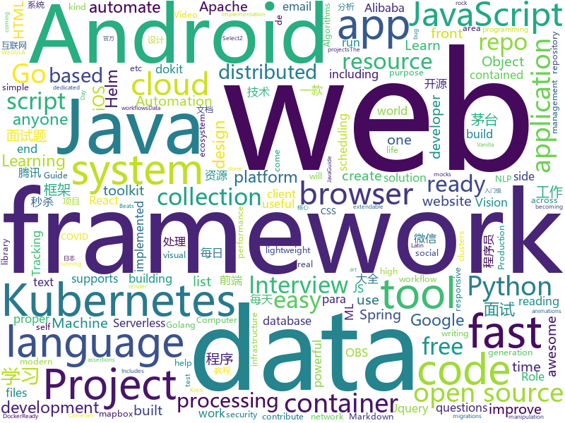

# 2021-01-06
See what the GitHub community is most excited about.

## python
+ [mmtracking](https://github.com/open-mmlab/mmtracking)(**112 stars today**): OpenMMLab Video Perception Toolbox. It supports Single Object Tracking (SOT), Multiple Object Tracking (MOT), Video Object Detection (VID) with a unified framework.
+ [system-design-primer](https://github.com/donnemartin/system-design-primer)(**188 stars today**): Learn how to design large-scale systems. Prep for the system design interview. Includes Anki flashcards.
+ [jd_maotai_seckill](https://github.com/ChinaVolvocars/jd_maotai_seckill)(**838 stars today**): 不抢茅台了，改行炒股了
+ [alive-progress](https://github.com/rsalmei/alive-progress)(**227 stars today**): A new kind of Progress Bar, with real time throughput, eta and very cool animations!
+ [ImageAI](https://github.com/OlafenwaMoses/ImageAI)(**63 stars today**): A python library built to empower developers to build applications and systems with self-contained Computer Vision capabilities
+ [sherlock](https://github.com/sherlock-project/sherlock)(**173 stars today**): 🔎Hunt down social media accounts by username across social networks
+ [faceai](https://github.com/vipstone/faceai)(**177 stars today**): 一款入门级的人脸、视频、文字检测以及识别的项目.
+ [12306](https://github.com/gzldc/12306)(**26 stars today**): 12306抢票脚本
+ [transformers](https://github.com/huggingface/transformers)(**62 stars today**): 🤗Transformers: State-of-the-art Natural Language Processing for Pytorch and TensorFlow 2.0.
+ [localstack](https://github.com/localstack/localstack)(**20 stars today**): 💻A fully functional local AWS cloud stack. Develop and test your cloud & Serverless apps offline!
+ [wait-for-it](https://github.com/vishnubob/wait-for-it)(**8 stars today**): Pure bash script to test and wait on the availability of a TCP host and port
+ [WebMap](https://github.com/Anteste/WebMap)(**40 stars today**): A Python tool used to automate the execution of the following tools : Nmap , Nikto and Dirsearch but also to automate the report generation during a Web Penetration Testing
+ [jupytext](https://github.com/mwouts/jupytext)(**19 stars today**): Jupyter Notebooks as Markdown Documents, Julia, Python or R scripts
+ [datasets](https://github.com/huggingface/datasets)(**93 stars today**): 🤗The largest hub of ready-to-use NLP datasets for ML models with fast, easy-to-use and efficient data manipulation tools
+ [black](https://github.com/psf/black)(**21 stars today**): The uncompromising Python code formatter
+ [celery](https://github.com/celery/celery)(**10 stars today**): Distributed Task Queue (development branch)
+ [game-programmer](https://github.com/miloyip/game-programmer)(**19 stars today**): A Study Path for Game Programmer
+ [insightface](https://github.com/deepinsight/insightface)(**17 stars today**): Face Analysis Project on MXNet
+ [compose](https://github.com/docker/compose)(**6 stars today**): Define and run multi-container applications with Docker
+ [EasyOCR](https://github.com/JaidedAI/EasyOCR)(**13 stars today**): Ready-to-use OCR with 80+ supported languages and all popular writing scripts including Latin, Chinese, Arabic, Devanagari, Cyrillic and etc.
+ [fastapi](https://github.com/tiangolo/fastapi)(**52 stars today**): FastAPI framework, high performance, easy to learn, fast to code, ready for production
+ [great_expectations](https://github.com/great-expectations/great_expectations)(**11 stars today**): Always know what to expect from your data.
+ [checkov](https://github.com/bridgecrewio/checkov)(**5 stars today**): Prevent cloud misconfigurations during build-time for Terraform, Cloudformation, Kubernetes, Serverless framework and other infrastructure-as-code-languages with Checkov by Bridgecrew.
+ [airflow](https://github.com/apache/airflow)(**28 stars today**): Apache Airflow - A platform to programmatically author, schedule, and monitor workflows
+ [Oblivion](https://github.com/loseys/Oblivion)(**88 stars today**): Data leak checker & OSINT Tool

## java
+ [miaosha](https://github.com/qiurunze123/miaosha)(**153 stars today**): ⭐⭐⭐⭐秒杀系统设计与实现.互联网工程师进阶与分析🙋🐓
+ [Java](https://github.com/TheAlgorithms/Java)(**282 stars today**): All Algorithms implemented in Java
+ [JavaGuide](https://github.com/Snailclimb/JavaGuide)(**90 stars today**): 「Java学习+面试指南」一份涵盖大部分 Java 程序员所需要掌握的核心知识。准备 Java 面试，首选 JavaGuide！
+ [tutorials](https://github.com/eugenp/tutorials)(**25 stars today**): Just Announced - "Learn Spring Security OAuth":
+ [selenium](https://github.com/SeleniumHQ/selenium)(**14 stars today**): A browser automation framework and ecosystem.
+ [grpc-java](https://github.com/grpc/grpc-java)(**12 stars today**): The Java gRPC implementation. HTTP/2 based RPC
+ [HikariCP](https://github.com/brettwooldridge/HikariCP)(**14 stars today**): 光 HikariCP・A solid, high-performance, JDBC connection pool at last.
+ [DoraemonKit](https://github.com/didi/DoraemonKit)(**73 stars today**): A full-featured App (iOS & Android) development assistant. You deserve it. 简称 "DoKit" 。一款功能齐全的客户端（ iOS 、Android、微信小程序 ）研发助手，你值得拥有。https://www.dokit.cn/
+ [spring-cloud-alibaba](https://github.com/alibaba/spring-cloud-alibaba)(**26 stars today**): Spring Cloud Alibaba provides a one-stop solution for application development for the distributed solutions of Alibaba middleware.
+ [jdbc-postgres](https://github.com/devsuperior/jdbc-postgres)(**18 stars today**): 
+ [elasticsearch](https://github.com/elastic/elasticsearch)(**17 stars today**): Open Source, Distributed, RESTful Search Engine
+ [CS-Notes](https://github.com/CyC2018/CS-Notes)(**116 stars today**): 📚技术面试必备基础知识、Leetcode、计算机操作系统、计算机网络、系统设计、Java、Python、C++
+ [termux-app](https://github.com/termux/termux-app)(**29 stars today**): Android terminal and Linux environment - app repository.
+ [BurpCustomizer](https://github.com/CoreyD97/BurpCustomizer)(**44 stars today**): Because just a dark theme wasn't enough!
+ [incubator-dolphinscheduler](https://github.com/apache/incubator-dolphinscheduler)(**4 stars today**): Dolphin Scheduler is a distributed and easy-to-extend visual workflow scheduling platform, dedicated to solving the complex dependencies in data processing, making the scheduling system out of the box for data processing.(分布式易扩展的可视化工作流任务调度)
+ [XXPermissions](https://github.com/getActivity/XXPermissions)(**6 stars today**): Android 权限请求框架，已适配 Android 11
+ [RIBs](https://github.com/uber/RIBs)(**7 stars today**): Uber's cross-platform mobile architecture framework.
+ [jmeter](https://github.com/apache/jmeter)(**15 stars today**): Apache JMeter
+ [tiny-spring](https://github.com/code4craft/tiny-spring)(**24 stars today**): A tiny IoC container refer to Spring.
+ [antlr4](https://github.com/antlr/antlr4)(**13 stars today**): ANTLR (ANother Tool for Language Recognition) is a powerful parser generator for reading, processing, executing, or translating structured text or binary files.
+ [zookeeper](https://github.com/apache/zookeeper)(**6 stars today**): Apache ZooKeeper
+ [InternetArchitect](https://github.com/bjmashibing/InternetArchitect)(**18 stars today**): 年薪百万互联网架构师课程文档及源码(公开部分)
+ [android-interview-questions](https://github.com/MindorksOpenSource/android-interview-questions)(**4 stars today**): Your Cheat Sheet For Android Interview - Android Interview Questions
+ [spring-framework](https://github.com/spring-projects/spring-framework)(**26 stars today**): Spring Framework
+ [karate](https://github.com/intuit/karate)(**4 stars today**): Test Automation Made Simple

## unknown
+ [Project-Lightspeed](https://github.com/GRVYDEV/Project-Lightspeed)(**488 stars today**): A self contained OBS -> FTL -> WebRTC live streaming server. Comprised of 3 parts once configured anyone can achieve sub-second OBS to the browser livestreaming
+ [500-AI-Machine-learning-Deep-learning-Computer-vision-NLP-Projects-with-code](https://github.com/ashishpatel26/500-AI-Machine-learning-Deep-learning-Computer-vision-NLP-Projects-with-code)(**518 stars today**): 500 AI Machine learning Deep learning Computer vision NLP Projects with code
+ [PythonPark](https://github.com/Jack-Cherish/PythonPark)(**43 stars today**): Python开源项目之「自学编程之路」，学习指南+技术干货+大厂面经+资源分享
+ [955.WLB](https://github.com/formulahendry/955.WLB)(**52 stars today**): 955 不加班的公司名单 - 工作 955，work–life balance (工作与生活的平衡)
+ [Projects](https://github.com/karan/Projects)(**149 stars today**): 📃A list of practical projects that anyone can solve in any programming language.
+ [awesome-javascript](https://github.com/sorrycc/awesome-javascript)(**57 stars today**): 🐢A collection of awesome browser-side JavaScript libraries, resources and shiny things.
+ [gitignore](https://github.com/github/gitignore)(**59 stars today**): A collection of useful .gitignore templates
+ [COVID-19](https://github.com/CSSEGISandData/COVID-19)(**14 stars today**): Novel Coronavirus (COVID-19) Cases, provided by JHU CSSE
+ [developer-roadmap](https://github.com/kamranahmedse/developer-roadmap)(**299 stars today**): Roadmap to becoming a web developer in 2021
+ [first-contributions](https://github.com/firstcontributions/first-contributions)(**391 stars today**): 🚀✨Help beginners to contribute to open source projects
+ [Resources-for-engineering-students-who-like-mathematics](https://github.com/yewalenikhil65/Resources-for-engineering-students-who-like-mathematics)(**6 stars today**): This is a collection of resources that I feel will prove useful to anyone studying in the area of engineering but also like mathematics. I urge anyone who comes across this, to contribute to the list in proper sequence/indexing
+ [ml-visuals](https://github.com/dair-ai/ml-visuals)(**207 stars today**): 🎨ML Visuals contains figures and templates which you can reuse and customize to improve your scientific writing.
+ [You-Dont-Know-JS](https://github.com/getify/You-Dont-Know-JS)(**54 stars today**): A book series on JavaScript. @YDKJS on twitter.
+ [swift-news](https://github.com/SAllen0400/swift-news)(**8 stars today**): Links from the stories discussed on Swift News
+ [advml](https://github.com/antsecurity/advml)(**1 stars today**): AI安全
+ [stanford-cs-229-machine-learning](https://github.com/afshinea/stanford-cs-229-machine-learning)(**16 stars today**): VIP cheatsheets for Stanford's CS 229 Machine Learning
+ [vagas](https://github.com/frontendbr/vagas)(**17 stars today**): 🔬Espaço para divulgação de vagas para front-enders.
+ [suning_seckill](https://github.com/8090shuo/suning_seckill)(**50 stars today**): 苏宁易购抢购茅台，茅台秒杀
+ [Awesome-CobaltStrike-Defence](https://github.com/MichaelKoczwara/Awesome-CobaltStrike-Defence)(**61 stars today**): Defences against Cobalt Strike
+ [awesome-oneliner-bugbounty](https://github.com/dwisiswant0/awesome-oneliner-bugbounty)(**25 stars today**): A collection of awesome one-liner scripts especially for bug bounty tips.
+ [awesome-go-cn](https://github.com/jobbole/awesome-go-cn)(**17 stars today**): Go 资源大全中文版， 内容包括：Web框架、模板引擎、表单、身份认证、数据库、ORM框架、图片处理、文本处理、自然语言处理、机器学习、日志、代码分析、教程和（电子）书等。由「开源前哨」和「Go开发大全」微信团队维护。
+ [ansible-role-docker](https://github.com/geerlingguy/ansible-role-docker)(**4 stars today**): Ansible Role - Docker
+ [Free_CyberSecurity_Professional_Development_Resources](https://github.com/gerryguy311/Free_CyberSecurity_Professional_Development_Resources)(**5 stars today**): An awesome list of FREE resources for training, conferences, speaking, labs, reading, etc that are free. Originally built during COVID-19 for cybersecurity professionals with downtime can take advantage of to improve their skills and marketability to come out on the other side ready to rock. Now its taken on a life of its own and will persist, C…
+ [bestJavaer](https://github.com/crisxuan/bestJavaer)(**11 stars today**): 这是一个成为更好的Java程序员的系列教程
+ [design-patterns-for-humans](https://github.com/kamranahmedse/design-patterns-for-humans)(**17 stars today**): An ultra-simplified explanation to design patterns

## javascript
+ [hacker-scripts](https://github.com/NARKOZ/hacker-scripts)(**28 stars today**): Based on a true story
+ [reactjs-interview-questions](https://github.com/sudheerj/reactjs-interview-questions)(**40 stars today**): List of top 500 ReactJS Interview Questions & Answers....Coding exercise questions are coming soon!!
+ [cypress](https://github.com/cypress-io/cypress)(**28 stars today**): Fast, easy and reliable testing for anything that runs in a browser.
+ [select2](https://github.com/select2/select2)(**2 stars today**): Select2 is a jQuery based replacement for select boxes. It supports searching, remote data sets, and infinite scrolling of results.
+ [gulp](https://github.com/gulpjs/gulp)(**8 stars today**): A toolkit to automate & enhance your workflow
+ [maplibre-gl-js](https://github.com/maplibre/maplibre-gl-js)(**12 stars today**): MapLibre GL is a free and open-source fork of @mapbox/mapbox-gl
+ [carbon](https://github.com/carbon-design-system/carbon)(**2 stars today**): A design system built by IBM
+ [eslint-plugin-import](https://github.com/benmosher/eslint-plugin-import)(**5 stars today**): ESLint plugin with rules that help validate proper imports.
+ [javascript](https://github.com/airbnb/javascript)(**44 stars today**): JavaScript Style Guide
+ [appium](https://github.com/appium/appium)(**8 stars today**): 📱Automation for iOS, Android, and Windows Apps.
+ [lucky-draw](https://github.com/vitozyf/lucky-draw)(**34 stars today**): 年会抽奖程序
+ [fullstack-course4](https://github.com/jhu-ep-coursera/fullstack-course4)(**20 stars today**): Example code for HTML, CSS, and Javascript for Web Developers Coursera Course
+ [standard-version](https://github.com/conventional-changelog/standard-version)(**6 stars today**): 🏆Automate versioning and CHANGELOG generation, with semver.org and conventionalcommits.org
+ [myDrive](https://github.com/subnub/myDrive)(**24 stars today**): Node.js and mongoDB Google Drive Clone
+ [create-react-app](https://github.com/facebook/create-react-app)(**36 stars today**): Set up a modern web app by running one command.
+ [OpenAPI-Specification](https://github.com/OAI/OpenAPI-Specification)(**20 stars today**): The OpenAPI Specification Repository
+ [corona-widget](https://github.com/rphl/corona-widget)(**6 stars today**): COVID-19 Inzidenz-Widget für iOS innerhalb Deutschlands🇩🇪(Kreis/Stadt + Bundesland + Trend)
+ [react-table](https://github.com/tannerlinsley/react-table)(**12 stars today**): ⚛️Hooks for building fast and extendable tables and datagrids for React
+ [axios](https://github.com/axios/axios)(**48 stars today**): Promise based HTTP client for the browser and node.js
+ [svelte](https://github.com/sveltejs/svelte)(**41 stars today**): Cybernetically enhanced web apps
+ [gatsby](https://github.com/gatsbyjs/gatsby)(**36 stars today**): Build blazing fast, modern apps and websites with React
+ [fe-interview](https://github.com/haizlin/fe-interview)(**101 stars today**): 前端面试每日 3+1，以面试题来驱动学习，提倡每日学习与思考，每天进步一点！每天早上5点纯手工发布面试题（死磕自己，愉悦大家），3000+道前端面试题全面覆盖，HTML/CSS/JavaScript/Vue/React/Nodejs/TypeScript/ECMAScritpt/Webpack/Jquery/小程序/软技能……
+ [markdown-here](https://github.com/adam-p/markdown-here)(**22 stars today**): Google Chrome, Firefox, and Thunderbird extension that lets you write email in Markdown and render it before sending.
+ [TIMSDK](https://github.com/tencentyun/TIMSDK)(**4 stars today**): 腾讯云即时通信 IM 服务，国内下载镜像：
+ [Javascript](https://github.com/TheAlgorithms/Javascript)(**32 stars today**): A repository for All algorithms implemented in Javascript (for educational purposes only)

## html
+ [charts](https://github.com/bitnami/charts)(**12 stars today**): Helm Charts
+ [helm-charts](https://github.com/prometheus-community/helm-charts)(**9 stars today**): Prometheus community Helm charts
+ [styleguide](https://github.com/google/styleguide)(**13 stars today**): Style guides for Google-originated open-source projects
+ [EIPs](https://github.com/ethereum/EIPs)(**4 stars today**): The Ethereum Improvement Proposal repository
+ [wpt](https://github.com/web-platform-tests/wpt)(**3 stars today**): Test suites for Web platform specs — including WHATWG, W3C, and others
+ [foundation-sites](https://github.com/foundation/foundation-sites)(**3 stars today**): The most advanced responsive front-end framework in the world. Quickly create prototypes and production code for sites that work on any kind of device.
+ [boost](https://github.com/boostorg/boost)(**6 stars today**): Super-project for modularized Boost
+ [eks-charts](https://github.com/aws/eks-charts)(**1 stars today**): Amazon EKS Helm chart repository
+ [docker.github.io](https://github.com/docker/docker.github.io)(**2 stars today**): Source repo for Docker's Documentation
+ [fastText](https://github.com/facebookresearch/fastText)(**3 stars today**): Library for fast text representation and classification.
+ [tidytuesday](https://github.com/rfordatascience/tidytuesday)(**6 stars today**): Official repo for the #tidytuesday project
+ [ansible-role-mysql](https://github.com/geerlingguy/ansible-role-mysql)(**0 stars today**): Ansible Role - MySQL
+ [html-css](https://github.com/gustavoguanabara/html-css)(**7 stars today**): Curso de HTML5 e CSS3
+ [qcloud-documents](https://github.com/tencentyun/qcloud-documents)(**2 stars today**): 腾讯云官方文档
+ [3d-force-graph](https://github.com/vasturiano/3d-force-graph)(**3 stars today**): 3D force-directed graph component using ThreeJS/WebGL
+ [uikit](https://github.com/uikit/uikit)(**6 stars today**): A lightweight and modular front-end framework for developing fast and powerful web interfaces
+ [tools](https://github.com/googlecodelabs/tools)(**4 stars today**): Codelabs management & hosting tools
+ [JavaScript30](https://github.com/wesbos/JavaScript30)(**8 stars today**): 30 Day Vanilla JS Challenge
+ [amundsen](https://github.com/amundsen-io/amundsen)(**5 stars today**): Amundsen is a metadata driven application for improving the productivity of data analysts, data scientists and engineers when interacting with data.
+ [website](https://github.com/kubernetes/website)(**2 stars today**): Kubernetes website and documentation repo:
+ [learning-area](https://github.com/mdn/learning-area)(**5 stars today**): Github repo for the MDN Learning Area.
+ [calico](https://github.com/projectcalico/calico)(**6 stars today**): Cloud native networking and network security
+ [argo-helm](https://github.com/argoproj/argo-helm)(**0 stars today**): ArgoProj Helm Charts
+ [responsive-html-email-template](https://github.com/leemunroe/responsive-html-email-template)(**4 stars today**): A free simple responsive HTML email template
+ [kubespray](https://github.com/kubernetes-sigs/kubespray)(**8 stars today**): Deploy a Production Ready Kubernetes Cluster

## go
+ [helloworld](https://github.com/ztino/helloworld)(**161 stars today**): Hello，MT
+ [distribution](https://github.com/docker/distribution)(**5 stars today**): The toolkit to pack, ship, store, and deliver container content
+ [prometheus-operator](https://github.com/prometheus-operator/prometheus-operator)(**9 stars today**): Prometheus Operator creates/configures/manages Prometheus clusters atop Kubernetes
+ [zerolog](https://github.com/rs/zerolog)(**5 stars today**): Zero Allocation JSON Logger
+ [photoprism](https://github.com/photoprism/photoprism)(**327 stars today**): Personal Photo Management powered by Go and Google TensorFlow
+ [testify](https://github.com/stretchr/testify)(**15 stars today**): A toolkit with common assertions and mocks that plays nicely with the standard library
+ [vitess](https://github.com/vitessio/vitess)(**14 stars today**): Vitess is a database clustering system for horizontal scaling of MySQL.
+ [migrate](https://github.com/golang-migrate/migrate)(**4 stars today**): Database migrations. CLI and Golang library.
+ [dashboard](https://github.com/kubernetes/dashboard)(**8 stars today**): General-purpose web UI for Kubernetes clusters
+ [beats](https://github.com/elastic/beats)(**4 stars today**): 🐠Beats - Lightweight shippers for Elasticsearch & Logstash
+ [moby](https://github.com/moby/moby)(**10 stars today**): Moby Project - a collaborative project for the container ecosystem to assemble container-based systems
+ [argo](https://github.com/argoproj/argo)(**9 stars today**): Argo Workflows: Get stuff done with Kubernetes.
+ [jaeger](https://github.com/jaegertracing/jaeger)(**17 stars today**): CNCF Jaeger, a Distributed Tracing Platform
+ [terraform](https://github.com/hashicorp/terraform)(**28 stars today**): Terraform enables you to safely and predictably create, change, and improve infrastructure. It is an open source tool that codifies APIs into declarative configuration files that can be shared amongst team members, treated as code, edited, reviewed, and versioned.
+ [gosec](https://github.com/securego/gosec)(**7 stars today**): Golang security checker
+ [go](https://github.com/golang/go)(**52 stars today**): The Go programming language
+ [charts](https://github.com/helm/charts)(**3 stars today**): ⚠️(OBSOLETE) Curated applications for Kubernetes
+ [terraform-provider-azurerm](https://github.com/terraform-providers/terraform-provider-azurerm)(**4 stars today**): Terraform provider for Azure Resource Manager
+ [node_exporter](https://github.com/prometheus/node_exporter)(**6 stars today**): Exporter for machine metrics
+ [helm](https://github.com/helm/helm)(**11 stars today**): The Kubernetes Package Manager
+ [client-go](https://github.com/kubernetes/client-go)(**5 stars today**): Go client for Kubernetes.
+ [influxdb](https://github.com/influxdata/influxdb)(**10 stars today**): Scalable datastore for metrics, events, and real-time analytics
+ [logrus](https://github.com/sirupsen/logrus)(**3 stars today**): Structured, pluggable logging for Go.
+ [hugo](https://github.com/gohugoio/hugo)(**23 stars today**): The world’s fastest framework for building websites.
+ [mkcert](https://github.com/FiloSottile/mkcert)(**20 stars today**): A simple zero-config tool to make locally trusted development certificates with any names you'd like.

## WordCloud

