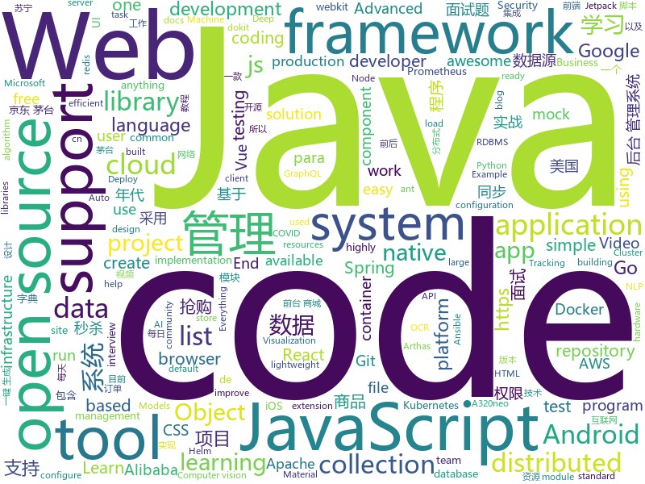

# 2021-01-07
See what the GitHub community is most excited about.

## python
+ [SparrowRecSys](https://github.com/wzhe06/SparrowRecSys)(**40 stars today**): A Deep Learning Recommender System
+ [StyleFlow](https://github.com/RameenAbdal/StyleFlow)(**102 stars today**): StyleFlow: Attribute-conditioned Exploration of StyleGAN-generated Images using Conditional Continuous Normalizing Flows
+ [mmtracking](https://github.com/open-mmlab/mmtracking)(**117 stars today**): OpenMMLab Video Perception Toolbox. It supports Single Object Tracking (SOT), Multiple Object Tracking (MOT), Video Object Detection (VID) with a unified framework.
+ [superset](https://github.com/apache/superset)(**15 stars today**): Apache Superset is a Data Visualization and Data Exploration Platform
+ [yolov5](https://github.com/ultralytics/yolov5)(**42 stars today**): YOLOv5 in PyTorch > ONNX > CoreML > TFLite
+ [datasets](https://github.com/huggingface/datasets)(**65 stars today**): 🤗The largest hub of ready-to-use NLP datasets for ML models with fast, easy-to-use and efficient data manipulation tools
+ [PythonPark](https://github.com/Jack-Cherish/PythonPark)(**66 stars today**): Python 开源项目之「自学编程之路」，保姆级教程：AI实验室、宝藏视频、数据结构、学习指南、机器学习实战、深度学习实战、网络爬虫、大厂面经、程序人生、资源分享。
+ [system-design-primer](https://github.com/donnemartin/system-design-primer)(**378 stars today**): Learn how to design large-scale systems. Prep for the system design interview. Includes Anki flashcards.
+ [faceai](https://github.com/vipstone/faceai)(**162 stars today**): 一款入门级的人脸、视频、文字检测以及识别的项目.
+ [ImageAI](https://github.com/OlafenwaMoses/ImageAI)(**61 stars today**): A python library built to empower developers to build applications and systems with self-contained Computer Vision capabilities
+ [Python-100-Days](https://github.com/jackfrued/Python-100-Days)(**71 stars today**): Python - 100天从新手到大师
+ [jd_seckill_docker](https://github.com/ChinaArJun/jd_seckill_docker)(**13 stars today**): 京东茅台抢购神器docker优化版，喜欢记得Star谢谢
+ [localstack](https://github.com/localstack/localstack)(**33 stars today**): 💻A fully functional local AWS cloud stack. Develop and test your cloud & Serverless apps offline!
+ [awx](https://github.com/ansible/awx)(**6 stars today**): AWX Project
+ [ansible](https://github.com/ansible/ansible)(**21 stars today**): Ansible is a radically simple IT automation platform that makes your applications and systems easier to deploy and maintain. Automate everything from code deployment to network configuration to cloud management, in a language that approaches plain English, using SSH, with no agents to install on remote systems. https://docs.ansible.com.
+ [airflow](https://github.com/apache/airflow)(**38 stars today**): Apache Airflow - A platform to programmatically author, schedule, and monitor workflows
+ [ambassador](https://github.com/datawire/ambassador)(**3 stars today**): open source Kubernetes-native API gateway for microservices built on the Envoy Proxy
+ [moto](https://github.com/spulec/moto)(**2 stars today**): A library that allows you to easily mock out tests based on AWS infrastructure.
+ [uncaptcha3](https://github.com/NikolaiT/uncaptcha3)(**11 stars today**): Update of uncaptcha2 from 2019
+ [pipelines](https://github.com/kubeflow/pipelines)(**4 stars today**): Machine Learning Pipelines for Kubeflow
+ [scikit-learn](https://github.com/scikit-learn/scikit-learn)(**13 stars today**): scikit-learn: machine learning in Python
+ [locust](https://github.com/locustio/locust)(**59 stars today**): Scalable user load testing tool written in Python
+ [ote](https://github.com/s0md3v/ote)(**39 stars today**): Generate Email, Register for anything, Get the OTP/Link
+ [OneNet](https://github.com/PeizeSun/OneNet)(**14 stars today**): OneNet: End-to-End One-Stage Object Detection
+ [visdom](https://github.com/fossasia/visdom)(**18 stars today**): A flexible tool for creating, organizing, and sharing visualizations of live, rich data. Supports Torch and Numpy.

## java
+ [CS-Notes](https://github.com/CyC2018/CS-Notes)(**175 stars today**): 📚技术面试必备基础知识、Leetcode、计算机操作系统、计算机网络、系统设计、Java、Python、C++
+ [miaosha](https://github.com/qiurunze123/miaosha)(**146 stars today**): ⭐⭐⭐⭐秒杀系统设计与实现.互联网工程师进阶与分析🙋🐓
+ [androidx](https://github.com/androidx/androidx)(**4 stars today**): Development environment for Android Jetpack extension libraries under the androidx namespace. Synchronized with Android Jetpack's primary development branch on AOSP.
+ [Java](https://github.com/TheAlgorithms/Java)(**172 stars today**): All Algorithms implemented in Java
+ [flink](https://github.com/apache/flink)(**14 stars today**): Apache Flink
+ [arthas](https://github.com/alibaba/arthas)(**19 stars today**): Alibaba Java Diagnostic Tool Arthas/Alibaba Java诊断利器Arthas
+ [eladmin](https://github.com/elunez/eladmin)(**105 stars today**): 项目基于 Spring Boot 2.1.0 、 Jpa、 Spring Security、redis、Vue的前后端分离的后台管理系统，项目采用分模块开发方式， 权限控制采用 RBAC，支持数据字典与数据权限管理，支持一键生成前后端代码，支持动态路由
+ [checkstyle](https://github.com/checkstyle/checkstyle)(**2 stars today**): Checkstyle is a development tool to help programmers write Java code that adheres to a coding standard. By default it supports the Google Java Style Guide and Sun Code Conventions, but is highly configurable. It can be invoked with an ANT task and a command line program.
+ [tutorials](https://github.com/eugenp/tutorials)(**21 stars today**): Just Announced - "Learn Spring Security OAuth":
+ [JavaGuide](https://github.com/Snailclimb/JavaGuide)(**91 stars today**): 「Java学习+面试指南」一份涵盖大部分 Java 程序员所需要掌握的核心知识。准备 Java 面试，首选 JavaGuide！
+ [graal](https://github.com/oracle/graal)(**12 stars today**): GraalVM: Run Programs Faster Anywhere🚀
+ [quarkus](https://github.com/quarkusio/quarkus)(**18 stars today**): Quarkus: Supersonic Subatomic Java.
+ [InternetArchitect](https://github.com/bjmashibing/InternetArchitect)(**9 stars today**): 年薪百万互联网架构师课程文档及源码(公开部分)
+ [COLA](https://github.com/alibaba/COLA)(**23 stars today**): 🥤COLA: Clean Object-oriented & Layered Architecture
+ [testcontainers-java](https://github.com/testcontainers/testcontainers-java)(**5 stars today**): Testcontainers is a Java library that supports JUnit tests, providing lightweight, throwaway instances of common databases, Selenium web browsers, or anything else that can run in a Docker container.
+ [lettuce-core](https://github.com/lettuce-io/lettuce-core)(**0 stars today**): Advanced Java Redis client for thread-safe sync, async, and reactive usage. Supports Cluster, Sentinel, Pipelining, and codecs.
+ [hadoop](https://github.com/apache/hadoop)(**6 stars today**): Apache Hadoop
+ [DoraemonKit](https://github.com/didi/DoraemonKit)(**60 stars today**): A full-featured App (iOS & Android) development assistant. You deserve it. 简称 "DoKit" 。一款功能齐全的客户端（ iOS 、Android、微信小程序 ）研发助手，你值得拥有。https://www.dokit.cn/
+ [xxl-job](https://github.com/xuxueli/xxl-job)(**16 stars today**): A distributed task scheduling framework.（分布式任务调度平台XXL-JOB）
+ [react-native-camera](https://github.com/react-native-camera/react-native-camera)(**2 stars today**): A Camera component for React Native. Also supports barcode scanning!
+ [liquibase](https://github.com/liquibase/liquibase)(**3 stars today**): Main Liquibase Source
+ [datax-web](https://github.com/WeiYe-Jing/datax-web)(**11 stars today**): DataX集成可视化页面，选择数据源即可一键生成数据同步任务，支持RDBMS、Hive、HBase、ClickHouse、MongoDB等数据源，批量创建RDBMS数据同步任务，集成开源调度系统，支持分布式、增量同步数据、实时查看运行日志、监控执行器资源、KILL运行进程、数据源信息加密等。
+ [flowable-engine](https://github.com/flowable/flowable-engine)(**4 stars today**): A compact and highly efficient workflow and Business Process Management (BPM) platform for developers, system admins and business users.
+ [mall](https://github.com/macrozheng/mall)(**58 stars today**): mall项目是一套电商系统，包括前台商城系统及后台管理系统，基于SpringBoot+MyBatis实现，采用Docker容器化部署。 前台商城系统包含首页门户、商品推荐、商品搜索、商品展示、购物车、订单流程、会员中心、客户服务、帮助中心等模块。 后台管理系统包含商品管理、订单管理、会员管理、促销管理、运营管理、内容管理、统计报表、财务管理、权限管理、设置等模块。
+ [spring-cloud-alibaba](https://github.com/alibaba/spring-cloud-alibaba)(**19 stars today**): Spring Cloud Alibaba provides a one-stop solution for application development for the distributed solutions of Alibaba middleware.

## unknown
+ [GCPSketchnote](https://github.com/priyankavergadia/GCPSketchnote)(**100 stars today**): If you are looking to become a Google Cloud Engineer , then you are at the right place. GCPSketchnote is series where I share Google Cloud concepts in quick and easy to learn format.
+ [interview](https://github.com/Olshansk/interview)(**65 stars today**): Everything you need to prepare for your technical interview
+ [500-AI-Machine-learning-Deep-learning-Computer-vision-NLP-Projects-with-code](https://github.com/ashishpatel26/500-AI-Machine-learning-Deep-learning-Computer-vision-NLP-Projects-with-code)(**607 stars today**): 500 AI Machine learning Deep learning Computer vision NLP Projects with code
+ [Projects](https://github.com/karan/Projects)(**196 stars today**): 📃A list of practical projects that anyone can solve in any programming language.
+ [awesome-javascript](https://github.com/sorrycc/awesome-javascript)(**77 stars today**): 🐢A collection of awesome browser-side JavaScript libraries, resources and shiny things.
+ [awesome-interview-questions](https://github.com/MaximAbramchuck/awesome-interview-questions)(**62 stars today**): A curated awesome list of lists of interview questions. Feel free to contribute!🎓
+ [gpt-3](https://github.com/openai/gpt-3)(**20 stars today**): GPT-3: Language Models are Few-Shot Learners
+ [suning_qianggou](https://github.com/583/suning_qianggou)(**10 stars today**): 苏宁茅台自动抢购。目前写了两个版本，但是都不太稳定。一个JS版模拟点击和一个抓包版本
+ [vagas](https://github.com/frontendbr/vagas)(**18 stars today**): 🔬Espaço para divulgação de vagas para front-enders.
+ [covid19-opendata-vaccini](https://github.com/italia/covid19-opendata-vaccini)(**30 stars today**): Open Data su consegna e somministrazione dei vaccini anti COVID-19 in Italia - Commissario straordinario per l'emergenza Covid-19
+ [roadmap](https://github.com/github/roadmap)(**12 stars today**): GitHub public roadmap
+ [awesome-oneliner-bugbounty](https://github.com/dwisiswant0/awesome-oneliner-bugbounty)(**36 stars today**): A collection of awesome one-liner scripts especially for bug bounty tips.
+ [AmericaOpposeAmerica](https://github.com/zealotCE/AmericaOpposeAmerica)(**65 stars today**): 《美国反对美国》是王沪宁先生在上世纪80年代末赴美观察写作的。我们知道在那个年代中国对西方特别是美国的追捧有多高，所以突然看到一个学者在80年代就有如此清楚的认识，十分钦佩。由于网上只有效果很差的PDF扫描版，所以我想利用OCR技术和肉眼（人体OCR）来转成现代化的文本格式。目前已经全部完成。
+ [recursosfrontend](https://github.com/yurimutti/recursosfrontend)(**18 stars today**): 
+ [personal-website](https://github.com/ProgrammingHero1/personal-website)(**9 stars today**): 
+ [microgrants](https://github.com/nayafia/microgrants)(**15 stars today**): A list of microgrant programs for your good ideas
+ [955.WLB](https://github.com/formulahendry/955.WLB)(**64 stars today**): 955 不加班的公司名单 - 工作 955，work–life balance (工作与生活的平衡)
+ [patches](https://github.com/ITotalJustice/patches)(**7 stars today**): 
+ [WebKit](https://github.com/WebKit/WebKit)(**5 stars today**): Official git mirror of the WebKit repository, https://svn.webkit.org/repository/webkit, future canonical repository.
+ [app-ideas](https://github.com/florinpop17/app-ideas)(**40 stars today**): A Collection of application ideas which can be used to improve your coding skills.
+ [jd_seckill_guide](https://github.com/smileArchitect/jd_seckill_guide)(**7 stars today**): 京东茅台秒杀手把手教程，秒杀茅台苏宁 天猫超市在路上
+ [Red-Teaming-Toolkit](https://github.com/infosecn1nja/Red-Teaming-Toolkit)(**8 stars today**): A collection of open source and commercial tools that aid in red team operations.
+ [docs](https://github.com/AsahiLinux/docs)(**10 stars today**): Hardware and software docs / wiki
+ [market-toolkit](https://github.com/ckz8780/market-toolkit)(**9 stars today**): A collection of stock market resources and tools
+ [iCSS](https://github.com/chokcoco/iCSS)(**22 stars today**): 不止于 CSS

## javascript
+ [tech-interview-handbook](https://github.com/yangshun/tech-interview-handbook)(**102 stars today**): 💯Materials to help you rock your next coding interview
+ [hacker-scripts](https://github.com/NARKOZ/hacker-scripts)(**61 stars today**): Based on a true story
+ [fe-interview](https://github.com/haizlin/fe-interview)(**42 stars today**): 前端面试每日 3+1，以面试题来驱动学习，提倡每日学习与思考，每天进步一点！每天早上5点纯手工发布面试题（死磕自己，愉悦大家），3000+道前端面试题全面覆盖，HTML/CSS/JavaScript/Vue/React/Nodejs/TypeScript/ECMAScritpt/Webpack/Jquery/小程序/软技能……
+ [OpenAPI-Specification](https://github.com/OAI/OpenAPI-Specification)(**15 stars today**): The OpenAPI Specification Repository
+ [socket.io](https://github.com/socketio/socket.io)(**14 stars today**): Realtime application framework (Node.JS server)
+ [vue](https://github.com/vuejs/vue)(**73 stars today**): 🖖Vue.js is a progressive, incrementally-adoptable JavaScript framework for building UI on the web.
+ [three.js](https://github.com/mrdoob/three.js)(**29 stars today**): JavaScript 3D library.
+ [javascript-interview-questions](https://github.com/sudheerj/javascript-interview-questions)(**39 stars today**): List of 1000 JavaScript Interview Questions
+ [react-native](https://github.com/facebook/react-native)(**24 stars today**): A framework for building native apps with React.
+ [odoo](https://github.com/odoo/odoo)(**6 stars today**): Odoo. Open Source Apps To Grow Your Business.
+ [lucky-draw](https://github.com/vitozyf/lucky-draw)(**37 stars today**): 年会抽奖程序
+ [a32nx](https://github.com/flybywiresim/a32nx)(**8 stars today**): The A32NX Project is a community driven open source project to create a free Airbus A320neo in Microsoft Flight Simulator that is as close to reality as possible. It aims to enhance the default A320neo by improving the systems depth and functionality to bring it up to payware-level, all for free.
+ [mjd](https://github.com/liuxingguo/mjd)(**8 stars today**): 京东预约抢购
+ [fullstack-course4](https://github.com/jhu-ep-coursera/fullstack-course4)(**13 stars today**): Example code for HTML, CSS, and Javascript for Web Developers Coursera Course
+ [react-native-reanimated](https://github.com/software-mansion/react-native-reanimated)(**11 stars today**): React Native's Animated library reimplemented
+ [specter-desktop](https://github.com/cryptoadvance/specter-desktop)(**7 stars today**): A desktop GUI for Bitcoin Core optimised to work with hardware wallets
+ [openmtp](https://github.com/ganeshrvel/openmtp)(**12 stars today**): OpenMTP - Advanced Android File Transfer Application for macOS
+ [jitsi-meet](https://github.com/jitsi/jitsi-meet)(**12 stars today**): Jitsi Meet - Secure, Simple and Scalable Video Conferences that you use as a standalone app or embed in your web application.
+ [Ant-Forest](https://github.com/SuperMonster003/Ant-Forest)(**26 stars today**): 基于Auto.js的蚂蚁森林能量智能收取脚本 Auto.js-based alipay ant forest energy intelligent collection script
+ [material-table](https://github.com/mbrn/material-table)(**4 stars today**): Datatable for React based on material-ui's table with additional features
+ [graphqurl](https://github.com/hasura/graphqurl)(**32 stars today**): curl for GraphQL with autocomplete, subscriptions and GraphiQL. Also a dead-simple universal javascript GraphQL client.
+ [module-federation-examples](https://github.com/module-federation/module-federation-examples)(**10 stars today**): Implementation examples of module federation , by the creators of module federation
+ [v86](https://github.com/copy/v86)(**9 stars today**): x86 virtualization in your browser, recompiling x86 to wasm on the fly
+ [react-virtualized](https://github.com/bvaughn/react-virtualized)(**16 stars today**): React components for efficiently rendering large lists and tabular data
+ [cypress](https://github.com/cypress-io/cypress)(**25 stars today**): Fast, easy and reliable testing for anything that runs in a browser.

## html
+ [kubespray](https://github.com/kubernetes-sigs/kubespray)(**9 stars today**): Deploy a Production Ready Kubernetes Cluster
+ [hyperblog](https://github.com/freddier/hyperblog)(**14 stars today**): Un blog increíble para el curso de Git y Github de Platzi
+ [computer-science-flash-cards](https://github.com/jwasham/computer-science-flash-cards)(**14 stars today**): Mini website for testing both general CS knowledge and enforce coding practice and common algorithm/data structure memorization.
+ [wpt](https://github.com/web-platform-tests/wpt)(**3 stars today**): Test suites for Web platform specs — including WHATWG, W3C, and others
+ [styleguide](https://github.com/google/styleguide)(**12 stars today**): Style guides for Google-originated open-source projects
+ [helm-charts](https://github.com/prometheus-community/helm-charts)(**7 stars today**): Prometheus community Helm charts
+ [ws-monitoring](https://github.com/elestio/ws-monitoring)(**27 stars today**): A simple & lightweight realtime monitoring web UI + server in Node.js
+ [valorant-match-history](https://github.com/dylantheriot/valorant-match-history)(**3 stars today**): See your VALORANT match history with LP (VP??) gains
+ [Web-Fuzzing-Box](https://github.com/gh0stkey/Web-Fuzzing-Box)(**37 stars today**): Web Fuzzing Box - Web 模糊测试字典与一些Payloads，主要包含：弱口令暴力破解、目录以及文件枚举、Web漏洞...字典运用于实战案例：https://gh0st.cn/archives/2019-11-11/1
+ [json-viewer](https://github.com/tulios/json-viewer)(**1 stars today**): It is a Chrome extension for printing JSON and JSONP.
+ [fonts](https://github.com/google/fonts)(**3 stars today**): Font files available from Google Fonts
+ [winner](https://github.com/ioccc-src/winner)(**12 stars today**): Winners of the International Obfuscated C Code Contest
+ [kubeasz](https://github.com/easzlab/kubeasz)(**6 stars today**): 使用Ansible脚本安装K8S集群，介绍组件交互原理，方便直接，不受国内网络环境影响
+ [content](https://github.com/mdn/content)(**10 stars today**): The content behind MDN Web Docs
+ [nyt-2020-election-scraper](https://github.com/alex/nyt-2020-election-scraper)(**1 stars today**): 
+ [web-moderno](https://github.com/cod3rcursos/web-moderno)(**2 stars today**): 
+ [eks-charts](https://github.com/aws/eks-charts)(**1 stars today**): Amazon EKS Helm chart repository
+ [msteams-docs](https://github.com/MicrosoftDocs/msteams-docs)(**0 stars today**): Source for the Microsoft Teams developer platform documentation.
+ [foundation-sites](https://github.com/foundation/foundation-sites)(**2 stars today**): The most advanced responsive front-end framework in the world. Quickly create prototypes and production code for sites that work on any kind of device.
+ [fastText](https://github.com/facebookresearch/fastText)(**4 stars today**): Library for fast text representation and classification.
+ [tiny-slider](https://github.com/ganlanyuan/tiny-slider)(**6 stars today**): Vanilla javascript slider for all purposes.
+ [samples](https://github.com/azure-ad-b2c/samples)(**1 stars today**): Azure AD B2C Identity Experience Framework sample User Journeys.
+ [eleventy-base-blog](https://github.com/11ty/eleventy-base-blog)(**2 stars today**): A starter repository for a blog web site using the Eleventy static site generator.
+ [all-contributors](https://github.com/all-contributors/all-contributors)(**6 stars today**): ✨Recognize all contributors, not just the ones who push code✨
+ [training-kit](https://github.com/github/training-kit)(**4 stars today**): Open source cheat sheets for Git and GitHub

## go
+ [helloworld](https://github.com/ztino/helloworld)(**230 stars today**): Hello，MT
+ [mtSecKill](https://github.com/zqjzqj/mtSecKill)(**30 stars today**): 京东茅台抢购
+ [testify](https://github.com/stretchr/testify)(**11 stars today**): A toolkit with common assertions and mocks that plays nicely with the standard library
+ [consul](https://github.com/hashicorp/consul)(**10 stars today**): Consul is a distributed, highly available, and data center aware solution to connect and configure applications across dynamic, distributed infrastructure.
+ [OpenDiablo2](https://github.com/OpenDiablo2/OpenDiablo2)(**40 stars today**): An open source re-implementation of Diablo 2
+ [yaml](https://github.com/go-yaml/yaml)(**5 stars today**): YAML support for the Go language.
+ [minikeyvalue](https://github.com/geohot/minikeyvalue)(**73 stars today**): A distributed key value store in under 1000 lines. Used in production at comma.ai
+ [vitess](https://github.com/vitessio/vitess)(**7 stars today**): Vitess is a database clustering system for horizontal scaling of MySQL.
+ [opentelemetry-collector](https://github.com/open-telemetry/opentelemetry-collector)(**3 stars today**): OpenTelemetry Collector
+ [autoscaler](https://github.com/kubernetes/autoscaler)(**6 stars today**): Autoscaling components for Kubernetes
+ [terraform](https://github.com/hashicorp/terraform)(**23 stars today**): Terraform enables you to safely and predictably create, change, and improve infrastructure. It is an open source tool that codifies APIs into declarative configuration files that can be shared amongst team members, treated as code, edited, reviewed, and versioned.
+ [flux](https://github.com/fluxcd/flux)(**2 stars today**): The GitOps Kubernetes operator
+ [mockery](https://github.com/vektra/mockery)(**5 stars today**): A mock code autogenerator for Golang
+ [thanos](https://github.com/thanos-io/thanos)(**5 stars today**): Highly available Prometheus setup with long term storage capabilities. A CNCF Incubating project.
+ [rancher](https://github.com/rancher/rancher)(**11 stars today**): Complete container management platform
+ [cilium](https://github.com/cilium/cilium)(**9 stars today**): eBPF-based Networking, Security, and Observability
+ [mock](https://github.com/golang/mock)(**11 stars today**): GoMock is a mocking framework for the Go programming language.
+ [loki](https://github.com/grafana/loki)(**12 stars today**): Like Prometheus, but for logs.
+ [terraform-provider-aws](https://github.com/hashicorp/terraform-provider-aws)(**5 stars today**): Terraform AWS provider
+ [cockroach](https://github.com/cockroachdb/cockroach)(**15 stars today**): CockroachDB - the open source, cloud-native distributed SQL database.
+ [qt](https://github.com/therecipe/qt)(**19 stars today**): Qt binding for Go (Golang) with support for Windows / macOS / Linux / FreeBSD / Android / iOS / Sailfish OS / Raspberry Pi / AsteroidOS / Ubuntu Touch / JavaScript / WebAssembly
+ [prometheus-operator](https://github.com/prometheus-operator/prometheus-operator)(**3 stars today**): Prometheus Operator creates/configures/manages Prometheus clusters atop Kubernetes
+ [distribution](https://github.com/docker/distribution)(**89 stars today**): The toolkit to pack, ship, store, and deliver container content
+ [k6](https://github.com/loadimpact/k6)(**11 stars today**): A modern load testing tool, using Go and JavaScript - https://k6.io
+ [go-swagger](https://github.com/go-swagger/go-swagger)(**5 stars today**): Swagger 2.0 implementation for go

## WordCloud

