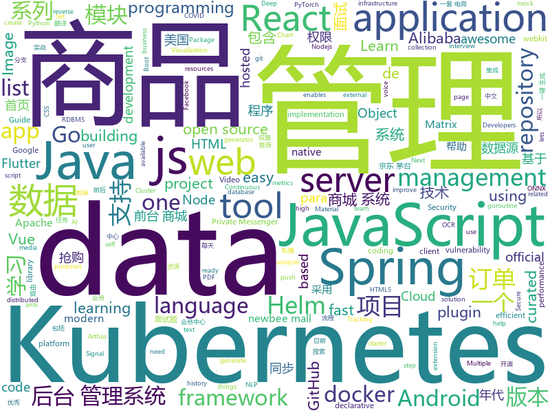

# 2021-01-08
See what the GitHub community is most excited about.

## python
+ [DALLE-pytorch](https://github.com/lucidrains/DALLE-pytorch)(**335 stars today**): Implementation / replication of DALL-E, OpenAI's Text to Image Transformer, in Pytorch
+ [jd_kill](https://github.com/who0sy/jd_kill)(**46 stars today**): 京东茅台懂得都懂 main分支是新版本，old分支是docker之前的版本
+ [mmtracking](https://github.com/open-mmlab/mmtracking)(**261 stars today**): OpenMMLab Video Perception Toolbox. It supports Single Object Tracking (SOT), Multiple Object Tracking (MOT), Video Object Detection (VID) with a unified framework.
+ [SparrowRecSys](https://github.com/wzhe06/SparrowRecSys)(**54 stars today**): A Deep Learning Recommender System
+ [PythonPark](https://github.com/Jack-Cherish/PythonPark)(**157 stars today**): Python 开源项目之「自学编程之路」，保姆级教程：AI实验室、宝藏视频、数据结构、学习指南、机器学习实战、深度学习实战、网络爬虫、大厂面经、程序人生、资源分享。
+ [gyroflow](https://github.com/ElvinC/gyroflow)(**6 stars today**): WIP Video stabilization using gyro data from GoPro or external log
+ [superset](https://github.com/apache/superset)(**128 stars today**): Apache Superset is a Data Visualization and Data Exploration Platform
+ [DiffMorph](https://github.com/volotat/DiffMorph)(**34 stars today**): Image morphing without reference points by applying warp maps and optimizing over them.
+ [datasets](https://github.com/huggingface/datasets)(**211 stars today**): 🤗The largest hub of ready-to-use NLP datasets for ML models with fast, easy-to-use and efficient data manipulation tools
+ [yolov5](https://github.com/ultralytics/yolov5)(**117 stars today**): YOLOv5 in PyTorch > ONNX > CoreML > TFLite
+ [StyleFlow](https://github.com/RameenAbdal/StyleFlow)(**129 stars today**): StyleFlow: Attribute-conditioned Exploration of StyleGAN-generated Images using Conditional Continuous Normalizing Flows
+ [moto](https://github.com/spulec/moto)(**6 stars today**): A library that allows you to easily mock out tests based on AWS infrastructure.
+ [ResnetGPT](https://github.com/FengQuanLi/ResnetGPT)(**33 stars today**): 用Resnet101+GPT搭建一个玩王者荣耀的AI
+ [persepolis](https://github.com/persepolisdm/persepolis)(**42 stars today**): Persepolis Download Manager is a GUI for aria2.
+ [DeBERTa](https://github.com/microsoft/DeBERTa)(**38 stars today**): The implementation of DeBERTa
+ [jd_seckill_new](https://github.com/lvgithub/jd_seckill_new)(**17 stars today**): 京东茅台抢购脚本（持续优化）
+ [jd_subscribe_seckill](https://github.com/ASAS1314/jd_subscribe_seckill)(**6 stars today**): 针对js_seckill代码进行了整理
+ [rasa](https://github.com/RasaHQ/rasa)(**8 stars today**): 💬Open source machine learning framework to automate text- and voice-based conversations: NLU, dialogue management, connect to Slack, Facebook, and more - Create chatbots and voice assistants
+ [awx](https://github.com/ansible/awx)(**5 stars today**): AWX Project
+ [h4cker](https://github.com/The-Art-of-Hacking/h4cker)(**10 stars today**): This repository is primarily maintained by Omar Santos and includes thousands of resources related to ethical hacking / penetration testing, digital forensics and incident response (DFIR), vulnerability research, exploit development, reverse engineering, and more.
+ [airflow](https://github.com/apache/airflow)(**38 stars today**): Apache Airflow - A platform to programmatically author, schedule, and monitor workflows
+ [pytorch-YOLOv4](https://github.com/Tianxiaomo/pytorch-YOLOv4)(**8 stars today**): PyTorch ,ONNX and TensorRT implementation of YOLOv4
+ [sqlalchemy](https://github.com/sqlalchemy/sqlalchemy)(**4 stars today**): The Database Toolkit for Python
+ [ArchiveBox](https://github.com/ArchiveBox/ArchiveBox)(**10 stars today**): 🗃The open source self-hosted web archive. Takes browser history/bookmarks/Pocket/Pinboard/etc., saves HTML, JS, PDFs, media, and more...
+ [wait-for-it](https://github.com/vishnubob/wait-for-it)(**4 stars today**): Pure bash script to test and wait on the availability of a TCP host and port

## java
+ [Signal-Android](https://github.com/signalapp/Signal-Android)(**150 stars today**): A private messenger for Android.
+ [flutter_boost](https://github.com/alibaba/flutter_boost)(**7 stars today**): FlutterBoost is a Flutter plugin which enables hybrid integration of Flutter for your existing native apps with minimum efforts
+ [ExoPlayer](https://github.com/google/ExoPlayer)(**9 stars today**): An extensible media player for Android
+ [eladmin](https://github.com/elunez/eladmin)(**124 stars today**): 项目基于 Spring Boot 2.1.0 、 Jpa、 Spring Security、redis、Vue的前后端分离的后台管理系统，项目采用分模块开发方式， 权限控制采用 RBAC，支持数据字典与数据权限管理，支持一键生成前后端代码，支持动态路由
+ [spring-cloud-alibaba](https://github.com/alibaba/spring-cloud-alibaba)(**18 stars today**): Spring Cloud Alibaba provides a one-stop solution for application development for the distributed solutions of Alibaba middleware.
+ [spring-framework](https://github.com/spring-projects/spring-framework)(**22 stars today**): Spring Framework
+ [tutorials](https://github.com/eugenp/tutorials)(**17 stars today**): Just Announced - "Learn Spring Security OAuth":
+ [JavaGuide](https://github.com/Snailclimb/JavaGuide)(**135 stars today**): 「Java学习+面试指南」一份涵盖大部分 Java 程序员所需要掌握的核心知识。准备 Java 面试，首选 JavaGuide！
+ [Signal-Server](https://github.com/signalapp/Signal-Server)(**69 stars today**): Server supporting the Signal Private Messenger applications on Android, Desktop, and iOS
+ [react-native-push-notification](https://github.com/zo0r/react-native-push-notification)(**3 stars today**): React Native Local and Remote Notifications
+ [okhttp](https://github.com/square/okhttp)(**18 stars today**): Square’s meticulous HTTP client for the JVM, Android, and GraalVM.
+ [arthas](https://github.com/alibaba/arthas)(**28 stars today**): Alibaba Java Diagnostic Tool Arthas/Alibaba Java诊断利器Arthas
+ [GitHub-Chinese-Top-Charts](https://github.com/kon9chunkit/GitHub-Chinese-Top-Charts)(**17 stars today**): 🇨🇳GitHub中文排行榜，帮助你发现高分优秀中文项目、更高效地吸收国人的优秀经验成果；榜单每周更新一次，敬请关注！
+ [pulsar](https://github.com/apache/pulsar)(**4 stars today**): Apache Pulsar - distributed pub-sub messaging system
+ [quickstart-android](https://github.com/firebase/quickstart-android)(**4 stars today**): Firebase Quickstart Samples for Android
+ [CS-Notes](https://github.com/CyC2018/CS-Notes)(**190 stars today**): 📚技术面试必备基础知识、Leetcode、计算机操作系统、计算机网络、系统设计、Java、Python、C++
+ [interviews](https://github.com/kdn251/interviews)(**27 stars today**): Everything you need to know to get the job.
+ [flowable-engine](https://github.com/flowable/flowable-engine)(**5 stars today**): A compact and highly efficient workflow and Business Process Management (BPM) platform for developers, system admins and business users.
+ [newbee-mall](https://github.com/newbee-ltd/newbee-mall)(**20 stars today**): newbee-mall 项目（新蜂商城）是一套电商系统，包括 newbee-mall 商城系统及 newbee-mall-admin 商城后台管理系统，基于 Spring Boot 2.X 及相关技术栈开发。 前台商城系统包含首页门户、商品分类、新品上线、首页轮播、商品推荐、商品搜索、商品展示、购物车、订单结算、订单流程、个人订单管理、会员中心、帮助中心等模块。 后台管理系统包含数据面板、轮播图管理、商品管理、订单管理、会员管理、分类管理、设置等模块。
+ [fastjson](https://github.com/alibaba/fastjson)(**7 stars today**): A fast JSON parser/generator for Java.
+ [mall](https://github.com/macrozheng/mall)(**56 stars today**): mall项目是一套电商系统，包括前台商城系统及后台管理系统，基于SpringBoot+MyBatis实现，采用Docker容器化部署。 前台商城系统包含首页门户、商品推荐、商品搜索、商品展示、购物车、订单流程、会员中心、客户服务、帮助中心等模块。 后台管理系统包含商品管理、订单管理、会员管理、促销管理、运营管理、内容管理、统计报表、财务管理、权限管理、设置等模块。
+ [datax-web](https://github.com/WeiYe-Jing/datax-web)(**19 stars today**): DataX集成可视化页面，选择数据源即可一键生成数据同步任务，支持RDBMS、Hive、HBase、ClickHouse、MongoDB等数据源，批量创建RDBMS数据同步任务，集成开源调度系统，支持分布式、增量同步数据、实时查看运行日志、监控执行器资源、KILL运行进程、数据源信息加密等。
+ [druid](https://github.com/apache/druid)(**7 stars today**): Apache Druid: a high performance real-time analytics database.
+ [spring-boot](https://github.com/spring-projects/spring-boot)(**40 stars today**): Spring Boot
+ [material-components-android](https://github.com/material-components/material-components-android)(**11 stars today**): Modular and customizable Material Design UI components for Android

## unknown
+ [WebKit](https://github.com/WebKit/WebKit)(**27 stars today**): Official git mirror of the WebKit repository, https://svn.webkit.org/repository/webkit, future canonical repository.
+ [GCPSketchnote](https://github.com/priyankavergadia/GCPSketchnote)(**218 stars today**): If you are looking to become a Google Cloud Engineer , then you are at the right place. GCPSketchnote is series where I share Google Cloud concepts in quick and easy to learn format.
+ [500-AI-Machine-learning-Deep-learning-Computer-vision-NLP-Projects-with-code](https://github.com/ashishpatel26/500-AI-Machine-learning-Deep-learning-Computer-vision-NLP-Projects-with-code)(**585 stars today**): 500 AI Machine learning Deep learning Computer vision NLP Projects with code
+ [interview](https://github.com/Olshansk/interview)(**127 stars today**): Everything you need to prepare for your technical interview
+ [vagas](https://github.com/frontendbr/vagas)(**17 stars today**): 🔬Espaço para divulgação de vagas para front-enders.
+ [Projects](https://github.com/karan/Projects)(**136 stars today**): 📃A list of practical projects that anyone can solve in any programming language.
+ [AmericaOpposeAmerica](https://github.com/zealotCE/AmericaOpposeAmerica)(**81 stars today**): 《美国反对美国》是王沪宁先生在上世纪80年代末赴美观察写作的。我们知道在那个年代中国对西方特别是美国的追捧有多高，所以突然看到一个学者在80年代就有如此清楚的认识，十分钦佩。由于网上只有效果很差的PDF扫描版，所以我想利用OCR技术和肉眼（人体OCR）来转成现代化的文本格式。目前已经全部完成。
+ [getting-a-gig](https://github.com/cassidoo/getting-a-gig)(**20 stars today**): Guide for getting a gig as a tech student.
+ [iCSS](https://github.com/chokcoco/iCSS)(**24 stars today**): 不止于 CSS
+ [gold-miner](https://github.com/xitu/gold-miner)(**13 stars today**): 🥇掘金翻译计划，可能是世界最大最好的英译中技术社区，最懂读者和译者的翻译平台：
+ [covid19-opendata-vaccini](https://github.com/italia/covid19-opendata-vaccini)(**20 stars today**): Open Data su consegna e somministrazione dei vaccini anti COVID-19 in Italia - Commissario straordinario per l'emergenza Covid-19
+ [awesome-interview-questions](https://github.com/MaximAbramchuck/awesome-interview-questions)(**47 stars today**): A curated awesome list of lists of interview questions. Feel free to contribute!🎓
+ [suning_qianggou](https://github.com/583/suning_qianggou)(**10 stars today**): 苏宁茅台自动抢购。目前写了两个版本，但是都不太稳定。一个JS版模拟点击和一个抓包版本
+ [download](https://github.com/getfotiaoqiang/download)(**19 stars today**): 佛跳墙官方版本下载页 翻墙 代理 科学上网 外网 加速器 梯子 路由
+ [Flutter-Course-Resources](https://github.com/londonappbrewery/Flutter-Course-Resources)(**8 stars today**): Learn to Code While Building Apps - The Complete Flutter Development Bootcamp
+ [awesome-devbook](https://github.com/738/awesome-devbook)(**28 stars today**): 📕국내 개발 도서 리스트
+ [iOS-Patched-IPAs](https://github.com/Netskao/iOS-Patched-IPAs)(**3 stars today**): iOS Patched IPAs. NoAds and Cracked
+ [Blog](https://github.com/mqyqingfeng/Blog)(**17 stars today**): 冴羽写博客的地方，预计写四个系列：JavaScript深入系列、JavaScript专题系列、ES6系列、React系列。
+ [app-ideas](https://github.com/florinpop17/app-ideas)(**36 stars today**): A Collection of application ideas which can be used to improve your coding skills.
+ [awesome-grpc](https://github.com/grpc-ecosystem/awesome-grpc)(**8 stars today**): A curated list of useful resources for gRPC
+ [modern-cpp-features](https://github.com/AnthonyCalandra/modern-cpp-features)(**14 stars today**): A cheatsheet of modern C++ language and library features.
+ [awesome-vite](https://github.com/vitejs/awesome-vite)(**3 stars today**): ⚡️A curated list of awesome things related to Vite.js
+ [guide](https://github.com/uber-go/guide)(**13 stars today**): The Uber Go Style Guide.
+ [useful](https://github.com/YauhenKavalchuk/useful)(**3 stars today**): 
+ [awesome-oneliner-bugbounty](https://github.com/dwisiswant0/awesome-oneliner-bugbounty)(**15 stars today**): A collection of awesome one-liner scripts especially for bug bounty tips.

## javascript
+ [30-Days-Of-JavaScript](https://github.com/Asabeneh/30-Days-Of-JavaScript)(**279 stars today**): 30 days of JavaScript programming challenge is a step by step guide to learn JavaScript programming language in 30 days
+ [Hack-Tools](https://github.com/LasCC/Hack-Tools)(**100 stars today**): The all-in-one Red Team extension for Web Pentester🛠
+ [hacker-scripts](https://github.com/NARKOZ/hacker-scripts)(**187 stars today**): Based on a true story
+ [metrics](https://github.com/lowlighter/metrics)(**110 stars today**): 📊An image generator with 20+ metrics about your GitHub account such as activity, community, repositories, coding habits, website performances, music played, starred topics, etc. that you can put on your profile or elsewhere !
+ [tech-interview-handbook](https://github.com/yangshun/tech-interview-handbook)(**143 stars today**): 💯Materials to help you rock your next coding interview
+ [jamstack-ecommerce](https://github.com/jamstack-cms/jamstack-ecommerce)(**33 stars today**): A starter project for building performant ECommerce applications with Next.js and React
+ [react-native](https://github.com/facebook/react-native)(**28 stars today**): A framework for building native apps with React.
+ [socket.io](https://github.com/socketio/socket.io)(**15 stars today**): Realtime application framework (Node.JS server)
+ [markdown-here](https://github.com/adam-p/markdown-here)(**22 stars today**): Google Chrome, Firefox, and Thunderbird extension that lets you write email in Markdown and render it before sending.
+ [cors-anywhere](https://github.com/Rob--W/cors-anywhere)(**8 stars today**): CORS Anywhere is a NodeJS reverse proxy which adds CORS headers to the proxied request.
+ [wxappUnpacker](https://github.com/xuedingmiaojun/wxappUnpacker)(**8 stars today**): 小程序反编译(支持分包)
+ [create-react-app](https://github.com/facebook/create-react-app)(**47 stars today**): Set up a modern web app by running one command.
+ [Signal-Desktop](https://github.com/signalapp/Signal-Desktop)(**76 stars today**): Signal — Private Messenger for Windows, Mac, and Linux
+ [inertia](https://github.com/inertiajs/inertia)(**10 stars today**): Inertia.js lets you quickly build modern single-page React, Vue and Svelte apps using classic server-side routing and controllers.
+ [portainer](https://github.com/portainer/portainer)(**21 stars today**): Making Docker and Kubernetes management easy.
+ [kubernetes-external-secrets](https://github.com/external-secrets/kubernetes-external-secrets)(**0 stars today**): Integrate external secret management systems with Kubernetes
+ [fe-interview](https://github.com/haizlin/fe-interview)(**113 stars today**): 前端面试每日 3+1，以面试题来驱动学习，提倡每日学习与思考，每天进步一点！每天早上5点纯手工发布面试题（死磕自己，愉悦大家），3000+道前端面试题全面覆盖，HTML/CSS/JavaScript/Vue/React/Nodejs/TypeScript/ECMAScritpt/Webpack/Jquery/小程序/软技能……
+ [react](https://github.com/facebook/react)(**67 stars today**): A declarative, efficient, and flexible JavaScript library for building user interfaces.
+ [semantic-release](https://github.com/semantic-release/semantic-release)(**9 stars today**): 📦🚀Fully automated version management and package publishing
+ [codelf](https://github.com/unbug/codelf)(**40 stars today**): A search tool helps dev to solve the naming things problem.
+ [gutenberg](https://github.com/WordPress/gutenberg)(**5 stars today**): The Block Editor project for WordPress and beyond. Plugin is available from the official repository.
+ [react-redux](https://github.com/reduxjs/react-redux)(**9 stars today**): Official React bindings for Redux
+ [d3](https://github.com/d3/d3)(**12 stars today**): Bring data to life with SVG, Canvas and HTML.📊📈🎉
+ [node](https://github.com/nodejs/node)(**38 stars today**): Node.js JavaScript runtime✨🐢🚀✨
+ [react-chartjs-2](https://github.com/reactchartjs/react-chartjs-2)(**5 stars today**): React wrapper for Chart.js

## html
+ [helm-charts](https://github.com/prometheus-community/helm-charts)(**2 stars today**): Prometheus community Helm charts
+ [kubespray](https://github.com/kubernetes-sigs/kubespray)(**6 stars today**): Deploy a Production Ready Kubernetes Cluster
+ [wpt](https://github.com/web-platform-tests/wpt)(**4 stars today**): Test suites for Web platform specs — including WHATWG, W3C, and others
+ [minwiz](https://github.com/zeplia/minwiz)(**26 stars today**): Minimal starter kit for under 2 KB sites
+ [django-DefectDojo](https://github.com/DefectDojo/django-DefectDojo)(**2 stars today**): DefectDojo is an open-source application vulnerability correlation and security orchestration tool.
+ [charts](https://github.com/bitnami/charts)(**8 stars today**): Helm Charts
+ [hyperblog](https://github.com/freddier/hyperblog)(**12 stars today**): Un blog increíble para el curso de Git y Github de Platzi
+ [v-calendar](https://github.com/nathanreyes/v-calendar)(**3 stars today**): An elegant calendar and datepicker plugin for Vue.
+ [element-web](https://github.com/vector-im/element-web)(**13 stars today**): A glossy Matrix collaboration client for the web.
+ [amundsen](https://github.com/amundsen-io/amundsen)(**10 stars today**): Amundsen is a metadata driven application for improving the productivity of data analysts, data scientists and engineers when interacting with data.
+ [shellphish](https://github.com/suljot/shellphish)(**1 stars today**): Phishing Tool for Instagram, Facebook, Twitter, Snapchat, Github
+ [Spoon-Knife](https://github.com/octocat/Spoon-Knife)(**1 stars today**): This repo is for demonstration purposes only.
+ [matrix-docker-ansible-deploy](https://github.com/spantaleev/matrix-docker-ansible-deploy)(**7 stars today**): Matrix (An open network for secure, decentralized communication) server setup using Ansible and Docker
+ [keycloak-documentation](https://github.com/keycloak/keycloak-documentation)(**1 stars today**): 
+ [tiny-slider](https://github.com/ganlanyuan/tiny-slider)(**6 stars today**): Vanilla javascript slider for all purposes.
+ [tools](https://github.com/googlecodelabs/tools)(**4 stars today**): Codelabs management & hosting tools
+ [gh-pages-url-shortener](https://github.com/nelsontky/gh-pages-url-shortener)(**9 stars today**): Minimal URL shortener that can be entirely hosted on GitHub pages.
+ [valorant-match-history](https://github.com/dylantheriot/valorant-match-history)(**5 stars today**): See your VALORANT match history with LP (VP??) gains
+ [EIPs](https://github.com/ethereum/EIPs)(**5 stars today**): The Ethereum Improvement Proposal repository
+ [uikit](https://github.com/uikit/uikit)(**4 stars today**): A lightweight and modular front-end framework for developing fast and powerful web interfaces
+ [swagger-codegen](https://github.com/swagger-api/swagger-codegen)(**7 stars today**): swagger-codegen contains a template-driven engine to generate documentation, API clients and server stubs in different languages by parsing your OpenAPI / Swagger definition.
+ [all-contributors](https://github.com/all-contributors/all-contributors)(**6 stars today**): ✨Recognize all contributors, not just the ones who push code✨
+ [speedtest](https://github.com/librespeed/speedtest)(**14 stars today**): Self-hosted Speedtest for HTML5 and more. Easy setup, examples, configurable, mobile friendly. Supports PHP, Node, Multiple servers, and more
+ [helm-charts](https://github.com/codecentric/helm-charts)(**1 stars today**): A curated set of Helm charts brought to you by codecentric
+ [html-css](https://github.com/gustavoguanabara/html-css)(**2 stars today**): Curso de HTML5 e CSS3

## go
+ [mtSecKill](https://github.com/zqjzqj/mtSecKill)(**83 stars today**): 京东茅台抢购
+ [helloworld](https://github.com/ztino/helloworld)(**185 stars today**): Hello，MT
+ [aws-sdk-go](https://github.com/aws/aws-sdk-go)(**6 stars today**): AWS SDK for the Go programming language.
+ [argo-cd](https://github.com/argoproj/argo-cd)(**15 stars today**): Declarative continuous deployment for Kubernetes.
+ [dendrite](https://github.com/matrix-org/dendrite)(**30 stars today**): Dendrite is a second-generation Matrix homeserver written in Go!
+ [clair](https://github.com/quay/clair)(**9 stars today**): Vulnerability Static Analysis for Containers
+ [eksctl](https://github.com/weaveworks/eksctl)(**2 stars today**): The official CLI for Amazon EKS
+ [flux](https://github.com/fluxcd/flux)(**5 stars today**): The GitOps Kubernetes operator
+ [cortex](https://github.com/cortexproject/cortex)(**4 stars today**): A horizontally scalable, highly available, multi-tenant, long term Prometheus.
+ [helm-diff](https://github.com/databus23/helm-diff)(**0 stars today**): A helm plugin that shows a diff explaining what a helm upgrade would change
+ [kaniko](https://github.com/GoogleContainerTools/kaniko)(**14 stars today**): Build Container Images In Kubernetes
+ [ants](https://github.com/panjf2000/ants)(**10 stars today**): 🐜🐜🐜ants is a high-performance and low-cost goroutine pool in Go, inspired by fasthttp./ ants 是一个高性能且低损耗的 goroutine 池。
+ [k9s](https://github.com/derailed/k9s)(**26 stars today**): 🐶Kubernetes CLI To Manage Your Clusters In Style!
+ [loki](https://github.com/grafana/loki)(**14 stars today**): Like Prometheus, but for logs.
+ [terraform](https://github.com/hashicorp/terraform)(**16 stars today**): Terraform enables you to safely and predictably create, change, and improve infrastructure. It is an open source tool that codifies APIs into declarative configuration files that can be shared amongst team members, treated as code, edited, reviewed, and versioned.
+ [esbuild](https://github.com/evanw/esbuild)(**38 stars today**): An extremely fast JavaScript bundler and minifier
+ [datadog-agent](https://github.com/DataDog/datadog-agent)(**4 stars today**): Datadog Agent
+ [kube-state-metrics](https://github.com/kubernetes/kube-state-metrics)(**3 stars today**): Add-on agent to generate and expose cluster-level metrics.
+ [teleport](https://github.com/gravitational/teleport)(**3 stars today**): Secure Access for Developers that doesn't get in the way.
+ [amazon-ecr-credential-helper](https://github.com/awslabs/amazon-ecr-credential-helper)(**4 stars today**): Automatically gets credentials for Amazon ECR on docker push/docker pull
+ [testify](https://github.com/stretchr/testify)(**14 stars today**): A toolkit with common assertions and mocks that plays nicely with the standard library
+ [helmfile](https://github.com/roboll/helmfile)(**3 stars today**): Deploy Kubernetes Helm Charts
+ [go](https://github.com/golang/go)(**52 stars today**): The Go programming language
+ [helm](https://github.com/helm/helm)(**17 stars today**): The Kubernetes Package Manager
+ [pprof](https://github.com/google/pprof)(**8 stars today**): pprof is a tool for visualization and analysis of profiling data

## WordCloud

