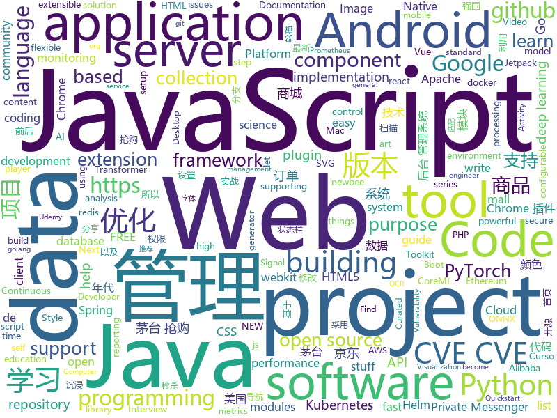

# 2021-01-09
See what the GitHub community is most excited about.

## python
+ [DALLE-pytorch](https://github.com/lucidrains/DALLE-pytorch)(**258 stars today**): Implementation / replication of DALL-E, OpenAI's Text to Image Transformer, in Pytorch
+ [red-python-scripts](https://github.com/davidbombal/red-python-scripts)(**19 stars today**): 
+ [taobao-seckill-maotai](https://github.com/HelloMaoTai/taobao-seckill-maotai)(**22 stars today**): 茅台抢购最新优化版本，茅台秒杀，优化了抢购线程队列
+ [Automatic-Udemy-Course-Enroller-GET-PAID-UDEMY-COURSES-for-FREE](https://github.com/aapatre/Automatic-Udemy-Course-Enroller-GET-PAID-UDEMY-COURSES-for-FREE)(**77 stars today**): Do you want to LEARN NEW STUFF for FREE? Don't worry, with the power of web-scraping and automation, this script will find the necessary Udemy coupons & enroll you for PAID UDEMY COURSES, ABSOLUTELY FREE!
+ [fastapi](https://github.com/tiangolo/fastapi)(**85 stars today**): FastAPI framework, high performance, easy to learn, fast to code, ready for production
+ [jd-seckill-maotai](https://github.com/HelloMaoTai/jd-seckill-maotai)(**9 stars today**): 茅台抢购最新优化版本，茅台秒杀，优化了抢购进程队列
+ [persepolis](https://github.com/persepolisdm/persepolis)(**27 stars today**): Persepolis Download Manager is a GUI for aria2.
+ [superset](https://github.com/apache/superset)(**169 stars today**): Apache Superset is a Data Visualization and Data Exploration Platform
+ [sentry](https://github.com/getsentry/sentry)(**18 stars today**): Sentry is cross-platform application monitoring, with a focus on error reporting.
+ [yolov5](https://github.com/ultralytics/yolov5)(**104 stars today**): YOLOv5 in PyTorch > ONNX > CoreML > TFLite
+ [aws-sam-cli](https://github.com/aws/aws-sam-cli)(**3 stars today**): CLI tool to build, test, debug, and deploy Serverless applications using AWS SAM
+ [vulmap](https://github.com/zhzyker/vulmap)(**22 stars today**): Vulmap - Web vulnerability scanning and verification tools，支持扫描 activemq, flink, shiro, solr, struts2, tomcat, unomi, drupal, elasticsearch, nexus, weblogic, jboss, thinkphp，并且具备漏洞利用功能。CVE-2020-14882, CVE-2020-2555, CVE-2020-2883, S2-061, CVE-2020-13942, CVE-2020-17530, CVE-2020-17518, CVE-2020-17519
+ [DeepCTR](https://github.com/shenweichen/DeepCTR)(**8 stars today**): Easy-to-use,Modular and Extendible package of deep-learning based CTR models for search and recommendation.
+ [python-cheatsheet](https://github.com/gto76/python-cheatsheet)(**44 stars today**): Comprehensive Python Cheatsheet
+ [jd_kill](https://github.com/who0sy/jd_kill)(**62 stars today**): 京东茅台懂得都懂 main分支是新版本，old分支是docker之前的版本
+ [DeBERTa](https://github.com/microsoft/DeBERTa)(**17 stars today**): The implementation of DeBERTa
+ [thonny](https://github.com/thonny/thonny)(**37 stars today**): Python IDE for beginners
+ [dash](https://github.com/plotly/dash)(**14 stars today**): Analytical Web Apps for Python, R, Julia, and Jupyter. No JavaScript Required.
+ [transformers](https://github.com/huggingface/transformers)(**62 stars today**): 🤗Transformers: State-of-the-art Natural Language Processing for Pytorch and TensorFlow 2.0.
+ [HelloGitHub](https://github.com/521xueweihan/HelloGitHub)(**198 stars today**): Find pearls on open-source seashore 分享 GitHub 上有趣、入门级的开源项目
+ [keras](https://github.com/keras-team/keras)(**15 stars today**): Deep Learning for humans
+ [yolov3](https://github.com/ultralytics/yolov3)(**11 stars today**): YOLOv3 in PyTorch > ONNX > CoreML > TFLite
+ [jd_maotai_seckill](https://github.com/mengxr123/jd_maotai_seckill)(**51 stars today**): 优化版本的京东茅台抢购神器
+ [tvm](https://github.com/apache/tvm)(**6 stars today**): Open deep learning compiler stack for cpu, gpu and specialized accelerators
+ [PythonPark](https://github.com/Jack-Cherish/PythonPark)(**141 stars today**): Python 开源项目之「自学编程之路」，保姆级教程：AI实验室、宝藏视频、数据结构、学习指南、机器学习实战、深度学习实战、网络爬虫、大厂面经、程序人生、资源分享。

## java
+ [Signal-Server](https://github.com/signalapp/Signal-Server)(**117 stars today**): Server supporting the Signal Private Messenger applications on Android, Desktop, and iOS
+ [Signal-Android](https://github.com/signalapp/Signal-Android)(**341 stars today**): A private messenger for Android.
+ [react-native-camera](https://github.com/react-native-camera/react-native-camera)(**7 stars today**): A Camera component for React Native. Also supports barcode scanning!
+ [debezium](https://github.com/debezium/debezium)(**9 stars today**): Change data capture for a variety of databases. Please log issues at https://issues.redhat.com/browse/DBZ.
+ [beam](https://github.com/apache/beam)(**5 stars today**): Apache Beam is a unified programming model for Batch and Streaming
+ [DependencyCheck](https://github.com/jeremylong/DependencyCheck)(**8 stars today**): OWASP dependency-check is a software composition analysis utility that detects publicly disclosed vulnerabilities in application dependencies.
+ [thingsboard](https://github.com/thingsboard/thingsboard)(**11 stars today**): Open-source IoT Platform - Device management, data collection, processing and visualization.
+ [react-native-video](https://github.com/react-native-video/react-native-video)(**3 stars today**): A <Video /> component for react-native
+ [kafdrop](https://github.com/obsidiandynamics/kafdrop)(**8 stars today**): Kafka Web UI
+ [Sentinel](https://github.com/alibaba/Sentinel)(**10 stars today**): A powerful flow control component enabling reliability, resilience and monitoring for microservices. (面向云原生微服务的高可用流控防护组件)
+ [bazel](https://github.com/bazelbuild/bazel)(**7 stars today**): a fast, scalable, multi-language and extensible build system
+ [quarkus-quickstarts](https://github.com/quarkusio/quarkus-quickstarts)(**3 stars today**): Quarkus quickstart code
+ [react-native-push-notification](https://github.com/zo0r/react-native-push-notification)(**3 stars today**): React Native Local and Remote Notifications
+ [CS-Notes](https://github.com/CyC2018/CS-Notes)(**194 stars today**): 📚技术面试必备基础知识、Leetcode、计算机操作系统、计算机网络、系统设计、Java、Python、C++
+ [android-interview-questions](https://github.com/MindorksOpenSource/android-interview-questions)(**7 stars today**): Your Cheat Sheet For Android Interview - Android Interview Questions
+ [checkstyle](https://github.com/checkstyle/checkstyle)(**2 stars today**): Checkstyle is a development tool to help programmers write Java code that adheres to a coding standard. By default it supports the Google Java Style Guide and Sun Code Conventions, but is highly configurable. It can be invoked with an ANT task and a command line program.
+ [sonarqube](https://github.com/SonarSource/sonarqube)(**7 stars today**): Continuous Inspection
+ [ImmersionBar](https://github.com/gyf-dev/ImmersionBar)(**11 stars today**): android 4.4以上沉浸式状态栏和沉浸式导航栏管理，适配横竖屏切换、刘海屏、软键盘弹出等问题，可以修改状态栏字体颜色和导航栏图标颜色，以及不可修改字体颜色手机的适配，适用于Activity、Fragment、DialogFragment、Dialog，PopupWindow，一句代码轻松实现，以及对bar的其他设置，详见README。简书请参考：http://www.jianshu.com/p/2a884e211a62
+ [QR-Code-generator](https://github.com/nayuki/QR-Code-generator)(**5 stars today**): High-quality QR Code generator library in Java, TypeScript/JavaScript, Python, C++, C, Rust.
+ [androidx](https://github.com/androidx/androidx)(**10 stars today**): Development environment for Android Jetpack extension libraries under the androidx namespace. Synchronized with Android Jetpack's primary development branch on AOSP.
+ [platform_frameworks_base](https://github.com/aosp-mirror/platform_frameworks_base)(**3 stars today**): 
+ [eladmin](https://github.com/elunez/eladmin)(**50 stars today**): 项目基于 Spring Boot 2.1.0 、 Jpa、 Spring Security、redis、Vue的前后端分离的后台管理系统，项目采用分模块开发方式， 权限控制采用 RBAC，支持数据字典与数据权限管理，支持一键生成前后端代码，支持动态路由
+ [arthas](https://github.com/alibaba/arthas)(**24 stars today**): Alibaba Java Diagnostic Tool Arthas/Alibaba Java诊断利器Arthas
+ [grpc-java](https://github.com/grpc/grpc-java)(**4 stars today**): The Java gRPC implementation. HTTP/2 based RPC
+ [newbee-mall](https://github.com/newbee-ltd/newbee-mall)(**19 stars today**): newbee-mall 项目（新蜂商城）是一套电商系统，包括 newbee-mall 商城系统及 newbee-mall-admin 商城后台管理系统，基于 Spring Boot 2.X 及相关技术栈开发。 前台商城系统包含首页门户、商品分类、新品上线、首页轮播、商品推荐、商品搜索、商品展示、购物车、订单结算、订单流程、个人订单管理、会员中心、帮助中心等模块。 后台管理系统包含数据面板、轮播图管理、商品管理、订单管理、会员管理、分类管理、设置等模块。

## unknown
+ [Projects](https://github.com/karan/Projects)(**192 stars today**): 📃A list of practical projects that anyone can solve in any programming language.
+ [AmericaOpposeAmerica](https://github.com/zealotCE/AmericaOpposeAmerica)(**63 stars today**): 《美国反对美国》是王沪宁先生在上世纪80年代末赴美观察写作的。我们知道在那个年代中国对西方特别是美国的追捧有多高，所以突然看到一个学者在80年代就有如此清楚的认识，十分钦佩。由于网上只有效果很差的PDF扫描版，所以我想利用OCR技术和肉眼（人体OCR）来转成现代化的文本格式。目前已经全部完成。
+ [GCPSketchnote](https://github.com/priyankavergadia/GCPSketchnote)(**328 stars today**): If you are looking to become a Google Cloud Engineer , then you are at the right place. GCPSketchnote is series where I share Google Cloud concepts in quick and easy to learn format.
+ [javascript-questions](https://github.com/lydiahallie/javascript-questions)(**129 stars today**): A long list of (advanced) JavaScript questions, and their explanations✨
+ [interview](https://github.com/Olshansk/interview)(**176 stars today**): Everything you need to prepare for your technical interview
+ [bugcrowd_university](https://github.com/bugcrowd/bugcrowd_university)(**12 stars today**): Open source education content for the researcher community
+ [awesome-devbook](https://github.com/738/awesome-devbook)(**42 stars today**): 📕국내 개발 도서 리스트
+ [HackTheBox-CTF-Writeups](https://github.com/Ignitetechnologies/HackTheBox-CTF-Writeups)(**12 stars today**): This cheasheet is aimed at the CTF Players and Beginners to help them sort Hack The Box Labs on the basis of Operating System and Difficulty.
+ [COVID-19](https://github.com/pcm-dpc/COVID-19)(**8 stars today**): COVID-19 Italia - Monitoraggio situazione
+ [binance-spot-api-docs](https://github.com/binance/binance-spot-api-docs)(**14 stars today**): Official Documentation for the Binance Spot APIs and Streams
+ [Projects-Solutions](https://github.com/karan/Projects-Solutions)(**13 stars today**): 📟Links to others' solutions to Projects (https://github.com/karan/Projects/)
+ [data-science](https://github.com/ossu/data-science)(**32 stars today**): 📊Path to a free self-taught education in Data Science!
+ [awesome-vite](https://github.com/vitejs/awesome-vite)(**9 stars today**): ⚡️A curated list of awesome things related to Vite.js
+ [500-AI-Machine-learning-Deep-learning-Computer-vision-NLP-Projects-with-code](https://github.com/ashishpatel26/500-AI-Machine-learning-Deep-learning-Computer-vision-NLP-Projects-with-code)(**378 stars today**): 500 AI Machine learning Deep learning Computer vision NLP Projects with code
+ [Among-Us-Sheriff-Mod](https://github.com/Woodi-dev/Among-Us-Sheriff-Mod)(**7 stars today**): Among Us Sheriff Mod
+ [iCSS](https://github.com/chokcoco/iCSS)(**31 stars today**): 不止于 CSS
+ [WebKit](https://github.com/WebKit/WebKit)(**46 stars today**): Official git mirror of the WebKit repository, https://svn.webkit.org/repository/webkit, future canonical repository.
+ [docs](https://github.com/AsahiLinux/docs)(**33 stars today**): Hardware and software docs / wiki
+ [postman-salesforce-apis](https://github.com/forcedotcom/postman-salesforce-apis)(**1 stars today**): Salesforce API Postman Collection
+ [NewGrad-2021](https://github.com/pittcsc/NewGrad-2021)(**4 stars today**): A collection of New Grad full time roles in SWE, Quant, and PM.
+ [HowToHunt](https://github.com/KathanP19/HowToHunt)(**8 stars today**): Tutorials and Things to Do while Hunting Vulnerability.
+ [for-mac](https://github.com/docker/for-mac)(**3 stars today**): Bug reports for Docker Desktop for Mac
+ [proxypool](https://github.com/zu1k/proxypool)(**5 stars today**): 代理池，socks/http/https/ss/ssr/vmess/vless/trojan
+ [Clean-Code-Collection-Books](https://github.com/sdcuike/Clean-Code-Collection-Books)(**3 stars today**): Clean Code Collection books-写代码的艺术--但是也不能死读书，照搬理论实践
+ [coding-interview-university](https://github.com/jwasham/coding-interview-university)(**219 stars today**): A complete computer science study plan to become a software engineer.

## javascript
+ [30-Days-Of-JavaScript](https://github.com/Asabeneh/30-Days-Of-JavaScript)(**361 stars today**): 30 days of JavaScript programming challenge is a step by step guide to learn JavaScript programming language in 30 days
+ [Hack-Tools](https://github.com/LasCC/Hack-Tools)(**448 stars today**): The all-in-one Red Team extension for Web Pentester🛠
+ [Signal-Desktop](https://github.com/signalapp/Signal-Desktop)(**128 stars today**): Signal — Private Messenger for Windows, Mac, and Linux
+ [metrics](https://github.com/lowlighter/metrics)(**174 stars today**): 📊An image generator with 20+ metrics about your GitHub account such as activity, community, repositories, coding habits, website performances, music played, starred topics, etc. that you can put on your profile or elsewhere!
+ [tech-interview-handbook](https://github.com/yangshun/tech-interview-handbook)(**161 stars today**): 💯Materials to help you rock your next coding interview
+ [bootstrap](https://github.com/twbs/bootstrap)(**39 stars today**): The most popular HTML, CSS, and JavaScript framework for developing responsive, mobile first projects on the web.
+ [hacker-scripts](https://github.com/NARKOZ/hacker-scripts)(**219 stars today**): Based on a true story
+ [xgplayer](https://github.com/bytedance/xgplayer)(**42 stars today**): A HTML5 video player with a parser that saves traffic
+ [ccxt](https://github.com/ccxt/ccxt)(**23 stars today**): A JavaScript / Python / PHP cryptocurrency trading API with support for more than 120 bitcoin/altcoin exchanges
+ [react](https://github.com/facebook/react)(**61 stars today**): A declarative, efficient, and flexible JavaScript library for building user interfaces.
+ [jamstack-ecommerce](https://github.com/jamstack-cms/jamstack-ecommerce)(**169 stars today**): A starter project for building performant ECommerce applications with Next.js and React
+ [Vue.Draggable](https://github.com/SortableJS/Vue.Draggable)(**12 stars today**): Vue drag-and-drop component based on Sortable.js
+ [clipboard.js](https://github.com/zenorocha/clipboard.js)(**43 stars today**): ✂️Modern copy to clipboard. No Flash. Just 3kb gzipped📋
+ [react-table](https://github.com/tannerlinsley/react-table)(**12 stars today**): ⚛️Hooks for building fast and extendable tables and datagrids for React
+ [project-guidelines](https://github.com/elsewhencode/project-guidelines)(**46 stars today**): A set of best practices for JavaScript projects
+ [algorithm-visualizer](https://github.com/algorithm-visualizer/algorithm-visualizer)(**22 stars today**): 🎆Interactive Online Platform that Visualizes Algorithms from Code
+ [d3](https://github.com/d3/d3)(**19 stars today**): Bring data to life with SVG, Canvas and HTML.📊📈🎉
+ [webpack](https://github.com/webpack/webpack)(**15 stars today**): A bundler for javascript and friends. Packs many modules into a few bundled assets. Code Splitting allows for loading parts of the application on demand. Through "loaders", modules can be CommonJs, AMD, ES6 modules, CSS, Images, JSON, Coffeescript, LESS, ... and your custom stuff.
+ [jd-base](https://github.com/EvineDeng/jd-base)(**26 stars today**): 京东薅羊毛脚本https://github.com/lxk0301/jd_scripts 的shell套壳工具
+ [jupyterlab](https://github.com/jupyterlab/jupyterlab)(**15 stars today**): JupyterLab computational environment.
+ [ChromeAppHeroes](https://github.com/zhaoolee/ChromeAppHeroes)(**33 stars today**): 🌈谷粒-Chrome插件英雄榜, 为优秀的Chrome插件写一本中文说明书, 让Chrome插件英雄们造福人类~ ChromePluginHeroes, Write a Chinese manual for the excellent Chrome plugin, let the Chrome plugin heroes benefit the human~ 公众号「0加1」同步更新
+ [QuantumultX](https://github.com/Orz-3/QuantumultX)(**5 stars today**): 
+ [developerFolio](https://github.com/saadpasta/developerFolio)(**11 stars today**): 🚀Software Developer Portfolio Template that helps you showcase your work and skills as a software developer.
+ [markdown-here](https://github.com/adam-p/markdown-here)(**22 stars today**): Google Chrome, Firefox, and Thunderbird extension that lets you write email in Markdown and render it before sending.
+ [amphtml](https://github.com/ampproject/amphtml)(**4 stars today**): The AMP web component framework.

## html
+ [styleguide](https://github.com/google/styleguide)(**24 stars today**): Style guides for Google-originated open-source projects
+ [hyperblog](https://github.com/freddier/hyperblog)(**11 stars today**): Un blog increíble para el curso de Git y Github de Platzi
+ [Spoon-Knife](https://github.com/octocat/Spoon-Knife)(**2 stars today**): This repo is for demonstration purposes only.
+ [speedtest](https://github.com/librespeed/speedtest)(**11 stars today**): Self-hosted Speedtest for HTML5 and more. Easy setup, examples, configurable, mobile friendly. Supports PHP, Node, Multiple servers, and more
+ [charts](https://github.com/bitnami/charts)(**8 stars today**): Helm Charts
+ [csswg-drafts](https://github.com/w3c/csswg-drafts)(**4 stars today**): CSS Working Group Editor Drafts
+ [TinDog-Start](https://github.com/londonappbrewery/TinDog-Start)(**2 stars today**): 
+ [matrix-docker-ansible-deploy](https://github.com/spantaleev/matrix-docker-ansible-deploy)(**6 stars today**): Matrix (An open network for secure, decentralized communication) server setup using Ansible and Docker
+ [v-calendar](https://github.com/nathanreyes/v-calendar)(**3 stars today**): An elegant calendar and datepicker plugin for Vue.
+ [html-css](https://github.com/gustavoguanabara/html-css)(**6 stars today**): Curso de HTML5 e CSS3
+ [tiny-slider](https://github.com/ganlanyuan/tiny-slider)(**5 stars today**): Vanilla javascript slider for all purposes.
+ [lovexuexi](https://github.com/james-bond-007/lovexuexi)(**2 stars today**): 我爱学习强国。学习强国聚合了大量可免费阅读的期刊、古籍、公开课、歌曲、戏曲、电影、图书等资料，内容严谨，专业性强。没有博眼球，无下限的自媒体内容和虚假新闻。推荐大家自发积极学习使用。
+ [eks-charts](https://github.com/aws/eks-charts)(**2 stars today**): Amazon EKS Helm chart repository
+ [flag-icon-css](https://github.com/lipis/flag-icon-css)(**5 stars today**): 🎏A collection of all country flags in SVG — plus the CSS for easier integration
+ [fluxion](https://github.com/FluxionNetwork/fluxion)(**3 stars today**): Fluxion is a remake of linset by vk496 with enhanced functionality.
+ [helm-charts](https://github.com/prometheus-community/helm-charts)(**2 stars today**): Prometheus community Helm charts
+ [ecma262](https://github.com/tc39/ecma262)(**10 stars today**): Status, process, and documents for ECMA-262
+ [DataCamp](https://github.com/wblakecannon/DataCamp)(**3 stars today**): DataCamp data-science courses
+ [PixelCraft](https://github.com/rgab1508/PixelCraft)(**31 stars today**): A Pixel Art Editor
+ [JSDec](https://github.com/MeditationDev/JSDec)(**10 stars today**): Online JavaScript decoder.Supported sojson v4/Premium/v5 and more(No longer update)
+ [quickstart-js](https://github.com/firebase/quickstart-js)(**3 stars today**): Firebase Quickstart Samples for Web
+ [lottie](https://github.com/airbnb/lottie)(**10 stars today**): Lottie documentation for http://airbnb.io/lottie
+ [content](https://github.com/mdn/content)(**8 stars today**): The content behind MDN Web Docs
+ [charts](https://github.com/Kong/charts)(**1 stars today**): Helm chart for Kong
+ [schemaorg](https://github.com/schemaorg/schemaorg)(**5 stars today**): Schema.org - schemas and supporting software

## go
+ [mtSecKill](https://github.com/zqjzqj/mtSecKill)(**227 stars today**): 京东茅台抢购
+ [tbtc](https://github.com/keep-network/tbtc)(**12 stars today**): Trustlessly tokenized Bitcoin on Ethereum ;)
+ [helloworld](https://github.com/ztino/helloworld)(**167 stars today**): Hello，MT
+ [cosmos-sdk](https://github.com/cosmos/cosmos-sdk)(**7 stars today**): ⛓️A Framework for Building High Value Public Blockchains✨
+ [argo](https://github.com/argoproj/argo)(**14 stars today**): Argo Workflows: Get stuff done with Kubernetes.
+ [flux2](https://github.com/fluxcd/flux2)(**4 stars today**): Open and extensible continuous delivery solution for Kubernetes. Powered by GitOps Toolkit.
+ [opa](https://github.com/open-policy-agent/opa)(**8 stars today**): An open source, general-purpose policy engine.
+ [aws-sdk-go](https://github.com/aws/aws-sdk-go)(**19 stars today**): AWS SDK for the Go programming language.
+ [prometheus](https://github.com/prometheus/prometheus)(**20 stars today**): The Prometheus monitoring system and time series database.
+ [vault](https://github.com/hashicorp/vault)(**10 stars today**): A tool for secrets management, encryption as a service, and privileged access management
+ [redis](https://github.com/go-redis/redis)(**13 stars today**): Type-safe Redis client for Golang
+ [clair](https://github.com/quay/clair)(**15 stars today**): Vulnerability Static Analysis for Containers
+ [charts](https://github.com/helm/charts)(**4 stars today**): ⚠️(OBSOLETE) Curated applications for Kubernetes
+ [istio](https://github.com/istio/istio)(**11 stars today**): Connect, secure, control, and observe services.
+ [sops](https://github.com/mozilla/sops)(**16 stars today**): Simple and flexible tool for managing secrets
+ [nats-server](https://github.com/nats-io/nats-server)(**9 stars today**): High-Performance server for NATS, the cloud native messaging system.
+ [testify](https://github.com/stretchr/testify)(**18 stars today**): A toolkit with common assertions and mocks that plays nicely with the standard library
+ [telegraf](https://github.com/influxdata/telegraf)(**4 stars today**): The plugin-driven server agent for collecting & reporting metrics.
+ [opentelemetry-go](https://github.com/open-telemetry/opentelemetry-go)(**3 stars today**): OpenTelemetry Go API and SDK
+ [helmfile](https://github.com/roboll/helmfile)(**6 stars today**): Deploy Kubernetes Helm Charts
+ [client-go](https://github.com/kubernetes/client-go)(**9 stars today**): Go client for Kubernetes.
+ [sqlx](https://github.com/jmoiron/sqlx)(**9 stars today**): general purpose extensions to golang's database/sql
+ [go-ethereum](https://github.com/ethereum/go-ethereum)(**26 stars today**): Official Go implementation of the Ethereum protocol
+ [mux](https://github.com/gorilla/mux)(**15 stars today**): A powerful HTTP router and URL matcher for building Go web servers with🦍
+ [confluent-kafka-go](https://github.com/confluentinc/confluent-kafka-go)(**5 stars today**): Confluent's Apache Kafka Golang client

## WordCloud

