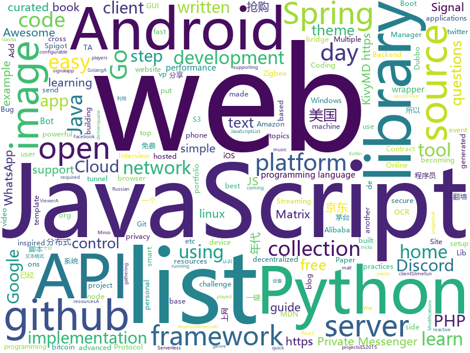

# 2021-01-11
See what the GitHub community is most excited about.

## python
+ [30-Days-Of-Python](https://github.com/Asabeneh/30-Days-Of-Python)(**287 stars today**): 30 days of Python programming challenge is a step by step guide to learn Python programming language in 30 days.
+ [s3viewer](https://github.com/SharonBrizinov/s3viewer)(**33 stars today**): Publicly Open Amazon AWS S3 Bucket Viewer
+ [public-apis](https://github.com/public-apis/public-apis)(**113 stars today**): A collective list of free APIs for use in software and web development.
+ [persepolis](https://github.com/persepolisdm/persepolis)(**77 stars today**): Persepolis Download Manager is a GUI for aria2.
+ [jd_maotai_seckill](https://github.com/mengxr123/jd_maotai_seckill)(**93 stars today**): 优化版本的京东茅台抢购神器
+ [red-python-scripts](https://github.com/davidbombal/red-python-scripts)(**56 stars today**): 
+ [python-cheatsheet](https://github.com/gto76/python-cheatsheet)(**41 stars today**): Comprehensive Python Cheatsheet
+ [StyleFlow](https://github.com/RameenAbdal/StyleFlow)(**206 stars today**): StyleFlow: Attribute-conditioned Exploration of StyleGAN-generated Images using Conditional Continuous Normalizing Flows
+ [crackq](https://github.com/f0cker/crackq)(**79 stars today**): CrackQ: A Python Hashcat cracking queue system
+ [Cura](https://github.com/Ultimaker/Cura)(**3 stars today**): 3D printer / slicing GUI built on top of the Uranium framework
+ [KivyMD](https://github.com/kivymd/KivyMD)(**2 stars today**): KivyMD is a collection of Material Design compliant widgets for use with Kivy, a framework for cross-platform, touch-enabled graphical applications. https://youtube.com/c/KivyMD https://twitter.com/KivyMD https://habr.com/ru/users/kivymd https://stackoverflow.com/tags/kivymd
+ [discord.py](https://github.com/Rapptz/discord.py)(**11 stars today**): An API wrapper for Discord written in Python.
+ [core](https://github.com/home-assistant/core)(**26 stars today**): 🏡Open source home automation that puts local control and privacy first
+ [nn](https://github.com/lab-ml/nn)(**83 stars today**): 🧠Minimal implementations of neural network architectures and layers in PyTorch with side-by-side notes
+ [doccano](https://github.com/doccano/doccano)(**65 stars today**): Open source text annotation tool for machine learning practitioner.
+ [DALLE-pytorch](https://github.com/lucidrains/DALLE-pytorch)(**476 stars today**): Implementation / replication of DALL-E, OpenAI's Text to Image Transformer, in Pytorch
+ [python-telegram-bot](https://github.com/python-telegram-bot/python-telegram-bot)(**44 stars today**): We have made you a wrapper you can't refuse
+ [my-qr.art](https://github.com/raatmarien/my-qr.art)(**36 stars today**): Design custom QR codes with this web app!
+ [ta-lib](https://github.com/mrjbq7/ta-lib)(**8 stars today**): Python wrapper for TA-Lib (http://ta-lib.org/).
+ [tuya-convert](https://github.com/ct-Open-Source/tuya-convert)(**6 stars today**): A collection of scripts to flash Tuya IoT devices to alternative firmwares
+ [python-miio](https://github.com/rytilahti/python-miio)(**2 stars today**): Python library & console tool for controlling Xiaomi smart appliances
+ [Awesome-Bugbounty-Writeups](https://github.com/devanshbatham/Awesome-Bugbounty-Writeups)(**19 stars today**): A curated list of bugbounty writeups (Bug type wise) , inspired from https://github.com/ngalongc/bug-bounty-reference
+ [bips](https://github.com/bitcoin/bips)(**9 stars today**): Bitcoin Improvement Proposals
+ [12306](https://github.com/gzldc/12306)(**17 stars today**): 12306抢票脚本
+ [ungoogled-chromium](https://github.com/Eloston/ungoogled-chromium)(**23 stars today**): Google Chromium, sans integration with Google

## java
+ [Signal-Android](https://github.com/signalapp/Signal-Android)(**1,248 stars today**): A private messenger for Android.
+ [Signal-Server](https://github.com/signalapp/Signal-Server)(**644 stars today**): Server supporting the Signal Private Messenger applications on Android, Desktop, and iOS
+ [cim](https://github.com/crossoverJie/cim)(**23 stars today**): 📲cim(cross IM) 适用于开发者的分布式即时通讯系统
+ [MinecraftForge](https://github.com/MinecraftForge/MinecraftForge)(**4 stars today**): Modifications to the Minecraft base files to assist in compatibility between mods.
+ [openhab-addons](https://github.com/openhab/openhab-addons)(**2 stars today**): Add-ons for openHAB
+ [libsignal-protocol-java](https://github.com/signalapp/libsignal-protocol-java)(**17 stars today**): Signal Protocol library for Java/Android
+ [Mohist](https://github.com/Mohist-Community/Mohist)(**2 stars today**): Minecraft Forge Hybrid server implementing the Paper/Spigot/Bukkit API, formerly known as Thermos/Cauldron/MCPC+
+ [java-developer-roadmap](https://github.com/s4kibs4mi/java-developer-roadmap)(**5 stars today**): Roadmap to becoming a Java developer in 2021
+ [fabric](https://github.com/FabricMC/fabric)(**2 stars today**): Essential hooks for modding with Fabric.
+ [Discord4J](https://github.com/Discord4J/Discord4J)(**2 stars today**): Discord4J is a fast, powerful, unopinionated, reactive library to enable quick and easy development of Discord bots for Java, Kotlin, and other JVM languages using the official Discord Bot API.
+ [Arduino](https://github.com/arduino/Arduino)(**5 stars today**): open-source electronics platform
+ [GmsCore](https://github.com/microg/GmsCore)(**13 stars today**): Free implementation of Play Services
+ [runelite](https://github.com/runelite/runelite)(**3 stars today**): Open source Old School RuneScape client
+ [Slimefun4](https://github.com/Slimefun/Slimefun4)(**1 stars today**): Slimefun 4 - A unique Spigot/Paper plugin that looks and feels like a modpack. We've been giving you backpacks, jetpacks, reactors and much more since 2013.
+ [portfolio](https://github.com/buchen/portfolio)(**4 stars today**): A simple tool to calculate the overall performance of an investment portfolio.
+ [PhotoEditor](https://github.com/burhanrashid52/PhotoEditor)(**2 stars today**): A Photo Editor library with simple, easy support for image editing using paints,text,filters,emoji and Sticker like stories.
+ [interview](https://github.com/mission-peace/interview)(**6 stars today**): Interview questions
+ [bitcoin-wallet](https://github.com/bitcoin-wallet/bitcoin-wallet)(**7 stars today**): Bitcoin Wallet app for your Android device. Standalone Bitcoin node, no centralized backend required.
+ [spring-in-action-5-samples](https://github.com/habuma/spring-in-action-5-samples)(**0 stars today**): Home for example code from Spring in Action 5.
+ [signal-cli](https://github.com/AsamK/signal-cli)(**30 stars today**): signal-cli provides a commandline and dbus interface for signalapp/libsignal-service-java
+ [AntennaPod](https://github.com/AntennaPod/AntennaPod)(**6 stars today**): A podcast manager for Android
+ [threema-android](https://github.com/threema-ch/threema-android)(**8 stars today**): Threema App for Android.
+ [SpringBoot-Labs](https://github.com/YunaiV/SpringBoot-Labs)(**15 stars today**): 一个涵盖六个专栏：Spring Boot 2.X、Spring Cloud、Spring Cloud Alibaba、Dubbo、分布式消息队列、分布式事务的仓库。希望胖友小手一抖，右上角来个 Star，感恩 1024
+ [NewPipe](https://github.com/TeamNewPipe/NewPipe)(**24 stars today**): A libre lightweight streaming front-end for Android.
+ [onemall](https://github.com/YunaiV/onemall)(**8 stars today**): 芋道 mall 商城，基于微服务的思想，构建在 B2C 电商场景下的项目实战。核心技术栈，是 Spring Boot + Dubbo 。未来，会重构成 Spring Cloud Alibaba 。

## unknown
+ [mydexchain](https://github.com/mydexchain/mydexchain)(**199 stars today**): 
+ [games](https://github.com/leereilly/games)(**442 stars today**): 🎮A list of popular/awesome video games, add-ons, maps, etc. hosted on GitHub. Any genre. Any platform. Any engine.
+ [AmericaOpposeAmerica](https://github.com/zealotCE/AmericaOpposeAmerica)(**235 stars today**): 《美国反对美国》是王沪宁先生在上世纪80年代末赴美观察写作的。我们知道在那个年代中国对西方特别是美国的追捧有多高，所以突然看到一个学者在80年代就有如此清楚的认识，十分钦佩。由于网上只有效果很差的PDF扫描版，所以我想利用OCR技术和肉眼（人体OCR）来转成现代化的文本格式。目前已经全部完成。
+ [Cloud-DevSecOps-Learning](https://github.com/chughes29/Cloud-DevSecOps-Learning)(**104 stars today**): Collection of Cloud and DevSecOps learning resources
+ [javascript-questions](https://github.com/lydiahallie/javascript-questions)(**285 stars today**): A long list of (advanced) JavaScript questions, and their explanations✨
+ [awesome-seo](https://github.com/madawei2699/awesome-seo)(**72 stars today**): Google SEO学习清单
+ [awesome](https://github.com/sindresorhus/awesome)(**66 stars today**): 😎Awesome lists about all kinds of interesting topics
+ [coder2gwy](https://github.com/coder2gwy/coder2gwy)(**136 stars today**): 互联网首份程序员考公指南，由3位已经进入体制内的前大厂程序员联合献上。
+ [T-Rex](https://github.com/trexminer/T-Rex)(**4 stars today**): T-Rex NVIDIA GPU miner with web control monitoring page
+ [thejsway](https://github.com/thejsway/thejsway)(**20 stars today**): The JavaScript Way book
+ [You-Dont-Know-JS](https://github.com/getify/You-Dont-Know-JS)(**48 stars today**): A book series on JavaScript. @YDKJS on twitter.
+ [COVID-19](https://github.com/CSSEGISandData/COVID-19)(**14 stars today**): Novel Coronavirus (COVID-19) Cases, provided by JHU CSSE
+ [new-pac](https://github.com/Alvin9999/new-pac)(**62 stars today**): 科学上网/自由上网/翻墙/软件/方法，一键翻墙浏览器，免费shadowsocks/ss/ssr/v2ray/goflyway账号/节点分享，vps一键搭建脚本/教程
+ [Profiles](https://github.com/DivineEngine/Profiles)(**38 stars today**): 🌐Dial-up Internet access
+ [thank-you-php](https://github.com/thank-you-php/thank-you-php)(**20 stars today**): Give thanks to PHP - An open letter of gratitude to PHP
+ [pierced](https://github.com/open-dingtalk/pierced)(**18 stars today**): 钉钉内网穿透
+ [Decision-Review-System](https://github.com/uditbhaskar21/Decision-Review-System)(**8 stars today**): 
+ [webdev](https://github.com/isarisariver/webdev)(**22 stars today**): A collection of helpful resources for web development.
+ [awesome-distributed-systems](https://github.com/theanalyst/awesome-distributed-systems)(**54 stars today**): A curated list to learn about distributed systems
+ [Projects](https://github.com/karan/Projects)(**218 stars today**): 📃A list of practical projects that anyone can solve in any programming language.
+ [getting-a-gig](https://github.com/cassidoo/getting-a-gig)(**18 stars today**): Guide for getting a gig as a tech student.
+ [trackerslist](https://github.com/ngosang/trackerslist)(**14 stars today**): Updated list of public BitTorrent trackers
+ [awesome-mlops](https://github.com/visenger/awesome-mlops)(**41 stars today**): A curated list of references for MLOps
+ [you-dont-know-js-ru](https://github.com/azat-io/you-dont-know-js-ru)(**6 stars today**): 📚Russian translation of "You Don't Know JS" book series

## javascript
+ [Signal-Desktop](https://github.com/signalapp/Signal-Desktop)(**625 stars today**): Signal — Private Messenger for Windows, Mac, and Linux
+ [ccxt](https://github.com/ccxt/ccxt)(**17 stars today**): A JavaScript / Python / PHP cryptocurrency trading API with support for more than 120 bitcoin/altcoin exchanges
+ [30-Days-Of-JavaScript](https://github.com/Asabeneh/30-Days-Of-JavaScript)(**344 stars today**): 30 days of JavaScript programming challenge is a step by step guide to learn JavaScript programming language in 30 days
+ [project-guidelines](https://github.com/elsewhencode/project-guidelines)(**39 stars today**): A set of best practices for JavaScript projects
+ [es6-cheatsheet](https://github.com/DrkSephy/es6-cheatsheet)(**37 stars today**): ES2015 [ES6] cheatsheet containing tips, tricks, best practices and code snippets
+ [discord.js](https://github.com/discordjs/discord.js)(**12 stars today**): A powerful JavaScript library for interacting with the Discord API
+ [metrics](https://github.com/lowlighter/metrics)(**882 stars today**): 📊An image generator with 20+ metrics about your GitHub account such as activity, community, repositories, coding habits, website performances, music played, starred topics, etc. that you can put on your profile or elsewhere!
+ [freeCodeCamp](https://github.com/freeCodeCamp/freeCodeCamp)(**43 stars today**): freeCodeCamp.org's open source codebase and curriculum. Learn to code at home.
+ [Javascript](https://github.com/TheAlgorithms/Javascript)(**66 stars today**): A repository for All algorithms implemented in Javascript (for educational purposes only)
+ [google-calendar-crx](https://github.com/manastungare/google-calendar-crx)(**41 stars today**): Google Calendar for Chrome
+ [whatsapp-web.js](https://github.com/pedroslopez/whatsapp-web.js)(**8 stars today**): A WhatsApp client library for NodeJS that connects through the WhatsApp Web browser app
+ [jdms](https://github.com/Yx1aoq1/jdms)(**31 stars today**): 京东抢购秒杀助手
+ [libsignal-protocol-javascript](https://github.com/signalapp/libsignal-protocol-javascript)(**62 stars today**): Signal Protocol library for JavaScript
+ [Pets-Adoption-App](https://github.com/ayoubbahmad/Pets-Adoption-App)(**10 stars today**): 
+ [reactjs-interview-questions](https://github.com/sudheerj/reactjs-interview-questions)(**36 stars today**): List of top 500 ReactJS Interview Questions & Answers....Coding exercise questions are coming soon!!
+ [zigbee2mqtt](https://github.com/Koenkk/zigbee2mqtt)(**12 stars today**): Zigbee🐝to MQTT bridge🌉, get rid of your proprietary Zigbee bridges🔨
+ [txAdmin](https://github.com/tabarra/txAdmin)(**14 stars today**): txAdmin - remotely manage&monitor your GTA5 FiveM Server
+ [webpack-boilerplate](https://github.com/taniarascia/webpack-boilerplate)(**3 stars today**): 📦‎ A sensible webpack 5 boilerplate.
+ [wtfjs](https://github.com/denysdovhan/wtfjs)(**127 stars today**): 🤪A list of funny and tricky JavaScript examples
+ [github-readme-stats](https://github.com/anuraghazra/github-readme-stats)(**77 stars today**): ⚡Dynamically generated stats for your github readmes
+ [react-resume-template](https://github.com/tbakerx/react-resume-template)(**8 stars today**): A personal resume website template built with ReactJs
+ [react-developer-roadmap](https://github.com/adam-golab/react-developer-roadmap)(**11 stars today**): Roadmap to becoming a React developer
+ [brave-browser](https://github.com/brave/brave-browser)(**37 stars today**): Next generation Brave browser for Android, Linux, macOS, Windows.
+ [openzeppelin-contracts](https://github.com/OpenZeppelin/openzeppelin-contracts)(**8 stars today**): OpenZeppelin Contracts is a library for secure smart contract development.
+ [InstagramClone](https://github.com/SimCoderYoutube/InstagramClone)(**5 stars today**): 

## html
+ [home-assistant.io](https://github.com/home-assistant/home-assistant.io)(**1 stars today**): 📘Home Assistant User documentation
+ [hyperblog](https://github.com/freddier/hyperblog)(**9 stars today**): Un blog increíble para el curso de Git y Github de Platzi
+ [minimal-mistakes](https://github.com/mmistakes/minimal-mistakes)(**5 stars today**): 📐Jekyll theme for building a personal site, blog, project documentation, or portfolio.
+ [learning-area](https://github.com/mdn/learning-area)(**2 stars today**): Github repo for the MDN Learning Area.
+ [speedtest](https://github.com/librespeed/speedtest)(**18 stars today**): Self-hosted Speedtest for HTML5 and more. Easy setup, examples, configurable, mobile friendly. Supports PHP, Node, Multiple servers, and more
+ [JavaScript30](https://github.com/wesbos/JavaScript30)(**13 stars today**): 30 Day Vanilla JS Challenge
+ [element-web](https://github.com/vector-im/element-web)(**21 stars today**): A glossy Matrix collaboration client for the web.
+ [valorant-match-history](https://github.com/dylantheriot/valorant-match-history)(**1 stars today**): See your VALORANT match history with LP (VP??) gains
+ [coreui-free-bootstrap-admin-template](https://github.com/coreui/coreui-free-bootstrap-admin-template)(**10 stars today**): CoreUI is free bootstrap admin template
+ [hugo-PaperMod](https://github.com/adityatelange/hugo-PaperMod)(**1 stars today**): Hugo Theme PaperMod
+ [privacytools.io](https://github.com/privacytools/privacytools.io)(**4 stars today**): 🛡🛠You are being watched. Protect your privacy against global mass surveillance.
+ [sevendayshpc](https://github.com/kaityo256/sevendayshpc)(**18 stars today**): 一週間でなれる！スパコンプログラマ
+ [FAANG](https://github.com/neerazz/FAANG)(**17 stars today**): Facebook, Amazon, Apple, Netflix and Google (FAANG) Job preparation.
+ [matrix-docker-ansible-deploy](https://github.com/spantaleev/matrix-docker-ansible-deploy)(**2 stars today**): Matrix (An open network for secure, decentralized communication) server setup using Ansible and Docker
+ [responsive-html-email-template](https://github.com/leemunroe/responsive-html-email-template)(**2 stars today**): A free simple responsive HTML email template
+ [HUST-Invictus](https://github.com/lyandut/HUST-Invictus)(**0 stars today**): 【分享】华中科技大学研究生课程资料
+ [pcc_2e](https://github.com/ehmatthes/pcc_2e)(**5 stars today**): Online resources for Python Crash Course (Second Edition), from No Starch Press
+ [30-Days-of-Python](https://github.com/codingforentrepreneurs/30-Days-of-Python)(**1 stars today**): A New Version of 30 Days of Python is nearly here. Get started today.
+ [openwrt-passwall](https://github.com/xiaorouji/openwrt-passwall)(**7 stars today**): 
+ [fluxion](https://github.com/FluxionNetwork/fluxion)(**2 stars today**): Fluxion is a remake of linset by vk496 with enhanced functionality.
+ [content](https://github.com/mdn/content)(**19 stars today**): The content behind MDN Web Docs
+ [raytracing.github.io](https://github.com/RayTracing/raytracing.github.io)(**12 stars today**): Main Web Site (Online Books)
+ [hugo-theme-meme](https://github.com/reuixiy/hugo-theme-meme)(**4 stars today**): You can’t spell aWEsoME without MEME!😝
+ [zfaka](https://github.com/zlkbdotnet/zfaka)(**2 stars today**): 免费、安全、稳定、高效的发卡系统，值得拥有!
+ [windmill-dashboard](https://github.com/estevanmaito/windmill-dashboard)(**5 stars today**): 📊A multi theme, completely accessible, ready for production dashboard.

## go
+ [mtSecKill](https://github.com/zqjzqj/mtSecKill)(**434 stars today**): 京东茅台抢购
+ [PhoneInfoga](https://github.com/sundowndev/PhoneInfoga)(**43 stars today**): Advanced information gathering & OSINT framework for phone numbers
+ [automuteus](https://github.com/denverquane/automuteus)(**10 stars today**): Discord Bot to automute Among Us players at round transitions, in conjunction with https://github.com/denverquane/amonguscapture
+ [watchtower](https://github.com/containrrr/watchtower)(**9 stars today**): A process for automating Docker container base image updates.
+ [fiber](https://github.com/gofiber/fiber)(**13 stars today**): ⚡️Express inspired web framework written in Go
+ [filestash](https://github.com/mickael-kerjean/filestash)(**55 stars today**): 🦄A modern web client for SFTP, S3, FTP, WebDAV, Git, Minio, LDAP, CalDAV, CardDAV, Mysql, Backblaze, ...
+ [chisel](https://github.com/jpillora/chisel)(**18 stars today**): A fast TCP/UDP tunnel over HTTP
+ [go-telegram-notifier](https://github.com/SlitiBrahim/go-telegram-notifier)(**16 stars today**): A Go REST API allowing me to send messages to myself, on my phone, according to some events.
+ [packer](https://github.com/hashicorp/packer)(**4 stars today**): Packer is a tool for creating identical machine images for multiple platforms from a single source configuration.
+ [yay](https://github.com/Jguer/yay)(**5 stars today**): Yet another Yogurt - An AUR Helper written in Go
+ [MailHog](https://github.com/mailhog/MailHog)(**11 stars today**): Web and API based SMTP testing
+ [webrtc](https://github.com/pion/webrtc)(**9 stars today**): Pure Go implementation of the WebRTC API
+ [clash](https://github.com/Dreamacro/clash)(**31 stars today**): A rule-based tunnel in Go.
+ [emp3r0r](https://github.com/jm33-m0/emp3r0r)(**39 stars today**): linux post-exploitation framework made by linux user
+ [colly](https://github.com/gocolly/colly)(**13 stars today**): Elegant Scraper and Crawler Framework for Golang
+ [v2ray-core](https://github.com/v2fly/v2ray-core)(**54 stars today**): A platform for building proxies to bypass network restrictions.
+ [chat](https://github.com/tinode/chat)(**11 stars today**): Instant messaging platform. Backend in Go. Clients: Swift iOS, Java Android, JS webapp, scriptable command line; chatbots
+ [chainlink](https://github.com/smartcontractkit/chainlink)(**4 stars today**): node of the decentralized oracle network, bridging on and off-chain computation
+ [owncast](https://github.com/owncast/owncast)(**24 stars today**): Take control over your live stream video by running it yourself. Streaming + chat out of the box.
+ [croc](https://github.com/schollz/croc)(**9 stars today**): Easily and securely send things from one computer to another🐊📦
+ [logsuck](https://github.com/JackBister/logsuck)(**28 stars today**): Easy log aggregation, indexing and searching
+ [nuclio](https://github.com/nuclio/nuclio)(**3 stars today**): High-Performance Serverless event and data processing platform
+ [ffuf](https://github.com/ffuf/ffuf)(**4 stars today**): Fast web fuzzer written in Go
+ [mautrix-whatsapp](https://github.com/tulir/mautrix-whatsapp)(**4 stars today**): A Matrix-WhatsApp puppeting bridge
+ [galene](https://github.com/jech/galene)(**4 stars today**): The Galène videoconferencing server

## WordCloud

