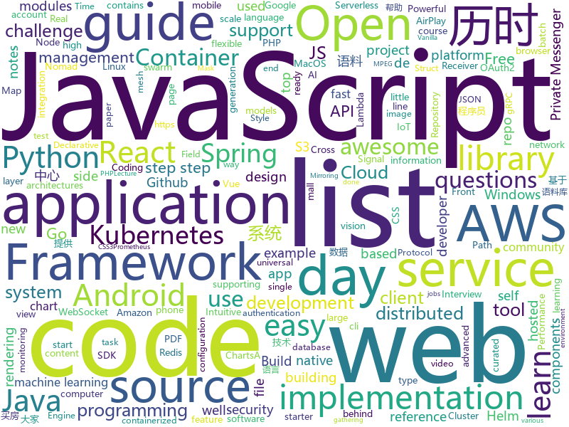

# 2021-01-12
See what the GitHub community is most excited about.

## python
+ [30-Days-Of-Python](https://github.com/Asabeneh/30-Days-Of-Python)(**275 stars today**): 30 days of Python programming challenge is a step by step guide to learn Python programming language in 30 days.
+ [s3viewer](https://github.com/SharonBrizinov/s3viewer)(**57 stars today**): Publicly Open Amazon AWS S3 Bucket Viewer
+ [fastapi](https://github.com/tiangolo/fastapi)(**59 stars today**): FastAPI framework, high performance, easy to learn, fast to code, ready for production
+ [corona](https://github.com/geohot/corona)(**12 stars today**): Reverse engineering SARS-CoV-2
+ [DALLE-mtf](https://github.com/EleutherAI/DALLE-mtf)(**16 stars today**): Open-AI's DALL-E for large scale training in mesh-tensorflow.
+ [mypy](https://github.com/python/mypy)(**7 stars today**): Optional static typing for Python 3 and 2 (PEP 484)
+ [scikit-learn](https://github.com/scikit-learn/scikit-learn)(**19 stars today**): scikit-learn: machine learning in Python
+ [microk8s](https://github.com/ubuntu/microk8s)(**8 stars today**): MicroK8s is a small, fast, single-package Kubernetes for developers, IoT and edge.
+ [DeepLearning.ai-Summary](https://github.com/mbadry1/DeepLearning.ai-Summary)(**11 stars today**): This repository contains my personal notes and summaries on DeepLearning.ai specialization courses. I've enjoyed every little bit of the course hope you enjoy my notes too.
+ [python-cheatsheet](https://github.com/gto76/python-cheatsheet)(**35 stars today**): Comprehensive Python Cheatsheet
+ [mlflow](https://github.com/mlflow/mlflow)(**8 stars today**): Open source platform for the machine learning lifecycle
+ [hacktricks](https://github.com/carlospolop/hacktricks)(**27 stars today**): Welcome to the page where you will find each trick/technique/whatever I have learnt in CTFs, real life apps, and reading researches and news.
+ [nn](https://github.com/lab-ml/nn)(**42 stars today**): 🧠Minimal implementations of neural network architectures and layers in PyTorch with side-by-side notes
+ [VisualizingTwitchCommunities](https://github.com/KiranGershenfeld/VisualizingTwitchCommunities)(**15 stars today**): Graphing communities on Twitch.tv in a visually intuitive way
+ [MODNet](https://github.com/ZHKKKe/MODNet)(**13 stars today**): A Trimap-Free Solution for Portrait Matting in Real Time under Changing Scenes
+ [public-apis](https://github.com/public-apis/public-apis)(**122 stars today**): A collective list of free APIs for use in software and web development.
+ [celery](https://github.com/celery/celery)(**17 stars today**): Distributed Task Queue (development branch)
+ [Mask_RCNN](https://github.com/matterport/Mask_RCNN)(**13 stars today**): Mask R-CNN for object detection and instance segmentation on Keras and TensorFlow
+ [pytorch-image-models](https://github.com/rwightman/pytorch-image-models)(**34 stars today**): PyTorch image models, scripts, pretrained weights -- (SE)ResNet/ResNeXT, DPN, EfficientNet, MixNet, MobileNet-V3/V2, MNASNet, Single-Path NAS, FBNet, and more
+ [aws-data-wrangler](https://github.com/awslabs/aws-data-wrangler)(**9 stars today**): Pandas on AWS - Easy integration with Athena, Glue, Redshift, Timestream, QuickSight, Chime, CloudWatchLogs, DynamoDB, EMR, SecretManager, PostgreSQL, MySQL, SQLServer and S3 (Parquet, CSV, JSON and EXCEL).
+ [awx](https://github.com/ansible/awx)(**8 stars today**): AWX Project
+ [bert](https://github.com/google-research/bert)(**18 stars today**): TensorFlow code and pre-trained models for BERT
+ [moco](https://github.com/facebookresearch/moco)(**8 stars today**): PyTorch implementation of MoCo: https://arxiv.org/abs/1911.05722
+ [django-allauth](https://github.com/pennersr/django-allauth)(**4 stars today**): Integrated set of Django applications addressing authentication, registration, account management as well as 3rd party (social) account authentication.
+ [networkx](https://github.com/networkx/networkx)(**6 stars today**): Network Analysis in Python

## java
+ [Signal-Android](https://github.com/signalapp/Signal-Android)(**820 stars today**): A private messenger for Android.
+ [Signal-Server](https://github.com/signalapp/Signal-Server)(**567 stars today**): Server supporting the Signal Private Messenger applications on Android, Desktop, and iOS
+ [signal-cli](https://github.com/AsamK/signal-cli)(**9 stars today**): signal-cli provides a commandline and dbus interface for signalapp/libsignal-service-java
+ [interview](https://github.com/mission-peace/interview)(**6 stars today**): Interview questions
+ [libsignal-protocol-java](https://github.com/signalapp/libsignal-protocol-java)(**12 stars today**): Signal Protocol library for Java/Android
+ [java-developer-roadmap](https://github.com/s4kibs4mi/java-developer-roadmap)(**20 stars today**): Roadmap to becoming a Java developer in 2021
+ [react-native-push-notification](https://github.com/zo0r/react-native-push-notification)(**3 stars today**): React Native Local and Remote Notifications
+ [spring-cloud-netflix](https://github.com/spring-cloud/spring-cloud-netflix)(**0 stars today**): Integration with Netflix OSS components
+ [djl](https://github.com/awslabs/djl)(**3 stars today**): An Engine-Agnostic Deep Learning Framework in Java
+ [nacos](https://github.com/alibaba/nacos)(**34 stars today**): an easy-to-use dynamic service discovery, configuration and service management platform for building cloud native applications.
+ [aws-doc-sdk-examples](https://github.com/awsdocs/aws-doc-sdk-examples)(**7 stars today**): Welcome to the AWS Code Examples Repository. This repo contains code examples used in the AWS documentation, AWS SDK Developer Guides, and more. For more information, see the Readme.rst file below.
+ [languagetool](https://github.com/languagetool-org/languagetool)(**8 stars today**): Style and Grammar Checker for 25+ Languages
+ [dbeaver](https://github.com/dbeaver/dbeaver)(**59 stars today**): Free universal database tool and SQL client
+ [keycloak](https://github.com/keycloak/keycloak)(**8 stars today**): Open Source Identity and Access Management For Modern Applications and Services
+ [springCloud](https://github.com/acloudyh/springCloud)(**2 stars today**): 尚硅谷springCloud学习
+ [spring-security-oauth](https://github.com/spring-projects/spring-security-oauth)(**3 stars today**): Support for adding OAuth1(a) and OAuth2 features (consumer and provider) for Spring web applications.
+ [mall-swarm](https://github.com/macrozheng/mall-swarm)(**14 stars today**): mall-swarm是一套微服务商城系统，采用了 Spring Cloud Hoxton & Alibaba、Spring Boot 2.3、Oauth2、MyBatis、Docker、Elasticsearch等核心技术，同时提供了基于Vue的管理后台方便快速搭建系统。mall-swarm在电商业务的基础集成了注册中心、配置中心、监控中心、网关等系统功能。文档齐全，附带全套Spring Cloud教程。
+ [threema-android](https://github.com/threema-ch/threema-android)(**8 stars today**): Threema App for Android.
+ [BaseRecyclerViewAdapterHelper](https://github.com/CymChad/BaseRecyclerViewAdapterHelper)(**14 stars today**): BRVAH:Powerful and flexible RecyclerAdapter
+ [grpc-java](https://github.com/grpc/grpc-java)(**5 stars today**): The Java gRPC implementation. HTTP/2 based RPC
+ [MPAndroidChart](https://github.com/PhilJay/MPAndroidChart)(**12 stars today**): A powerful🚀Android chart view / graph view library, supporting line- bar- pie- radar- bubble- and candlestick charts as well as scaling, panning and animations.
+ [spring-framework](https://github.com/spring-projects/spring-framework)(**11 stars today**): Spring Framework
+ [checkstyle](https://github.com/checkstyle/checkstyle)(**4 stars today**): Checkstyle is a development tool to help programmers write Java code that adheres to a coding standard. By default it supports the Google Java Style Guide and Sun Code Conventions, but is highly configurable. It can be invoked with an ANT task and a command line program.
+ [skywalking](https://github.com/apache/skywalking)(**13 stars today**): APM, Application Performance Monitoring System
+ [dropwizard](https://github.com/dropwizard/dropwizard)(**4 stars today**): A damn simple library for building production-ready RESTful web services.

## unknown
+ [gccrs](https://github.com/Rust-GCC/gccrs)(**105 stars today**): GCC Front-End for Rust
+ [coder2gwy](https://github.com/coder2gwy/coder2gwy)(**888 stars today**): 互联网首份程序员考公指南，由3位已经进入体制内的前大厂程序员联合献上。
+ [100-Days-Of-ML-Code](https://github.com/Avik-Jain/100-Days-Of-ML-Code)(**137 stars today**): 100 Days of ML Coding
+ [shanghai_house_knowledge](https://github.com/ayuer/shanghai_house_knowledge)(**212 stars today**): 2020年11月在上海买房经历总结出来的买房购房做的一些功课分享给大家，技术人帮助技术人，希望对大家有所帮助。
+ [awesome-distributed-transactions](https://github.com/rystsov/awesome-distributed-transactions)(**124 stars today**): Awesome list of distributed transactions
+ [Cloud-DevSecOps-Learning](https://github.com/chughes29/Cloud-DevSecOps-Learning)(**69 stars today**): Collection of Cloud and DevSecOps learning resources
+ [ChineseDiachronicCorpus](https://github.com/liuhuanyong/ChineseDiachronicCorpus)(**56 stars today**): ChineseDiachronicCorpus，中文历时语料库，横跨六十余年，包括腾讯历时新闻2000-2016，人民日报历时语料1946-2003，参考消息历时语料1957-2002。基于历时流通语料库，可用于历时语言变化计算、语言监测、社会文化变迁研究提供基础性的语料支持。
+ [javascript-questions](https://github.com/lydiahallie/javascript-questions)(**273 stars today**): A long list of (advanced) JavaScript questions, and their explanations✨
+ [data-science](https://github.com/ossu/data-science)(**17 stars today**): 📊Path to a free self-taught education in Data Science!
+ [games](https://github.com/leereilly/games)(**337 stars today**): 🎮A list of popular/awesome video games, add-ons, maps, etc. hosted on GitHub. Any genre. Any platform. Any engine.
+ [Decision-Review-System](https://github.com/uditbhaskar21/Decision-Review-System)(**13 stars today**): 
+ [awesome-mlops](https://github.com/visenger/awesome-mlops)(**14 stars today**): A curated list of references for MLOps
+ [awesome-computer-vision](https://github.com/jbhuang0604/awesome-computer-vision)(**106 stars today**): A curated list of awesome computer vision resources
+ [cs_study_plan](https://github.com/spring2go/cs_study_plan)(**236 stars today**): 一份硬核(hardcore)计算机科学CS自学计划，偏向软件工程和系统架构方向
+ [thank-you-php](https://github.com/thank-you-php/thank-you-php)(**15 stars today**): Give thanks to PHP - An open letter of gratitude to PHP
+ [lecture_notes](https://github.com/popgenmethods/lecture_notes)(**24 stars today**): Lecture Notes on Computational and Mathematical Population Genetics
+ [awesome-devbook](https://github.com/738/awesome-devbook)(**29 stars today**): 📕국내 개발 도서 리스트
+ [Top-10-Computer-Vision-Papers-2020](https://github.com/louisfb01/Top-10-Computer-Vision-Papers-2020)(**7 stars today**): A list of the top 10 computer vision papers in 2020 with video demos, articles, code and paper reference.
+ [hiddon](https://github.com/tuancc-hub/hiddon)(**5 stars today**): a undetectiable way to hide rootfs
+ [Specs](https://github.com/CocoaPods/Specs)(**1 stars today**): The CocoaPods Master Repo
+ [awesome-dotnet](https://github.com/quozd/awesome-dotnet)(**9 stars today**): A collection of awesome .NET libraries, tools, frameworks and software
+ [God-Of-BigData](https://github.com/wangzhiwubigdata/God-Of-BigData)(**10 stars today**): 大数据面试题，大数据成神之路开启...Flink/Spark/Hadoop/Hbase/Hive...
+ [Xiaomi_Kernel_OpenSource](https://github.com/MiCode/Xiaomi_Kernel_OpenSource)(**4 stars today**): Xiaomi Mobile Phone Kernel OpenSource
+ [awesome-public-datasets](https://github.com/awesomedata/awesome-public-datasets)(**19 stars today**): A topic-centric list of HQ open datasets.
+ [algorithmsbook](https://github.com/sisl/algorithmsbook)(**19 stars today**): Preview of the textbook Algorithms for Decision Making

## javascript
+ [Signal-Desktop](https://github.com/signalapp/Signal-Desktop)(**486 stars today**): Signal — Private Messenger for Windows, Mac, and Linux
+ [webpack](https://github.com/webpack/webpack)(**16 stars today**): A bundler for javascript and friends. Packs many modules into a few bundled assets. Code Splitting allows for loading parts of the application on demand. Through "loaders", modules can be CommonJs, AMD, ES6 modules, CSS, Images, JSON, Coffeescript, LESS, ... and your custom stuff.
+ [ccxt](https://github.com/ccxt/ccxt)(**111 stars today**): A JavaScript / Python / PHP cryptocurrency trading API with support for more than 120 bitcoin/altcoin exchanges
+ [brave-browser](https://github.com/brave/brave-browser)(**15 stars today**): Next generation Brave browser for Android, Linux, macOS, Windows.
+ [reactjs-interview-questions](https://github.com/sudheerj/reactjs-interview-questions)(**43 stars today**): List of top 500 ReactJS Interview Questions & Answers....Coding exercise questions are coming soon!!
+ [nuxt.js](https://github.com/nuxt/nuxt.js)(**24 stars today**): The Intuitive Vue Framework
+ [30-Days-Of-JavaScript](https://github.com/Asabeneh/30-Days-Of-JavaScript)(**300 stars today**): 30 days of JavaScript programming challenge is a step by step guide to learn JavaScript programming language in 30 days
+ [google-calendar-crx](https://github.com/manastungare/google-calendar-crx)(**58 stars today**): Google Calendar for Chrome
+ [30-Days-Of-React](https://github.com/Asabeneh/30-Days-Of-React)(**18 stars today**): 30 Days of React challenge is a step by step guide to learn React in 30 days. This challenge needs an intermediate level of HTML, CSS, and JavaScript knowledge. It is recommended to feel good at JavaScript before you start to React. If you are not comfortable with JavaScript check out 30DaysOfJavaScript. This is a continuation of 30 Days Of JS.
+ [plotly.js](https://github.com/plotly/plotly.js)(**8 stars today**): Open-source JavaScript charting library behind Plotly and Dash
+ [Detect-It-Easy](https://github.com/horsicq/Detect-It-Easy)(**18 stars today**): Program for determining types of files for Windows, Linux and MacOS.
+ [material-ui](https://github.com/mui-org/material-ui)(**36 stars today**): React components for faster and simpler web development. Build your own design system, or start with Material Design.
+ [libsignal-protocol-javascript](https://github.com/signalapp/libsignal-protocol-javascript)(**34 stars today**): Signal Protocol library for JavaScript
+ [ninja](https://github.com/remvst/ninja)(**11 stars today**): 
+ [serverless](https://github.com/serverless/serverless)(**15 stars today**): ⚡Serverless Framework – Build web, mobile and IoT applications with serverless architectures using AWS Lambda, Azure Functions, Google CloudFunctions & more! –
+ [react-router](https://github.com/ReactTraining/react-router)(**15 stars today**): Declarative routing for React
+ [react-window](https://github.com/bvaughn/react-window)(**11 stars today**): React components for efficiently rendering large lists and tabular data
+ [node-telegram-bot-api](https://github.com/yagop/node-telegram-bot-api)(**8 stars today**): Telegram Bot API for NodeJS
+ [opensource.guide](https://github.com/github/opensource.guide)(**8 stars today**): 📚Community guides for open source creators
+ [strapi](https://github.com/strapi/strapi)(**31 stars today**): 🚀Open source Node.js Headless CMS to easily build customisable APIs
+ [three.js](https://github.com/mrdoob/three.js)(**35 stars today**): JavaScript 3D library.
+ [dash.js](https://github.com/Dash-Industry-Forum/dash.js)(**3 stars today**): A reference client implementation for the playback of MPEG DASH via Javascript and compliant browsers.
+ [jsPDF](https://github.com/MrRio/jsPDF)(**17 stars today**): Client-side JavaScript PDF generation for everyone.
+ [next.js](https://github.com/vercel/next.js)(**55 stars today**): The React Framework
+ [txAdmin](https://github.com/tabarra/txAdmin)(**19 stars today**): txAdmin - remotely manage&monitor your GTA5 FiveM Server

## html
+ [charts](https://github.com/bitnami/charts)(**10 stars today**): Helm Charts
+ [Front-end-Developer-Interview-Questions](https://github.com/h5bp/Front-end-Developer-Interview-Questions)(**15 stars today**): A list of helpful front-end related questions you can use to interview potential candidates, test yourself or completely ignore.
+ [mlh-hackathon-flask-starter](https://github.com/MLH/mlh-hackathon-flask-starter)(**4 stars today**): Hackathon starter project for Flask applications
+ [hyperblog](https://github.com/freddier/hyperblog)(**16 stars today**): Un blog increíble para el curso de Git y Github de Platzi
+ [ML-notes](https://github.com/Sakura-gh/ML-notes)(**7 stars today**): notes about machine learning
+ [AdminLTE](https://github.com/ColorlibHQ/AdminLTE)(**22 stars today**): AdminLTE - Free admin dashboard template based on Bootstrap 4
+ [UPduino-v3.0](https://github.com/tinyvision-ai-inc/UPduino-v3.0)(**30 stars today**): UPduino 3.0: new 4 layer layout, various other improvements
+ [wiki](https://github.com/PeiQi0/wiki)(**5 stars today**): wiki
+ [Airplay-SDK](https://github.com/xfirefly/Airplay-SDK)(**15 stars today**): Airplay Receiver SDK supports Airplay Mirroring and AirPlay Casting to a receiver device.
+ [element-web](https://github.com/vector-im/element-web)(**12 stars today**): A glossy Matrix collaboration client for the web.
+ [helm-charts](https://github.com/jenkinsci/helm-charts)(**0 stars today**): Jenkins community Helm charts
+ [html-css](https://github.com/gustavoguanabara/html-css)(**5 stars today**): Curso de HTML5 e CSS3
+ [helm-charts](https://github.com/prometheus-community/helm-charts)(**3 stars today**): Prometheus community Helm charts
+ [intro.js](https://github.com/usablica/intro.js)(**10 stars today**): A better way for new feature introduction and step-by-step users guide for your website and project.
+ [url-to-pdf-api](https://github.com/alvarcarto/url-to-pdf-api)(**3 stars today**): Web page PDF/PNG rendering done right. Self-hosted service for rendering receipts, invoices, or any content.
+ [machine-learning-systems-design](https://github.com/chiphuyen/machine-learning-systems-design)(**6 stars today**): A booklet on machine learning systems design with exercises
+ [content](https://github.com/mdn/content)(**19 stars today**): The content behind MDN Web Docs
+ [cypress-example-kitchensink](https://github.com/cypress-io/cypress-example-kitchensink)(**0 stars today**): This is an example app used to showcase Cypress.io testing.
+ [helm-charts](https://github.com/DataDog/helm-charts)(**0 stars today**): Helm charts for Datadog products
+ [mlh-hackathon-nodejs-starter](https://github.com/MLH/mlh-hackathon-nodejs-starter)(**3 stars today**): Hackathon starter project for Node.js applications
+ [JavaScript30](https://github.com/wesbos/JavaScript30)(**14 stars today**): 30 Day Vanilla JS Challenge
+ [DetectionLab](https://github.com/clong/DetectionLab)(**1 stars today**): Automate the creation of a lab environment complete with security tooling and logging best practices
+ [ansible-role-security](https://github.com/geerlingguy/ansible-role-security)(**1 stars today**): Ansible Role - Security
+ [frida-all-in-one](https://github.com/hookmaster/frida-all-in-one)(**2 stars today**): 《FRIDA操作手册》by @hluwa @r0ysue
+ [tidytuesday](https://github.com/rfordatascience/tidytuesday)(**4 stars today**): Official repo for the #tidytuesday project

## go
+ [juicefs](https://github.com/juicedata/juicefs)(**387 stars today**): A distributed POSIX file system built on top of Redis and S3.
+ [mtSecKill](https://github.com/zqjzqj/mtSecKill)(**307 stars today**): 京东茅台抢购
+ [iris](https://github.com/kataras/iris)(**14 stars today**): The fastest HTTP/2 Go Web Framework. AWS Lambda, gRPC, MVC, Unique Router, Websockets, Sessions, Test suite, Dependency Injection and more. A true successor of expressjs and laravel | 谢谢 https://github.com/kataras/iris/issues/1329 |
+ [argo-cd](https://github.com/argoproj/argo-cd)(**12 stars today**): Declarative continuous deployment for Kubernetes.
+ [PhoneInfoga](https://github.com/sundowndev/PhoneInfoga)(**113 stars today**): Advanced information gathering & OSINT framework for phone numbers
+ [linkerd2](https://github.com/linkerd/linkerd2)(**12 stars today**): Ultralight, security-first service mesh for Kubernetes. Main repo for Linkerd 2.x.
+ [validator](https://github.com/go-playground/validator)(**11 stars today**): 💯Go Struct and Field validation, including Cross Field, Cross Struct, Map, Slice and Array diving
+ [kubernetes](https://github.com/kubernetes/kubernetes)(**36 stars today**): Production-Grade Container Scheduling and Management
+ [eksctl](https://github.com/weaveworks/eksctl)(**3 stars today**): The official CLI for Amazon EKS
+ [goquery](https://github.com/PuerkitoBio/goquery)(**6 stars today**): A little like that j-thing, only in Go.
+ [nomad](https://github.com/hashicorp/nomad)(**5 stars today**): Nomad is an easy-to-use, flexible, and performant workload orchestrator that can deploy a mix of microservice, batch, containerized, and non-containerized applications. Nomad is easy to operate and scale and has native Consul and Vault integrations.
+ [jaeger](https://github.com/jaegertracing/jaeger)(**16 stars today**): CNCF Jaeger, a Distributed Tracing Platform
+ [viper](https://github.com/spf13/viper)(**15 stars today**): Go configuration with fangs
+ [prometheus](https://github.com/prometheus/prometheus)(**26 stars today**): The Prometheus monitoring system and time series database.
+ [websocket](https://github.com/gorilla/websocket)(**18 stars today**): A fast, well-tested and widely used WebSocket implementation for Go.
+ [sourcegraph](https://github.com/sourcegraph/sourcegraph)(**9 stars today**): Universal code search (self-hosted)
+ [cluster-api](https://github.com/kubernetes-sigs/cluster-api)(**0 stars today**): Home for the Cluster Management API work, a subproject of sig-cluster-lifecycle
+ [harvester](https://github.com/rancher/harvester)(**3 stars today**): Open source hyperconverged infrastructure (HCI) software
+ [cri-o](https://github.com/cri-o/cri-o)(**7 stars today**): Open Container Initiative-based implementation of Kubernetes Container Runtime Interface
+ [podman](https://github.com/containers/podman)(**12 stars today**): Podman: A tool for managing OCI containers and pods
+ [tendermint](https://github.com/tendermint/tendermint)(**3 stars today**): ⟁ Tendermint Core (BFT Consensus) in Go
+ [pushgateway](https://github.com/prometheus/pushgateway)(**3 stars today**): Push acceptor for ephemeral and batch jobs.
+ [redis](https://github.com/go-redis/redis)(**10 stars today**): Type-safe Redis client for Golang
+ [autoscaler](https://github.com/kubernetes/autoscaler)(**6 stars today**): Autoscaling components for Kubernetes
+ [cosmos-sdk](https://github.com/cosmos/cosmos-sdk)(**5 stars today**): ⛓️A Framework for Building High Value Public Blockchains✨

## WordCloud

