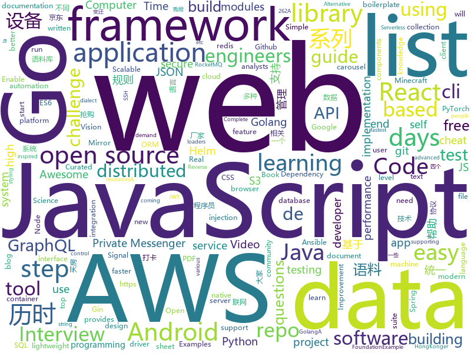

# 2021-01-13
See what the GitHub community is most excited about.

## python
+ [parler-tricks](https://github.com/d0nk/parler-tricks)(**42 stars today**): Reverse engineered Parler API
+ [hacktricks](https://github.com/carlospolop/hacktricks)(**37 stars today**): Welcome to the page where you will find each trick/technique/whatever I have learnt in CTFs, real life apps, and reading researches and news.
+ [s3viewer](https://github.com/SharonBrizinov/s3viewer)(**106 stars today**): Publicly Open Amazon AWS S3 Bucket Viewer
+ [30-Days-Of-Python](https://github.com/Asabeneh/30-Days-Of-Python)(**319 stars today**): 30 days of Python programming challenge is a step by step guide to learn Python programming language in 30 days.
+ [erpnext](https://github.com/frappe/erpnext)(**12 stars today**): Free and Open Source Alternative to SAP
+ [numpy-ml](https://github.com/ddbourgin/numpy-ml)(**52 stars today**): Machine learning, in numpy
+ [arXiv2020-RIFE](https://github.com/hzwer/arXiv2020-RIFE)(**15 stars today**): RIFE: Real Time Video Frame Rate Enhancement
+ [cheat.sh](https://github.com/chubin/cheat.sh)(**49 stars today**): the only cheat sheet you need
+ [ungoogled-chromium](https://github.com/Eloston/ungoogled-chromium)(**17 stars today**): Google Chromium, sans integration with Google
+ [localstack](https://github.com/localstack/localstack)(**19 stars today**): 💻A fully functional local AWS cloud stack. Develop and test your cloud & Serverless apps offline!
+ [mlflow](https://github.com/mlflow/mlflow)(**6 stars today**): Open source platform for the machine learning lifecycle
+ [pytorch-lightning](https://github.com/PyTorchLightning/pytorch-lightning)(**25 stars today**): The lightweight PyTorch wrapper for high-performance AI research. Scale your models, not the boilerplate.
+ [caldera](https://github.com/mitre/caldera)(**8 stars today**): Scalable Automated Adversary Emulation Platform
+ [BackgroundMattingV2](https://github.com/PeterL1n/BackgroundMattingV2)(**72 stars today**): Real-Time High-Resolution Background Matting
+ [django-rest-framework](https://github.com/encode/django-rest-framework)(**12 stars today**): Web APIs for Django.🎸
+ [17wanxiaoCheckin-Actions](https://github.com/ReaJason/17wanxiaoCheckin-Actions)(**11 stars today**): 完美校园健康打卡，校内打卡，理论上支持所有学校（大概...），开启Actions，可能需要Enable一下
+ [aws-data-wrangler](https://github.com/awslabs/aws-data-wrangler)(**8 stars today**): Pandas on AWS - Easy integration with Athena, Glue, Redshift, Timestream, QuickSight, Chime, CloudWatchLogs, DynamoDB, EMR, SecretManager, PostgreSQL, MySQL, SQLServer and S3 (Parquet, CSV, JSON and EXCEL).
+ [moco](https://github.com/facebookresearch/moco)(**6 stars today**): PyTorch implementation of MoCo: https://arxiv.org/abs/1911.05722
+ [mmcv](https://github.com/open-mmlab/mmcv)(**6 stars today**): OpenMMLab Computer Vision Foundation
+ [aws-cdk-examples](https://github.com/aws-samples/aws-cdk-examples)(**6 stars today**): Example projects using the AWS CDK
+ [dbt](https://github.com/fishtown-analytics/dbt)(**4 stars today**): dbt (data build tool) enables data analysts and engineers to transform their data using the same practices that software engineers use to build applications.
+ [pytorch3d](https://github.com/facebookresearch/pytorch3d)(**6 stars today**): PyTorch3D is FAIR's library of reusable components for deep learning with 3D data
+ [dagster](https://github.com/dagster-io/dagster)(**3 stars today**): A data orchestrator for machine learning, analytics, and ETL.
+ [tensorflow-yolov3](https://github.com/YunYang1994/tensorflow-yolov3)(**7 stars today**): 🔥TensorFlow Code for technical report: "YOLOv3: An Incremental Improvement"
+ [r0capture](https://github.com/r0ysue/r0capture)(**11 stars today**): 安卓应用层抓包通杀脚本

## java
+ [Signal-Android](https://github.com/signalapp/Signal-Android)(**675 stars today**): A private messenger for Android.
+ [Signal-Server](https://github.com/signalapp/Signal-Server)(**441 stars today**): Server supporting the Signal Private Messenger applications on Android, Desktop, and iOS
+ [AndroidAPS](https://github.com/nightscout/AndroidAPS)(**5 stars today**): 
+ [janusgraph](https://github.com/JanusGraph/janusgraph)(**10 stars today**): JanusGraph: an open-source, distributed graph database
+ [PojavLauncher](https://github.com/PojavLauncherTeam/PojavLauncher)(**3 stars today**): A Minecraft: Java Edition Launcher for Android based on Boardwalk. Note that v2 will not able to run Minecraft 1.12+.
+ [aws-doc-sdk-examples](https://github.com/awsdocs/aws-doc-sdk-examples)(**3 stars today**): Welcome to the AWS Code Examples Repository. This repo contains code examples used in the AWS documentation, AWS SDK Developer Guides, and more. For more information, see the Readme.rst file below.
+ [java-developer-roadmap](https://github.com/s4kibs4mi/java-developer-roadmap)(**9 stars today**): Roadmap to becoming a Java developer in 2021
+ [geekshop](https://github.com/geekxyz/geekshop)(**10 stars today**): 极客商城 ～ 一个面向开发者的、基于Spring+GraphQL+Angular的、无前端(headless)电商框架
+ [signal-cli](https://github.com/AsamK/signal-cli)(**19 stars today**): signal-cli provides a commandline and dbus interface for signalapp/libsignal-service-java
+ [dropwizard](https://github.com/dropwizard/dropwizard)(**5 stars today**): A damn simple library for building production-ready RESTful web services.
+ [rocketmq-externals](https://github.com/apache/rocketmq-externals)(**5 stars today**): Mirror of Apache RocketMQ (Incubating)
+ [android-interview-questions](https://github.com/MindorksOpenSource/android-interview-questions)(**9 stars today**): Your Cheat Sheet For Android Interview - Android Interview Questions
+ [ExoPlayer](https://github.com/google/ExoPlayer)(**11 stars today**): An extensible media player for Android
+ [rabbitmq-tutorials](https://github.com/rabbitmq/rabbitmq-tutorials)(**1 stars today**): Tutorials for using RabbitMQ in various ways
+ [retrofit](https://github.com/square/retrofit)(**10 stars today**): A type-safe HTTP client for Android and the JVM
+ [rest-assured](https://github.com/rest-assured/rest-assured)(**1 stars today**): Java DSL for easy testing of REST services
+ [dbeaver](https://github.com/dbeaver/dbeaver)(**34 stars today**): Free universal database tool and SQL client
+ [jetlinks-community](https://github.com/jetlinks/jetlinks-community)(**10 stars today**): JetLinks 基于Java8,Spring Boot 2.x ,WebFlux,Netty,Vert.x,Reactor等开发, 是一个全响应式的企业级物联网平台。支持统一物模型管理,多种设备,多种厂家,统一管理。统一设备连接管理,多协议适配(TCP,MQTT,UDP,CoAP,HTTP等),屏蔽网络编程复杂性,灵活接入不同厂家不同协议等设备。实时数据处理,设备告警,消息通知,数据转发。地理位置,数据可视化等。能帮助你快速建立物联网相关业务系统。
+ [interview](https://github.com/mission-peace/interview)(**8 stars today**): Interview questions
+ [guice](https://github.com/google/guice)(**3 stars today**): Guice (pronounced 'juice') is a lightweight dependency injection framework for Java 6 and above, brought to you by Google.
+ [DataX](https://github.com/alibaba/DataX)(**10 stars today**): 
+ [selenium](https://github.com/SeleniumHQ/selenium)(**10 stars today**): A browser automation framework and ecosystem.
+ [graphql-java](https://github.com/graphql-java/graphql-java)(**6 stars today**): GraphQL Java implementation
+ [keycloak](https://github.com/keycloak/keycloak)(**12 stars today**): Open Source Identity and Access Management For Modern Applications and Services
+ [jedis](https://github.com/redis/jedis)(**1 stars today**): A blazingly small and sane redis java client

## unknown
+ [coder2gwy](https://github.com/coder2gwy/coder2gwy)(**2,604 stars today**): 互联网首份程序员考公指南，由3位已经进入体制内的前大厂程序员联合献上。
+ [mewehkdirectory](https://github.com/mewedir/mewehkdirectory)(**24 stars today**): MeWe Directory for HongKonger
+ [frontend-challenges](https://github.com/felipefialho/frontend-challenges)(**27 stars today**): 💥Listing some playful open-source's challenges of jobs to test your knowledge
+ [data-science](https://github.com/ossu/data-science)(**84 stars today**): 📊Path to a free self-taught education in Data Science!
+ [shanghai_house_knowledge](https://github.com/ayuer/shanghai_house_knowledge)(**124 stars today**): 2020年11月在上海买房经历总结出来的买房购房做的一些功课分享给大家，技术人帮助技术人，希望对大家有所帮助。
+ [git-cheat-sheet](https://github.com/arslanbilal/git-cheat-sheet)(**39 stars today**): git and git flow cheat sheet
+ [100-Days-Of-ML-Code](https://github.com/Avik-Jain/100-Days-Of-ML-Code)(**154 stars today**): 100 Days of ML Coding
+ [ChineseDiachronicCorpus](https://github.com/liuhuanyong/ChineseDiachronicCorpus)(**135 stars today**): ChineseDiachronicCorpus，中文历时语料库，横跨六十余年，包括腾讯历时新闻2000-2016，人民日报历时语料1946-2003，参考消息历时语料1957-2002。基于历时流通语料库，可用于历时语言变化计算、语言监测、社会文化变迁研究提供基础性的语料支持。
+ [PocketLCD](https://github.com/peng-zhihui/PocketLCD)(**22 stars today**): 带充电宝功能的便携显示器
+ [gccrs](https://github.com/Rust-GCC/gccrs)(**139 stars today**): GCC Front-End for Rust
+ [javascript-questions](https://github.com/lydiahallie/javascript-questions)(**438 stars today**): A long list of (advanced) JavaScript questions, and their explanations✨
+ [awesome-distributed-transactions](https://github.com/rystsov/awesome-distributed-transactions)(**138 stars today**): Awesome list of distributed transactions
+ [MyActions](https://github.com/sazs34/MyActions)(**40 stars today**): 
+ [cs-video-courses](https://github.com/Developer-Y/cs-video-courses)(**202 stars today**): List of Computer Science courses with video lectures.
+ [the-engineering-managers-booklist](https://github.com/jesselpalmer/the-engineering-managers-booklist)(**47 stars today**): Books for people who are or aspire to manage/lead team(s) of software engineers
+ [Blog](https://github.com/mqyqingfeng/Blog)(**33 stars today**): 冴羽写博客的地方，预计写四个系列：JavaScript深入系列、JavaScript专题系列、ES6系列、React系列。
+ [cs_study_plan](https://github.com/spring2go/cs_study_plan)(**45 stars today**): 一份硬核(hardcore)计算机科学CS自学计划，偏向软件工程和系统架构方向
+ [awesome-graphql](https://github.com/chentsulin/awesome-graphql)(**11 stars today**): Awesome list of GraphQL & Relay
+ [awesome-computer-vision](https://github.com/jbhuang0604/awesome-computer-vision)(**58 stars today**): A curated list of awesome computer vision resources
+ [the-book-of-secret-knowledge](https://github.com/trimstray/the-book-of-secret-knowledge)(**13 stars today**): A collection of inspiring lists, manuals, cheatsheets, blogs, hacks, one-liners, cli/web tools and more.
+ [you-dont-know-js-ru](https://github.com/azat-io/you-dont-know-js-ru)(**5 stars today**): 📚Russian translation of "You Don't Know JS" book series
+ [ACL4SSR](https://github.com/ACL4SSR/ACL4SSR)(**5 stars today**): SSR 去广告ACL规则/SS完整GFWList规则/Clash规则碎片，Telegram频道订阅地址
+ [Tvlist-awesome-m3u-m3u8](https://github.com/imDazui/Tvlist-awesome-m3u-m3u8)(**10 stars today**): 直播源相关资源汇总📺💯IPTV、M3U —— 勤洗手、戴口罩，祝愿所有人百毒不侵
+ [autoware.ai](https://github.com/Autoware-AI/autoware.ai)(**6 stars today**): Open-source software for self-driving vehicles
+ [AKS](https://github.com/Azure/AKS)(**3 stars today**): Azure Kubernetes Service

## javascript
+ [Signal-Desktop](https://github.com/signalapp/Signal-Desktop)(**506 stars today**): Signal — Private Messenger for Windows, Mac, and Linux
+ [30-Days-Of-React](https://github.com/Asabeneh/30-Days-Of-React)(**142 stars today**): 30 Days of React challenge is a step by step guide to learn React in 30 days. This challenge needs an intermediate level of HTML, CSS, and JavaScript knowledge. It is recommended to feel good at JavaScript before you start to React. If you are not comfortable with JavaScript check out 30DaysOfJavaScript. This is a continuation of 30 Days Of JS.
+ [ccxt](https://github.com/ccxt/ccxt)(**288 stars today**): A JavaScript / Python / PHP cryptocurrency trading API with support for more than 120 bitcoin/altcoin exchanges
+ [next.js](https://github.com/vercel/next.js)(**60 stars today**): The React Framework
+ [material-ui](https://github.com/mui-org/material-ui)(**30 stars today**): React components for faster and simpler web development. Build your own design system, or start with Material Design.
+ [draft-js](https://github.com/facebook/draft-js)(**9 stars today**): A React framework for building text editors.
+ [jitsi-meet](https://github.com/jitsi/jitsi-meet)(**19 stars today**): Jitsi Meet - Secure, Simple and Scalable Video Conferences that you use as a standalone app or embed in your web application.
+ [cypress](https://github.com/cypress-io/cypress)(**30 stars today**): Fast, easy and reliable testing for anything that runs in a browser.
+ [jdms](https://github.com/Yx1aoq1/jdms)(**63 stars today**): 京东抢购秒杀助手
+ [lerna](https://github.com/lerna/lerna)(**16 stars today**): 🐉A tool for managing JavaScript projects with multiple packages.
+ [tailwindcss.com](https://github.com/tailwindlabs/tailwindcss.com)(**60 stars today**): 
+ [hackathon-starter](https://github.com/sahat/hackathon-starter)(**13 stars today**): A boilerplate for Node.js web applications
+ [react](https://github.com/facebook/react)(**63 stars today**): A declarative, efficient, and flexible JavaScript library for building user interfaces.
+ [react-beautiful-dnd](https://github.com/atlassian/react-beautiful-dnd)(**20 stars today**): Beautiful and accessible drag and drop for lists with React
+ [reactjs-interview-questions](https://github.com/sudheerj/reactjs-interview-questions)(**35 stars today**): List of top 500 ReactJS Interview Questions & Answers....Coding exercise questions are coming soon!!
+ [webpack](https://github.com/webpack/webpack)(**44 stars today**): A bundler for javascript and friends. Packs many modules into a few bundled assets. Code Splitting allows for loading parts of the application on demand. Through "loaders", modules can be CommonJs, AMD, ES6 modules, CSS, Images, JSON, Coffeescript, LESS, ... and your custom stuff.
+ [bigbluebutton](https://github.com/bigbluebutton/bigbluebutton)(**4 stars today**): Complete open source web conferencing system.
+ [pdf.js](https://github.com/mozilla/pdf.js)(**19 stars today**): PDF Reader in JavaScript
+ [chalk](https://github.com/chalk/chalk)(**9 stars today**): 🖍Terminal string styling done right
+ [Detox](https://github.com/wix/Detox)(**7 stars today**): Gray box end-to-end testing and automation framework for mobile apps
+ [react-slick](https://github.com/akiran/react-slick)(**8 stars today**): React carousel component
+ [ninja](https://github.com/remvst/ninja)(**13 stars today**): 
+ [google-calendar-crx](https://github.com/manastungare/google-calendar-crx)(**24 stars today**): Google Calendar for Chrome
+ [slick](https://github.com/kenwheeler/slick)(**7 stars today**): the last carousel you'll ever need
+ [sequelize](https://github.com/sequelize/sequelize)(**10 stars today**): An easy-to-use multi SQL dialect ORM for Node.js

## html
+ [ansible-collection-hardening](https://github.com/dev-sec/ansible-collection-hardening)(**3 stars today**): This Ansible collection provides battle tested hardening for Linux, SSH, nginx, MySQL
+ [tidytuesday](https://github.com/rfordatascience/tidytuesday)(**7 stars today**): Official repo for the #tidytuesday project
+ [charts](https://github.com/bitnami/charts)(**12 stars today**): Helm Charts
+ [matrix-docker-ansible-deploy](https://github.com/spantaleev/matrix-docker-ansible-deploy)(**5 stars today**): Matrix (An open network for secure, decentralized communication) server setup using Ansible and Docker
+ [learning-area](https://github.com/mdn/learning-area)(**6 stars today**): Github repo for the MDN Learning Area.
+ [amundsen](https://github.com/amundsen-io/amundsen)(**2 stars today**): Amundsen is a metadata driven application for improving the productivity of data analysts, data scientists and engineers when interacting with data.
+ [hyperblog](https://github.com/freddier/hyperblog)(**18 stars today**): Un blog increíble para el curso de Git y Github de Platzi
+ [free-for-dev](https://github.com/ripienaar/free-for-dev)(**32 stars today**): A list of SaaS, PaaS and IaaS offerings that have free tiers of interest to devops and infradev
+ [html-css](https://github.com/gustavoguanabara/html-css)(**10 stars today**): Curso de HTML5 e CSS3
+ [panda-commerce](https://github.com/ProgrammingHero1/panda-commerce)(**3 stars today**): Panda Commerce
+ [tek2](https://github.com/TesteurManiak/tek2)(**0 stars today**): Piscine + projets de la deuxième année Epitech
+ [embeddedsw](https://github.com/Xilinx/embeddedsw)(**1 stars today**): Xilinx Embedded Software (embeddedsw) Development
+ [helm-charts](https://github.com/jenkinsci/helm-charts)(**0 stars today**): Jenkins community Helm charts
+ [helm-charts](https://github.com/prometheus-community/helm-charts)(**5 stars today**): Prometheus community Helm charts
+ [ecma262](https://github.com/tc39/ecma262)(**5 stars today**): Status, process, and documents for ECMA-262
+ [moveit_tutorials](https://github.com/ros-planning/moveit_tutorials)(**0 stars today**): A sphinx-based centralized documentation repo for MoveIt
+ [EIPs](https://github.com/ethereum/EIPs)(**7 stars today**): The Ethereum Improvement Proposal repository
+ [charts](https://github.com/minio/charts)(**4 stars today**): MinIO Helm Charts
+ [wpt](https://github.com/web-platform-tests/wpt)(**1 stars today**): Test suites for Web platform specs — including WHATWG, W3C, and others
+ [infinite-scroll](https://github.com/metafizzy/infinite-scroll)(**9 stars today**): 📜Automatically add next page
+ [calendar](https://github.com/PythonFreeCourse/calendar)(**2 stars today**): 
+ [awesome-compose](https://github.com/docker/awesome-compose)(**8 stars today**): Awesome Docker Compose samples
+ [2004A](https://github.com/Beau-Tian/2004A)(****): 课程资料，笔记etc.
+ [intro.js](https://github.com/usablica/intro.js)(**10 stars today**): A better way for new feature introduction and step-by-step users guide for your website and project.
+ [ESPEasy](https://github.com/letscontrolit/ESPEasy)(**3 stars today**): Easy MultiSensor device based on ESP8266

## go
+ [juicefs](https://github.com/juicedata/juicefs)(**376 stars today**): JuiceFS is a distributed POSIX file system built on top of Redis and S3.
+ [mongo-go-driver](https://github.com/mongodb/mongo-go-driver)(**9 stars today**): The Go driver for MongoDB
+ [graphql](https://github.com/graphql-go/graphql)(**11 stars today**): An implementation of GraphQL for Go / Golang
+ [cobra](https://github.com/spf13/cobra)(**17 stars today**): A Commander for modern Go CLI interactions
+ [gofpdf](https://github.com/jung-kurt/gofpdf)(**1 stars today**): A PDF document generator with high level support for text, drawing and images
+ [terraform-provider-aws](https://github.com/hashicorp/terraform-provider-aws)(**5 stars today**): Terraform AWS provider
+ [sourcegraph](https://github.com/sourcegraph/sourcegraph)(**11 stars today**): Universal code search (self-hosted)
+ [gorm](https://github.com/go-gorm/gorm)(**18 stars today**): The fantastic ORM library for Golang, aims to be developer friendly
+ [yq](https://github.com/mikefarah/yq)(**10 stars today**): yq is a portable command-line YAML processor
+ [iris](https://github.com/kataras/iris)(**35 stars today**): The fastest HTTP/2 Go Web Framework. AWS Lambda, gRPC, MVC, Unique Router, Websockets, Sessions, Test suite, Dependency Injection and more. A true successor of expressjs and laravel | 谢谢 https://github.com/kataras/iris/issues/1329 |
+ [charts](https://github.com/helm/charts)(**5 stars today**): ⚠️(OBSOLETE) Curated applications for Kubernetes
+ [go-sqlmock](https://github.com/DATA-DOG/go-sqlmock)(**5 stars today**): Sql mock driver for golang to test database interactions
+ [kubernetes](https://github.com/kubernetes/kubernetes)(**45 stars today**): Production-Grade Container Scheduling and Management
+ [jwt-go](https://github.com/dgrijalva/jwt-go)(**9 stars today**): Golang implementation of JSON Web Tokens (JWT)
+ [pipeline](https://github.com/tektoncd/pipeline)(**7 stars today**): A K8s-native Pipeline resource.
+ [mtSecKill](https://github.com/zqjzqj/mtSecKill)(**301 stars today**): 京东茅台抢购
+ [gin](https://github.com/gin-gonic/gin)(**25 stars today**): Gin is a HTTP web framework written in Go (Golang). It features a Martini-like API with much better performance -- up to 40 times faster. If you need smashing performance, get yourself some Gin.
+ [jaeger](https://github.com/jaegertracing/jaeger)(**14 stars today**): CNCF Jaeger, a Distributed Tracing Platform
+ [mapstructure](https://github.com/mitchellh/mapstructure)(**6 stars today**): Go library for decoding generic map values into native Go structures and vice versa.
+ [istio](https://github.com/istio/istio)(**10 stars today**): Connect, secure, control, and observe services.
+ [fiber](https://github.com/gofiber/fiber)(**24 stars today**): ⚡️Express inspired web framework written in Go
+ [go](https://github.com/golang/go)(**56 stars today**): The Go programming language
+ [crypto](https://github.com/golang/crypto)(**3 stars today**): [mirror] Go supplementary cryptography libraries
+ [MailHog](https://github.com/mailhog/MailHog)(**9 stars today**): Web and API based SMTP testing
+ [go-containerregistry](https://github.com/google/go-containerregistry)(**1 stars today**): Go library and CLIs for working with container registries

## WordCloud

