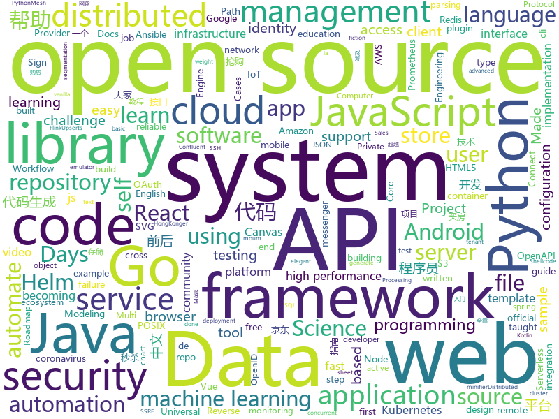

# 2021-01-14
See what the GitHub community is most excited about.

## python
+ [parler-tricks](https://github.com/d0nk/parler-tricks)(**81 stars today**): Reverse engineered Parler API
+ [hacktricks](https://github.com/carlospolop/hacktricks)(**78 stars today**): Welcome to the page where you will find each trick/technique/whatever I have learnt in CTFs, real life apps, and reading researches and news.
+ [TextBox](https://github.com/RUCAIBox/TextBox)(**27 stars today**): TextBox is an open-source library for building text generation system.
+ [pydantic](https://github.com/samuelcolvin/pydantic)(**9 stars today**): Data parsing and validation using Python type hints
+ [python-telegram-bot](https://github.com/python-telegram-bot/python-telegram-bot)(**20 stars today**): We have made you a wrapper you can't refuse
+ [jd_seckill](https://github.com/andyzys/jd_seckill)(**10 stars today**): 京东秒杀商品抢购
+ [aws-cli](https://github.com/aws/aws-cli)(**5 stars today**): Universal Command Line Interface for Amazon Web Services
+ [wagtail](https://github.com/wagtail/wagtail)(**26 stars today**): A Django content management system focused on flexibility and user experience
+ [mlflow](https://github.com/mlflow/mlflow)(**17 stars today**): Open source platform for the machine learning lifecycle
+ [causalml](https://github.com/uber/causalml)(**5 stars today**): Uplift modeling and causal inference with machine learning algorithms
+ [ansible](https://github.com/ansible/ansible)(**21 stars today**): Ansible is a radically simple IT automation platform that makes your applications and systems easier to deploy and maintain. Automate everything from code deployment to network configuration to cloud management, in a language that approaches plain English, using SSH, with no agents to install on remote systems. https://docs.ansible.com.
+ [Pytorch-Medical-Segmentation](https://github.com/MontaEllis/Pytorch-Medical-Segmentation)(**18 stars today**): This repository is an unoffical PyTorch implementation of Medical segmentation in 3D and 2D.
+ [salt](https://github.com/saltstack/salt)(**3 stars today**): Software to automate the management and configuration of any infrastructure or application at scale. Get access to the Salt software package repository here:
+ [mypy](https://github.com/python/mypy)(**5 stars today**): Optional static typing for Python 3 and 2 (PEP 484)
+ [scikit-learn](https://github.com/scikit-learn/scikit-learn)(**5 stars today**): scikit-learn: machine learning in Python
+ [FFxivPythonCraft](https://github.com/nyaoouo/FFxivPythonCraft)(**5 stars today**): 
+ [mesh](https://github.com/tensorflow/mesh)(**15 stars today**): Mesh TensorFlow: Model Parallelism Made Easier
+ [jupyterhub](https://github.com/jupyterhub/jupyterhub)(**4 stars today**): Multi-user server for Jupyter notebooks
+ [frappe](https://github.com/frappe/frappe)(**3 stars today**): Low Code Open Source Framework in Python and JS
+ [erpnext](https://github.com/frappe/erpnext)(**9 stars today**): Free and Open Source Alternative to SAP
+ [fastapi](https://github.com/tiangolo/fastapi)(**50 stars today**): FastAPI framework, high performance, easy to learn, fast to code, ready for production
+ [pymc3](https://github.com/pymc-devs/pymc3)(**2 stars today**): Probabilistic Programming in Python: Bayesian Modeling and Probabilistic Machine Learning with Theano
+ [ungoogled-chromium](https://github.com/Eloston/ungoogled-chromium)(**17 stars today**): Google Chromium, sans integration with Google
+ [pyyaml](https://github.com/yaml/pyyaml)(**3 stars today**): Canonical source repository for PyYAML
+ [numpy-ml](https://github.com/ddbourgin/numpy-ml)(**33 stars today**): Machine learning, in numpy

## java
+ [signal-cli](https://github.com/AsamK/signal-cli)(**21 stars today**): signal-cli provides a commandline and dbus interface for signalapp/libsignal-service-java
+ [libsignal-protocol-java](https://github.com/signalapp/libsignal-protocol-java)(**15 stars today**): Signal Protocol library for Java/Android
+ [ghidra](https://github.com/NationalSecurityAgency/ghidra)(**20 stars today**): Ghidra is a software reverse engineering (SRE) framework
+ [keycloak](https://github.com/keycloak/keycloak)(**10 stars today**): Open Source Identity and Access Management For Modern Applications and Services
+ [ssrf-king](https://github.com/ethicalhackingplayground/ssrf-king)(**12 stars today**): SSRF plugin for burp Automates SSRF Detection in all of the Request
+ [kafka](https://github.com/apache/kafka)(**11 stars today**): Mirror of Apache Kafka
+ [zfile](https://github.com/zhaojun1998/zfile)(**48 stars today**): 在线云盘、网盘、OneDrive、云存储、私有云、对象存储、h5ai
+ [Signal-Android](https://github.com/signalapp/Signal-Android)(**403 stars today**): A private messenger for Android.
+ [soul](https://github.com/dromara/soul)(**13 stars today**): High-Performance Java API Gateway
+ [apollo-android](https://github.com/apollographql/apollo-android)(**4 stars today**): 🤖A strongly-typed, caching GraphQL client for the JVM, Android and Kotlin multiplatform
+ [grpc-java](https://github.com/grpc/grpc-java)(**5 stars today**): The Java gRPC implementation. HTTP/2 based RPC
+ [tutorials](https://github.com/eugenp/tutorials)(**13 stars today**): Just Announced - "Learn Spring Security OAuth":
+ [karate](https://github.com/intuit/karate)(**18 stars today**): Test Automation Made Simple
+ [hbase](https://github.com/apache/hbase)(**5 stars today**): Apache HBase
+ [JCSprout](https://github.com/crossoverJie/JCSprout)(**9 stars today**): 👨‍🎓Java Core Sprout : basic, concurrent, algorithm
+ [threema-android](https://github.com/threema-ch/threema-android)(**5 stars today**): Threema App for Android.
+ [APIJSON](https://github.com/Tencent/APIJSON)(**12 stars today**): 🏆码云最有价值开源项目🚀后端接口和文档自动化，前端(客户端) 定制返回 JSON 的数据和结构！🏆Gitee Most Valuable Project🚀A JSON Transmission Protocol and an ORM Library for automatically providing APIs and Docs.
+ [Hystrix](https://github.com/Netflix/Hystrix)(**11 stars today**): Hystrix is a latency and fault tolerance library designed to isolate points of access to remote systems, services and 3rd party libraries, stop cascading failure and enable resilience in complex distributed systems where failure is inevitable.
+ [PowerJob](https://github.com/PowerJob/PowerJob)(**9 stars today**): Enterprise job scheduling middleware with distributed computing ability.
+ [selenium](https://github.com/SeleniumHQ/selenium)(**9 stars today**): A browser automation framework and ecosystem.
+ [djl](https://github.com/awslabs/djl)(**4 stars today**): An Engine-Agnostic Deep Learning Framework in Java
+ [spring-boot-admin](https://github.com/codecentric/spring-boot-admin)(**4 stars today**): Admin UI for administration of spring boot applications
+ [flink](https://github.com/apache/flink)(**20 stars today**): Apache Flink
+ [hudi](https://github.com/apache/hudi)(**4 stars today**): Upserts, Deletes And Incremental Processing on Big Data.
+ [jeecg-boot](https://github.com/zhangdaiscott/jeecg-boot)(**22 stars today**): 基于代码生成器的低代码平台，超越传统商业平台！前后端分离架构SpringBoot 2.x，SpringCloud，Ant Design&Vue，Mybatis-plus，Shiro，JWT。强大的代码生成器让前后端代码一键生成，无需写任何代码! 引领新低代码开发模式OnlineCoding->代码生成->手工MERGE，帮助Java项目解决70%重复工作，让开发更关注业务，既能快速提高开发效率，帮助公司节省成本，同时又不失灵活性。

## unknown
+ [cs-video-courses](https://github.com/Developer-Y/cs-video-courses)(**69 stars today**): List of Computer Science courses with video lectures.
+ [mewehkdirectory](https://github.com/mewedir/mewehkdirectory)(**30 stars today**): MeWe Directory for HongKonger
+ [data-science](https://github.com/ossu/data-science)(**227 stars today**): 📊Path to a free self-taught education in Data Science!
+ [developer-roadmap](https://github.com/kamranahmedse/developer-roadmap)(**180 stars today**): Roadmap to becoming a web developer in 2021
+ [coder2gwy](https://github.com/coder2gwy/coder2gwy)(**1,876 stars today**): 互联网首份程序员考公指南，由3位已经进入体制内的前大厂程序员联合献上。
+ [computer-science](https://github.com/ossu/computer-science)(**75 stars today**): 🎓Path to a free self-taught education in Computer Science!
+ [frontend-challenges](https://github.com/felipefialho/frontend-challenges)(**115 stars today**): 💥Listing some playful open-source's challenges of jobs to test your knowledge
+ [100-Days-Of-ML-Code](https://github.com/Avik-Jain/100-Days-Of-ML-Code)(**188 stars today**): 100 Days of ML Coding
+ [postman-salesforce-apis](https://github.com/forcedotcom/postman-salesforce-apis)(**5 stars today**): Salesforce API Postman Collection
+ [git-cheat-sheet](https://github.com/arslanbilal/git-cheat-sheet)(**264 stars today**): git and git flow cheat sheet
+ [fucking-algorithm](https://github.com/labuladong/fucking-algorithm)(**188 stars today**): 刷算法全靠套路，认准 labuladong 就够了！English version supported! Crack LeetCode, not only how, but also why.
+ [shanghai_house_knowledge](https://github.com/ayuer/shanghai_house_knowledge)(**241 stars today**): 2020年11月在上海买房经历总结出来的买房购房做的一些功课分享给大家，技术人帮助技术人，希望对大家有所帮助。
+ [AspNetCore-Developer-Roadmap](https://github.com/MoienTajik/AspNetCore-Developer-Roadmap)(**33 stars today**): Roadmap to becoming an ASP.NET Core developer in 2021
+ [bestJavaer](https://github.com/crisxuan/bestJavaer)(**16 stars today**): 这是一个成为更好的Java程序员的系列教程
+ [KingOfBugBountyTips](https://github.com/KingOfBugbounty/KingOfBugBountyTips)(**10 stars today**): 
+ [free-programming-books-zh_CN](https://github.com/justjavac/free-programming-books-zh_CN)(**147 stars today**): 📚免费的计算机编程类中文书籍，欢迎投稿
+ [RepVGG](https://github.com/megvii-model/RepVGG)(**12 stars today**): 
+ [Specs](https://github.com/CocoaPods/Specs)(**2 stars today**): The CocoaPods Master Repo
+ [sysmon-config](https://github.com/SwiftOnSecurity/sysmon-config)(**4 stars today**): Sysmon configuration file template with default high-quality event tracing
+ [covid-19-data](https://github.com/nytimes/covid-19-data)(**9 stars today**): An ongoing repository of data on coronavirus cases and deaths in the U.S.
+ [autoware.ai](https://github.com/Autoware-AI/autoware.ai)(**5 stars today**): Open-source software for self-driving vehicles
+ [Python](https://github.com/TwoWater/Python)(**18 stars today**): 最良心的 Python 教程：
+ [COVID-19](https://github.com/CSSEGISandData/COVID-19)(**15 stars today**): Novel Coronavirus (COVID-19) Cases, provided by JHU CSSE
+ [Cookbook](https://github.com/andkret/Cookbook)(**9 stars today**): The Data Engineering Cookbook

## javascript
+ [30-Days-Of-React](https://github.com/Asabeneh/30-Days-Of-React)(**177 stars today**): 30 Days of React challenge is a step by step guide to learn React in 30 days. This challenge needs an intermediate level of HTML, CSS, and JavaScript knowledge. It is recommended to feel good at JavaScript before you start to React. If you are not comfortable with JavaScript check out 30DaysOfJavaScript. This is a continuation of 30 Days Of JS.
+ [jdms](https://github.com/Yx1aoq1/jdms)(**77 stars today**): 京东抢购秒杀助手
+ [Signal-Desktop](https://github.com/signalapp/Signal-Desktop)(**426 stars today**): Signal — Private Messenger for Windows, Mac, and Linux
+ [svelte](https://github.com/sveltejs/svelte)(**109 stars today**): Cybernetically enhanced web apps
+ [fabric.js](https://github.com/fabricjs/fabric.js)(**16 stars today**): Javascript Canvas Library, SVG-to-Canvas (& canvas-to-SVG) Parser
+ [edex-ui](https://github.com/GitSquared/edex-ui)(**31 stars today**): A cross-platform, customizable science fiction terminal emulator with advanced monitoring & touchscreen support.
+ [ccxt](https://github.com/ccxt/ccxt)(**286 stars today**): A JavaScript / Python / PHP cryptocurrency trading API with support for more than 120 bitcoin/altcoin exchanges
+ [bigbluebutton](https://github.com/bigbluebutton/bigbluebutton)(**10 stars today**): Complete open source web conferencing system.
+ [next.js](https://github.com/vercel/next.js)(**66 stars today**): The React Framework
+ [react](https://github.com/facebook/react)(**66 stars today**): A declarative, efficient, and flexible JavaScript library for building user interfaces.
+ [OpenAPI-Specification](https://github.com/OAI/OpenAPI-Specification)(**11 stars today**): The OpenAPI Specification Repository
+ [Inputmask](https://github.com/RobinHerbots/Inputmask)(**1 stars today**): Input Mask plugin
+ [cypress](https://github.com/cypress-io/cypress)(**29 stars today**): Fast, easy and reliable testing for anything that runs in a browser.
+ [stf](https://github.com/openstf/stf)(**5 stars today**): Control and manage Android devices from your browser.
+ [gulp](https://github.com/gulpjs/gulp)(**6 stars today**): A toolkit to automate & enhance your workflow
+ [node-fetch](https://github.com/node-fetch/node-fetch)(**7 stars today**): A light-weight module that brings the Fetch API to Node.js
+ [yapi](https://github.com/YMFE/yapi)(**20 stars today**): YApi 是一个可本地部署的、打通前后端及QA的、可视化的接口管理平台
+ [strapi](https://github.com/strapi/strapi)(**33 stars today**): 🚀Open source Node.js Headless CMS to easily build customisable APIs
+ [OSINT-Framework](https://github.com/lockfale/OSINT-Framework)(**18 stars today**): OSINT Framework
+ [javascript](https://github.com/airbnb/javascript)(**42 stars today**): JavaScript Style Guide
+ [AI-Expert-Roadmap](https://github.com/AMAI-GmbH/AI-Expert-Roadmap)(**18 stars today**): Roadmap to becoming an Artificial Intelligence Expert in 2021
+ [Detox](https://github.com/wix/Detox)(**7 stars today**): Gray box end-to-end testing and automation framework for mobile apps
+ [serverless](https://github.com/serverless/serverless)(**11 stars today**): ⚡Serverless Framework – Build web, mobile and IoT applications with serverless architectures using AWS Lambda, Azure Functions, Google CloudFunctions & more! –
+ [video.js](https://github.com/videojs/video.js)(**12 stars today**): Video.js - open source HTML5 & Flash video player
+ [carbon](https://github.com/carbon-design-system/carbon)(**3 stars today**): A design system built by IBM

## html
+ [panda-commerce](https://github.com/ProgrammingHero1/panda-commerce)(**3 stars today**): Panda Commerce
+ [html-css](https://github.com/gustavoguanabara/html-css)(**4 stars today**): Curso de HTML5 e CSS3
+ [charts](https://github.com/bitnami/charts)(**11 stars today**): Helm Charts
+ [xiaolai.github.io](https://github.com/xiaolai/xiaolai.github.io)(**3 stars today**): an ever-growing brain
+ [CSSG](https://github.com/RCStep/CSSG)(**39 stars today**): Cobalt Strike Shellcode Generator
+ [swagger-codegen](https://github.com/swagger-api/swagger-codegen)(**5 stars today**): swagger-codegen contains a template-driven engine to generate documentation, API clients and server stubs in different languages by parsing your OpenAPI / Swagger definition.
+ [learning-area](https://github.com/mdn/learning-area)(**4 stars today**): Github repo for the MDN Learning Area.
+ [volt-bootstrap-5-dashboard](https://github.com/themesberg/volt-bootstrap-5-dashboard)(**4 stars today**): ⚡️Volt - Bootstrap 5 Admin Dashboard Template with vanilla Javascript
+ [cp-ansible](https://github.com/confluentinc/cp-ansible)(**0 stars today**): Ansible playbooks for the Confluent Platform
+ [341-web-design-Spring2021-resources](https://github.com/Montana-Media-Arts/341-web-design-Spring2021-resources)(**5 stars today**): Issues Repo
+ [cypress-example-kitchensink](https://github.com/cypress-io/cypress-example-kitchensink)(**2 stars today**): This is an example app used to showcase Cypress.io testing.
+ [helm-charts](https://github.com/prometheus-community/helm-charts)(**9 stars today**): Prometheus community Helm charts
+ [peng-zhihui.github.io](https://github.com/peng-zhihui/peng-zhihui.github.io)(**2 stars today**): 稚晖的个人站
+ [v-calendar](https://github.com/nathanreyes/v-calendar)(**4 stars today**): An elegant calendar and datepicker plugin for Vue.
+ [charts](https://github.com/minio/charts)(**1 stars today**): MinIO Helm Charts
+ [rdkit](https://github.com/rdkit/rdkit)(**3 stars today**): The official sources for the RDKit library
+ [quickstart-js](https://github.com/firebase/quickstart-js)(**3 stars today**): Firebase Quickstart Samples for Web
+ [home-assistant.io](https://github.com/home-assistant/home-assistant.io)(**6 stars today**): 📘Home Assistant User documentation
+ [helm-charts](https://github.com/jenkinsci/helm-charts)(**0 stars today**): Jenkins community Helm charts
+ [styleguide](https://github.com/google/styleguide)(**8 stars today**): Style guides for Google-originated open-source projects
+ [sale-workflow](https://github.com/OCA/sale-workflow)(**0 stars today**): Odoo Sales, Workflow and Organization
+ [matrix-docker-ansible-deploy](https://github.com/spantaleev/matrix-docker-ansible-deploy)(**7 stars today**): Matrix (An open network for secure, decentralized communication) server setup using Ansible and Docker
+ [eks-charts](https://github.com/aws/eks-charts)(**2 stars today**): Amazon EKS Helm chart repository
+ [openshift-docs](https://github.com/openshift/openshift-docs)(**0 stars today**): OpenShift 3 and 4 product and community documentation
+ [tek2](https://github.com/TesteurManiak/tek2)(**0 stars today**): Piscine + projets de la deuxième année Epitech

## go
+ [juicefs](https://github.com/juicedata/juicefs)(**807 stars today**): JuiceFS is a distributed POSIX file system built on top of Redis and S3.
+ [moby](https://github.com/moby/moby)(**8 stars today**): Moby Project - a collaborative project for the container ecosystem to assemble container-based systems
+ [juicesync](https://github.com/juicedata/juicesync)(**22 stars today**): A tool to move your data between any clouds or regions.
+ [wtf](https://github.com/benbjohnson/wtf)(**12 stars today**): WTF Dial is an example application written in Go.
+ [esbuild](https://github.com/evanw/esbuild)(**135 stars today**): An extremely fast JavaScript bundler and minifier
+ [etcd](https://github.com/etcd-io/etcd)(**32 stars today**): Distributed reliable key-value store for the most critical data of a distributed system
+ [raft](https://github.com/hashicorp/raft)(**4 stars today**): Golang implementation of the Raft consensus protocol
+ [hydra](https://github.com/ory/hydra)(**137 stars today**): OpenID Certified™ OpenID Connect and OAuth Provider written in Go - cloud native, security-first, open source API security for your infrastructure. SDKs for any language. Compatible with MITREid.
+ [cloudquery](https://github.com/cloudquery/cloudquery)(**7 stars today**): cloudquery transforms your cloud infrastructure into SQL or Graph database for easy monitoring, governance and security.
+ [aws-vault](https://github.com/99designs/aws-vault)(**5 stars today**): A vault for securely storing and accessing AWS credentials in development environments
+ [go](https://github.com/golang/go)(**61 stars today**): The Go programming language
+ [kratos](https://github.com/ory/kratos)(**56 stars today**): Next-gen identity server (think Auth0, Okta, Firebase) with ORY-hardened authentication, MFA, FIDO2, profile management, identity schemas, social sign in, registration, account recovery, service-to-service and IoT auth. Can work as an OAuth2 / OpenID Connect Provider. Golang, headles, API-only - without templating or themeing headaches.
+ [argo](https://github.com/argoproj/argo)(**13 stars today**): Argo Workflows: Get stuff done with Kubernetes.
+ [redis](https://github.com/go-redis/redis)(**15 stars today**): Type-safe Redis client for Golang
+ [authelia](https://github.com/authelia/authelia)(**16 stars today**): The Single Sign-On Multi-Factor portal for web apps
+ [cilium](https://github.com/cilium/cilium)(**9 stars today**): eBPF-based Networking, Security, and Observability
+ [beego](https://github.com/beego/beego)(**11 stars today**): beego is an open-source, high-performance web framework for the Go programming language.
+ [sourcegraph](https://github.com/sourcegraph/sourcegraph)(**10 stars today**): Universal code search (self-hosted)
+ [eksctl](https://github.com/weaveworks/eksctl)(**5 stars today**): The official CLI for Amazon EKS
+ [cortex](https://github.com/cortexproject/cortex)(**7 stars today**): A horizontally scalable, highly available, multi-tenant, long term Prometheus.
+ [seaweedfs](https://github.com/chrislusf/seaweedfs)(**19 stars today**): SeaweedFS is a distributed object store and file system to store and serve billions of files fast! Object store has O(1) disk seek, transparent cloud integration. Filer supports cross-cluster active-active replication, Kubernetes, POSIX, S3 API, encryption, Erasure Coding for warm storage, FUSE mount, Hadoop, WebDAV.
+ [linkerd2](https://github.com/linkerd/linkerd2)(**6 stars today**): Ultralight, security-first service mesh for Kubernetes. Main repo for Linkerd 2.x.
+ [reviewdog](https://github.com/reviewdog/reviewdog)(**4 stars today**): 🐶Automated code review tool integrated with any code analysis tools regardless of programming language
+ [sample-controller](https://github.com/kubernetes/sample-controller)(**1 stars today**): Repository for sample controller. Complements sample-apiserver
+ [the-way-to-go_ZH_CN](https://github.com/unknwon/the-way-to-go_ZH_CN)(**16 stars today**): 《The Way to Go》中文译本，中文正式名《Go 入门指南》

## WordCloud

