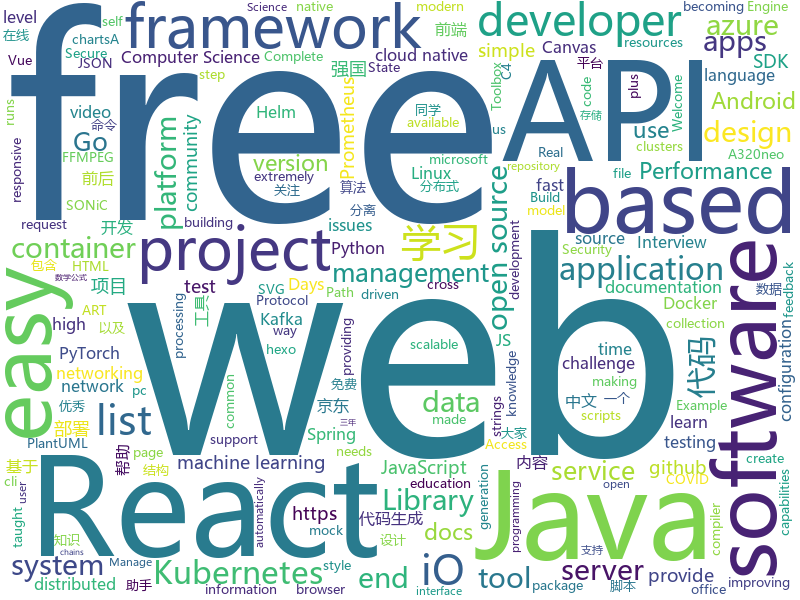

# 2021-01-15
See what the GitHub community is most excited about.

## python
+ [hacktricks](https://github.com/carlospolop/hacktricks)(**236 stars today**): Welcome to the page where you will find each trick/technique/whatever I have learnt in CTFs, real life apps, and reading researches and news.
+ [dagster](https://github.com/dagster-io/dagster)(**15 stars today**): A data orchestrator for machine learning, analytics, and ETL.
+ [django](https://github.com/django/django)(**35 stars today**): The Web framework for perfectionists with deadlines.
+ [timetagger](https://github.com/almarklein/timetagger)(**21 stars today**): Tag your time, get the insight
+ [tinypilot](https://github.com/mtlynch/tinypilot)(**11 stars today**): Use your Raspberry Pi as a browser-based KVM.
+ [public-apis](https://github.com/public-apis/public-apis)(**124 stars today**): A collective list of free APIs for use in software and web development.
+ [RepVGG](https://github.com/DingXiaoH/RepVGG)(**140 stars today**): RepVGG: Making VGG-style ConvNets Great Again
+ [big-list-of-naughty-strings](https://github.com/minimaxir/big-list-of-naughty-strings)(**125 stars today**): The Big List of Naughty Strings is a list of strings which have a high probability of causing issues when used as user-input data.
+ [transformers](https://github.com/huggingface/transformers)(**89 stars today**): 🤗Transformers: State-of-the-art Natural Language Processing for Pytorch and TensorFlow 2.0.
+ [confluent-kafka-python](https://github.com/confluentinc/confluent-kafka-python)(**1 stars today**): Confluent's Kafka Python Client
+ [FaceX-Zoo](https://github.com/JDAI-CV/FaceX-Zoo)(**65 stars today**): A PyTorch Toolbox for Face Recognition
+ [adversarial-robustness-toolbox](https://github.com/Trusted-AI/adversarial-robustness-toolbox)(**4 stars today**): Adversarial Robustness Toolbox (ART) - Python Library for Machine Learning Security - Evasion, Poisoning, Extraction, Inference
+ [fastapi](https://github.com/tiangolo/fastapi)(**61 stars today**): FastAPI framework, high performance, easy to learn, fast to code, ready for production
+ [numpy-ml](https://github.com/ddbourgin/numpy-ml)(**32 stars today**): Machine learning, in numpy
+ [black](https://github.com/psf/black)(**9 stars today**): The uncompromising Python code formatter
+ [covariants](https://github.com/hodcroftlab/covariants)(**9 stars today**): Real-time updates and information about key SARS-CoV-2 variants, plus the scripts that generate this information.
+ [locust](https://github.com/locustio/locust)(**103 stars today**): Scalable user load testing tool written in Python
+ [covid-19-data](https://github.com/owid/covid-19-data)(**10 stars today**): Data on COVID-19 (coronavirus) cases, deaths, hospitalizations, tests • All countries • Updated daily by Our World in Data
+ [apex](https://github.com/NVIDIA/apex)(**7 stars today**): A PyTorch Extension: Tools for easy mixed precision and distributed training in Pytorch
+ [python-patterns](https://github.com/faif/python-patterns)(**14 stars today**): A collection of design patterns/idioms in Python
+ [parler-tricks](https://github.com/d0nk/parler-tricks)(**101 stars today**): Reverse engineered Parler API
+ [spack](https://github.com/spack/spack)(**4 stars today**): A flexible package manager that supports multiple versions, configurations, platforms, and compilers.
+ [scikit-learn](https://github.com/scikit-learn/scikit-learn)(**14 stars today**): scikit-learn: machine learning in Python
+ [poetry](https://github.com/python-poetry/poetry)(**15 stars today**): Python dependency management and packaging made easy.
+ [HyperTag](https://github.com/SeanPedersen/HyperTag)(**11 stars today**): File organization made for humans

## java
+ [soul](https://github.com/dromara/soul)(**22 stars today**): High-Performance Java API Gateway
+ [android-interview-questions](https://github.com/MindorksOpenSource/android-interview-questions)(**8 stars today**): Your Cheat Sheet For Android Interview - Android Interview Questions
+ [nacos](https://github.com/alibaba/nacos)(**46 stars today**): an easy-to-use dynamic service discovery, configuration and service management platform for building cloud native applications.
+ [azure-sdk-for-java](https://github.com/Azure/azure-sdk-for-java)(**6 stars today**): This repository is for active development of the Azure SDK for Java. For consumers of the SDK we recommend visiting our public developer docs at https://docs.microsoft.com/en-us/java/azure/ or our versioned developer docs at https://azure.github.io/azure-sdk-for-java.
+ [spring-boot](https://github.com/spring-projects/spring-boot)(**34 stars today**): Spring Boot
+ [zfile](https://github.com/zhaojun1998/zfile)(**32 stars today**): 在线云盘、网盘、OneDrive、云存储、私有云、对象存储、h5ai
+ [CameraView](https://github.com/natario1/CameraView)(**4 stars today**): 📸A well documented, high-level Android interface that makes capturing pictures and videos easy, addressing all of the common issues and needs. Real-time filters, gestures, watermarks, frame processing, RAW, output of any size.
+ [jeecg-boot](https://github.com/zhangdaiscott/jeecg-boot)(**28 stars today**): 基于代码生成器的低代码平台，超越传统商业平台！前后端分离架构SpringBoot 2.x，SpringCloud，Ant Design&Vue，Mybatis-plus，Shiro，JWT。强大的代码生成器让前后端代码一键生成，无需写任何代码! 引领新低代码开发模式OnlineCoding->代码生成->手工MERGE，帮助Java项目解决70%重复工作，让开发更关注业务，既能快速提高开发效率，帮助公司节省成本，同时又不失灵活性。
+ [capacitor](https://github.com/ionic-team/capacitor)(**17 stars today**): Build cross-platform Native Progressive Web Apps for iOS, Android, and the Web⚡️
+ [react-native-video](https://github.com/react-native-video/react-native-video)(**5 stars today**): A <Video /> component for react-native
+ [keycloak](https://github.com/keycloak/keycloak)(**9 stars today**): Open Source Identity and Access Management For Modern Applications and Services
+ [OpenRefine](https://github.com/OpenRefine/OpenRefine)(**4 stars today**): OpenRefine is a free, open source power tool for working with messy data and improving it
+ [schema-registry](https://github.com/confluentinc/schema-registry)(**1 stars today**): Confluent Schema Registry for Kafka
+ [APIJSON](https://github.com/Tencent/APIJSON)(**14 stars today**): 🏆码云最有价值开源项目🚀后端接口和文档自动化，前端(客户端) 定制返回 JSON 的数据和结构！🏆Gitee Most Valuable Project🚀A JSON Transmission Protocol and an ORM Library for automatically providing APIs and Docs.
+ [GitHub-Chinese-Top-Charts](https://github.com/kon9chunkit/GitHub-Chinese-Top-Charts)(**40 stars today**): 🇨🇳GitHub中文排行榜，帮助你发现高分优秀中文项目、更高效地吸收国人的优秀经验成果；榜单每周更新一次，敬请关注！
+ [spring-framework](https://github.com/spring-projects/spring-framework)(**15 stars today**): Spring Framework
+ [flinkx](https://github.com/DTStack/flinkx)(**7 stars today**): 基于flink的分布式数据同步工具
+ [signal-cli](https://github.com/AsamK/signal-cli)(**34 stars today**): signal-cli provides a commandline and dbus interface for signalapp/libsignal-service-java
+ [advanced-java](https://github.com/doocs/advanced-java)(**40 stars today**): 😮互联网 Java 工程师进阶知识完全扫盲：涵盖高并发、分布式、高可用、微服务、海量数据处理等领域知识，后端同学必看，前端同学也可学习
+ [netty](https://github.com/netty/netty)(**13 stars today**): Netty project - an event-driven asynchronous network application framework
+ [elasticsearch](https://github.com/elastic/elasticsearch)(**26 stars today**): Open Source, Distributed, RESTful Search Engine
+ [openapi-generator](https://github.com/OpenAPITools/openapi-generator)(**12 stars today**): OpenAPI Generator allows generation of API client libraries (SDK generation), server stubs, documentation and configuration automatically given an OpenAPI Spec (v2, v3)
+ [spring-data-examples](https://github.com/spring-projects/spring-data-examples)(**2 stars today**): Spring Data Example Projects
+ [JsonPath](https://github.com/json-path/JsonPath)(**4 stars today**): Java JsonPath implementation
+ [hive](https://github.com/apache/hive)(**2 stars today**): Apache Hive

## unknown
+ [pdd_3years](https://github.com/LeadroyaL/pdd_3years)(**252 stars today**): 我在拼多多的三年，以及网站崩溃时候的日志文件
+ [C4-PlantUML](https://github.com/plantuml-stdlib/C4-PlantUML)(**4 stars today**): C4-PlantUML combines the benefits of PlantUML and the C4 model for providing a simple way of describing and communicate software architectures
+ [cs-video-courses](https://github.com/Developer-Y/cs-video-courses)(**100 stars today**): List of Computer Science courses with video lectures.
+ [frontend-challenges](https://github.com/felipefialho/frontend-challenges)(**349 stars today**): 💥Listing some playful open-source's challenges of jobs to test your knowledge
+ [HealthCode](https://github.com/XJP-GIT/HealthCode)(**44 stars today**): 健康码演示
+ [developer-roadmap](https://github.com/kamranahmedse/developer-roadmap)(**266 stars today**): Roadmap to becoming a web developer in 2021
+ [AspNetCore-Developer-Roadmap](https://github.com/MoienTajik/AspNetCore-Developer-Roadmap)(**16 stars today**): Roadmap to becoming an ASP.NET Core developer in 2021
+ [data-science](https://github.com/ossu/data-science)(**244 stars today**): 📊Path to a free self-taught education in Data Science!
+ [fucking-algorithm](https://github.com/labuladong/fucking-algorithm)(**202 stars today**): 刷算法全靠套路，认准 labuladong 就够了！English version supported! Crack LeetCode, not only how, but also why.
+ [free-programming-books-zh_CN](https://github.com/justjavac/free-programming-books-zh_CN)(**164 stars today**): 📚免费的计算机编程类中文书籍，欢迎投稿
+ [AutoXue2](https://github.com/Jack-Laoyang/AutoXue2)(**10 stars today**): 学习强国助手，通过安装pc模拟器，彻底解放手机。除了强国运动，目前支持所有项目拿分，最高拿61分。争上游胜率70%以上
+ [Among-Us-Sheriff-Mod](https://github.com/Woodi-dev/Among-Us-Sheriff-Mod)(**7 stars today**): Among Us Sheriff Mod
+ [Script](https://github.com/NobyDa/Script)(**12 stars today**): This project is based on the scripting capabilities of two excellent iOS proxy tools, Quantumult X or Surge.
+ [KingOfBugBountyTips](https://github.com/KingOfBugbounty/KingOfBugBountyTips)(**8 stars today**): 
+ [responsive-assignment](https://github.com/ProgrammingHero1/responsive-assignment)(**7 stars today**): 
+ [computer-science](https://github.com/ossu/computer-science)(**198 stars today**): 🎓Path to a free self-taught education in Computer Science!
+ [HealthCode-sim](https://github.com/sagerlikesspring/HealthCode-sim)(**4 stars today**): 
+ [selling-partner-api-docs](https://github.com/amzn/selling-partner-api-docs)(**5 stars today**): This repository contains documentation for developers to use to call Selling Partner APIs.
+ [coding-interview-university](https://github.com/jwasham/coding-interview-university)(**103 stars today**): A complete computer science study plan to become a software engineer.
+ [write-a-programming-language-in-450-lines](https://github.com/karminski/write-a-programming-language-in-450-lines)(**11 stars today**): 本教程教大家用 450 行 Go 代码实现一个简单的编程语言
+ [postman-salesforce-apis](https://github.com/forcedotcom/postman-salesforce-apis)(**11 stars today**): Salesforce API Postman Collection
+ [Loon-Script](https://github.com/Tartarus2014/Loon-Script)(**4 stars today**): Loon脚本收集
+ [architecture_decision_record](https://github.com/joelparkerhenderson/architecture_decision_record)(**7 stars today**): Architecture decision record (ADR) examples for software planning, IT leadership, and template documentation
+ [free-programming-books](https://github.com/EbookFoundation/free-programming-books)(**94 stars today**): 📚Freely available programming books
+ [JavaScript-Algorithms](https://github.com/sisterAn/JavaScript-Algorithms)(**12 stars today**): 基础理论+JS框架应用+实践，从0到1构建整个前端算法体系

## javascript
+ [30-Days-Of-React](https://github.com/Asabeneh/30-Days-Of-React)(**296 stars today**): 30 Days of React challenge is a step by step guide to learn React in 30 days. This challenge needs an intermediate level of HTML, CSS, and JavaScript knowledge. It is recommended to feel good at JavaScript before you start to React. If you are not comfortable with JavaScript check out 30DaysOfJavaScript. This is a continuation of 30 Days Of JS.
+ [jd-base](https://github.com/EvineDeng/jd-base)(**127 stars today**): 京东薅羊毛脚本https://github.com/lxk0301/jd_scripts 的shell套壳工具
+ [1](https://github.com/ChuheGit/1)(**18 stars today**): 
+ [jdms](https://github.com/Yx1aoq1/jdms)(**75 stars today**): 京东抢购秒杀助手
+ [corona-widget](https://github.com/rphl/corona-widget)(**5 stars today**): COVID-19 Inzidenz-Widget für iOS innerhalb Deutschlands🇩🇪(Kreis/Stadt + Bundesland + Trend)
+ [svelte](https://github.com/sveltejs/svelte)(**192 stars today**): Cybernetically enhanced web apps
+ [next.js](https://github.com/vercel/next.js)(**80 stars today**): The React Framework
+ [edex-ui](https://github.com/GitSquared/edex-ui)(**95 stars today**): A cross-platform, customizable science fiction terminal emulator with advanced monitoring & touchscreen support.
+ [a32nx](https://github.com/flybywiresim/a32nx)(**9 stars today**): The A32NX Project is a community driven open source project to create a free Airbus A320neo in Microsoft Flight Simulator that is as close to reality as possible. It aims to enhance the default A320neo by improving the systems depth and functionality to bring it up to payware-level, all for free.
+ [nuxt.js](https://github.com/nuxt/nuxt.js)(**26 stars today**): The Intuitive Vue Framework
+ [strapi](https://github.com/strapi/strapi)(**39 stars today**): 🚀Open source Node.js Headless CMS to easily build customisable APIs
+ [iptv](https://github.com/iptv-org/iptv)(**71 stars today**): Collection of 5000+ publicly available IPTV channels from all over the world
+ [monkeytype](https://github.com/Miodec/monkeytype)(**17 stars today**): A minimalistic typing test
+ [cypress](https://github.com/cypress-io/cypress)(**29 stars today**): Fast, easy and reliable testing for anything that runs in a browser.
+ [CodeceptJS](https://github.com/codeceptjs/CodeceptJS)(**10 stars today**): Supercharged End 2 End Testing Framework for NodeJS
+ [xzs](https://github.com/mindskip/xzs)(**9 stars today**): 学之思在线考试系统 - postgresql版，支持多种题型：选择题、多选题、判断题、填空题、解答题以及数学公式，包含PC端、小程序端，扩展性强，部署方便(集成部署、前后端分离部署、docker部署)、界面设计友好、代码结构清晰
+ [bigbluebutton](https://github.com/bigbluebutton/bigbluebutton)(**8 stars today**): Complete open source web conferencing system.
+ [Recoil](https://github.com/facebookexperimental/Recoil)(**27 stars today**): Recoil is an experimental state management library for React apps. It provides several capabilities that are difficult to achieve with React alone, while being compatible with the newest features of React.
+ [semantic-release](https://github.com/semantic-release/semantic-release)(**11 stars today**): 📦🚀Fully automated version management and package publishing
+ [fabric.js](https://github.com/fabricjs/fabric.js)(**33 stars today**): Javascript Canvas Library, SVG-to-Canvas (& canvas-to-SVG) Parser
+ [office-docs-powershell](https://github.com/MicrosoftDocs/office-docs-powershell)(**0 stars today**): PowerShell Reference for Office Products - Short URL: aka.ms/office-powershell
+ [awesome-selfhosted](https://github.com/awesome-selfhosted/awesome-selfhosted)(**48 stars today**): A list of Free Software network services and web applications which can be hosted locally. Selfhosting is the process of hosting and managing applications instead of renting from Software-as-a-Service providers
+ [jd_sign_bot](https://github.com/ruicky/jd_sign_bot)(**39 stars today**): 京东签到机器人
+ [react-native](https://github.com/facebook/react-native)(**33 stars today**): A framework for building native apps with React.
+ [appwrite](https://github.com/appwrite/appwrite)(**7 stars today**): Appwrite is a secure end-to-end backend server for Web, Mobile, and Flutter developers that is packaged as a set of Docker containers for easy deployment🚀

## html
+ [helm-charts](https://github.com/jenkinsci/helm-charts)(**0 stars today**): Jenkins community Helm charts
+ [CSSG](https://github.com/RCStep/CSSG)(**14 stars today**): Cobalt Strike Shellcode Generator
+ [html-css](https://github.com/gustavoguanabara/html-css)(**9 stars today**): Curso de HTML5 e CSS3
+ [machine-learning-systems-design](https://github.com/chiphuyen/machine-learning-systems-design)(**10 stars today**): A booklet on machine learning systems design with exercises
+ [aave-protocol](https://github.com/aave/aave-protocol)(**1 stars today**): Aave Protocol Version 1.0 - Decentralized Lending Pools
+ [lovexuexi](https://github.com/james-bond-007/lovexuexi)(**5 stars today**): 我爱学习强国。学习强国聚合了大量可免费阅读的期刊、古籍、公开课、歌曲、戏曲、电影、图书等资料，内容严谨，专业性强。没有博眼球，无下限的自媒体内容和虚假新闻。推荐大家自发积极学习使用。
+ [helm-charts](https://github.com/prometheus-community/helm-charts)(**5 stars today**): Prometheus community Helm charts
+ [Front-end-Developer-Interview-Questions](https://github.com/h5bp/Front-end-Developer-Interview-Questions)(**18 stars today**): A list of helpful front-end related questions you can use to interview potential candidates, test yourself or completely ignore.
+ [responsive-html-email-template](https://github.com/leemunroe/responsive-html-email-template)(**8 stars today**): A free simple responsive HTML email template
+ [eks-charts](https://github.com/aws/eks-charts)(**1 stars today**): Amazon EKS Helm chart repository
+ [charts](https://github.com/bitnami/charts)(**10 stars today**): Helm Charts
+ [node-fluent-ffmpeg](https://github.com/fluent-ffmpeg/node-fluent-ffmpeg)(**4 stars today**): A fluent API to FFMPEG (http://www.ffmpeg.org)
+ [calico](https://github.com/projectcalico/calico)(**4 stars today**): Cloud native networking and network security
+ [Certified-Kubernetes-Security-Specialist](https://github.com/walidshaari/Certified-Kubernetes-Security-Specialist)(**4 stars today**): Curated resources help you prepare for the CNCF/Linux Foundation CKS 2021 "Kubernetes Certified Security Specialist" Certification exam. Please provide feedback or requests by raising issues, or making a pull request. All feedback for improvements are welcome. thank you.
+ [CoolAdmin](https://github.com/puikinsh/CoolAdmin)(**1 stars today**): Free Bootstrap 4.1 based admin dashboard template
+ [hexo-theme-matery](https://github.com/blinkfox/hexo-theme-matery)(**6 stars today**): A beautiful hexo blog theme with material design and responsive design.一个基于材料设计和响应式设计而成的全面、美观的Hexo主题。国内访问：http://blinkfox.com
+ [keycloak-documentation](https://github.com/keycloak/keycloak-documentation)(**1 stars today**): 
+ [ru.javascript.info](https://github.com/javascript-tutorial/ru.javascript.info)(**5 stars today**): Современный учебник JavaScript
+ [awesome-piracy](https://github.com/Igglybuff/awesome-piracy)(**7 stars today**): A curated list of awesome warez and piracy links
+ [docker.github.io](https://github.com/docker/docker.github.io)(**1 stars today**): Source repo for Docker's Documentation
+ [SONiC](https://github.com/Azure/SONiC)(**0 stars today**): Landing page for Software for Open Networking in the Cloud (SONiC) - http://azure.github.io/SONiC/
+ [beginner-javascript](https://github.com/wesbos/beginner-javascript)(**3 stars today**): Slam Dunk JavaScript
+ [linux-command](https://github.com/jaywcjlove/linux-command)(**5 stars today**): Linux命令大全搜索工具，内容包含Linux命令手册、详解、学习、搜集。https://git.io/linux
+ [WebFundamentals](https://github.com/google/WebFundamentals)(**6 stars today**): Best practices for modern web development
+ [ansible-collection-hardening](https://github.com/dev-sec/ansible-collection-hardening)(**5 stars today**): This Ansible collection provides battle tested hardening for Linux, SSH, nginx, MySQL

## go
+ [sarama](https://github.com/Shopify/sarama)(**5 stars today**): Sarama is a Go library for Apache Kafka 0.8, and up.
+ [juicefs](https://github.com/juicedata/juicefs)(**265 stars today**): JuiceFS is a distributed POSIX file system built on top of Redis and S3.
+ [moby](https://github.com/moby/moby)(**34 stars today**): Moby Project - a collaborative project for the container ecosystem to assemble container-based systems
+ [esbuild](https://github.com/evanw/esbuild)(**100 stars today**): An extremely fast JavaScript bundler and minifier
+ [nebula](https://github.com/slackhq/nebula)(**23 stars today**): A scalable overlay networking tool with a focus on performance, simplicity and security
+ [mock](https://github.com/golang/mock)(**6 stars today**): GoMock is a mocking framework for the Go programming language.
+ [prometheus-operator](https://github.com/prometheus-operator/prometheus-operator)(**3 stars today**): Prometheus Operator creates/configures/manages Prometheus clusters atop Kubernetes
+ [coredns](https://github.com/coredns/coredns)(**7 stars today**): CoreDNS is a DNS server that chains plugins
+ [harvester](https://github.com/rancher/harvester)(**4 stars today**): Open source hyperconverged infrastructure (HCI) software
+ [nakama](https://github.com/heroiclabs/nakama)(**30 stars today**): Distributed server for social and realtime games and apps.
+ [testify](https://github.com/stretchr/testify)(**5 stars today**): A toolkit with common assertions and mocks that plays nicely with the standard library
+ [kubevela](https://github.com/oam-dev/kubevela)(**23 stars today**): A Highly Extensible Platform Engine based on Kubernetes and Open Application Model.
+ [aws-nuke](https://github.com/rebuy-de/aws-nuke)(**3 stars today**): Nuke a whole AWS account and delete all its resources.
+ [teleport](https://github.com/gravitational/teleport)(**14 stars today**): Secure Access for Developers that doesn't get in the way.
+ [rke](https://github.com/rancher/rke)(**4 stars today**): Rancher Kubernetes Engine (RKE), an extremely simple, lightning fast Kubernetes distribution that runs entirely within containers.
+ [alertmanager](https://github.com/prometheus/alertmanager)(**7 stars today**): Prometheus Alertmanager
+ [grpc-go](https://github.com/grpc/grpc-go)(**14 stars today**): The Go language implementation of gRPC. HTTP/2 based RPC
+ [slack](https://github.com/slack-go/slack)(**5 stars today**): Slack API in Go - community-maintained fork created by the original author, @nlopes
+ [nats-server](https://github.com/nats-io/nats-server)(**11 stars today**): High-Performance server for NATS, the cloud native messaging system.
+ [go-sqlmock](https://github.com/DATA-DOG/go-sqlmock)(**7 stars today**): Sql mock driver for golang to test database interactions
+ [gopher-lua](https://github.com/yuin/gopher-lua)(**6 stars today**): GopherLua: VM and compiler for Lua in Go
+ [trivy](https://github.com/aquasecurity/trivy)(**9 stars today**): A Simple and Comprehensive Vulnerability Scanner for Containers, Suitable for CI
+ [MailHog](https://github.com/mailhog/MailHog)(**5 stars today**): Web and API based SMTP testing
+ [ingress-nginx](https://github.com/kubernetes/ingress-nginx)(**4 stars today**): NGINX Ingress Controller for Kubernetes
+ [k9s](https://github.com/derailed/k9s)(**19 stars today**): 🐶Kubernetes CLI To Manage Your Clusters In Style!

## WordCloud

